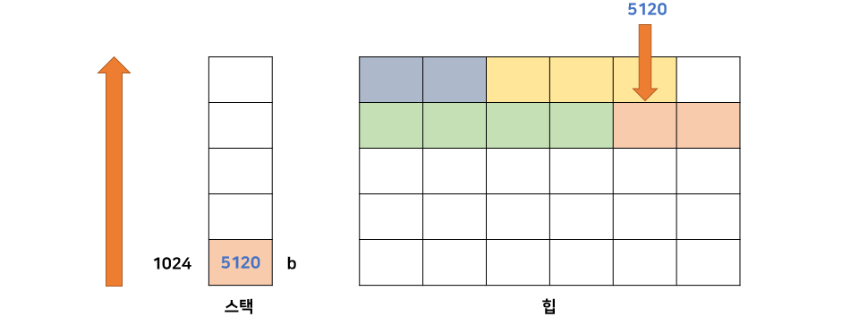
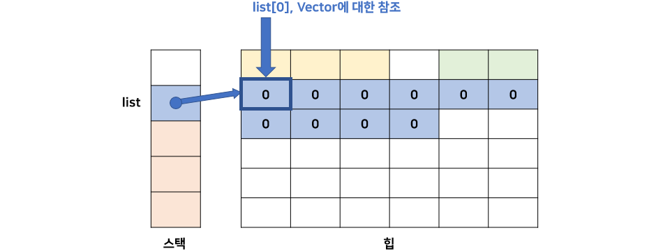
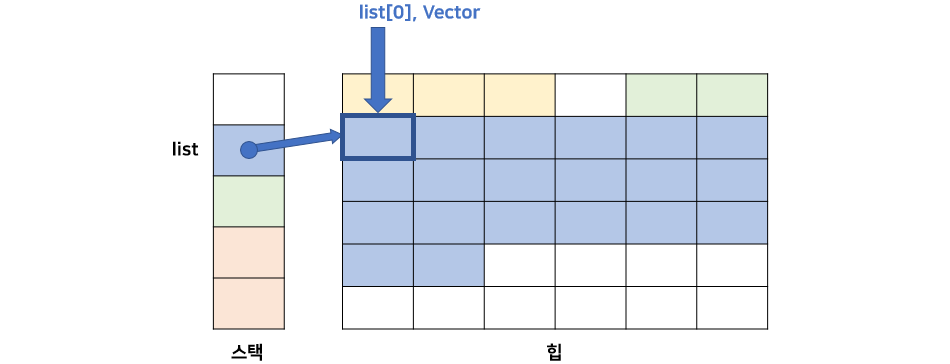

# C++ 관련 질문

## 목차
- [Q. C++ VS Java](#q-c-vs-java)

## Q. C++ VS Java
### C++에서 가능한 기능
- 힙에 할당하는 메모리를 직접 관리
- 클래스
- 객체
- 생성자
- 메서드 오버로딩/오버라이딩
- 힙에 객체 생성하기
- 스택에 객체 생성하기
- 복사 생성자
- 소멸자
- 연산자 오버로딩
- 정적 바인딩
- 다중 상속
- Call By Value 가능
- Call By Reference 가능

### Java에서 가능한 기능
- 힙에 할당하는 메모리는 GC에서 자동 관리
- 클래스
- 객체
- 생성자
- 메서드 오버로딩/오버라이딩
- 힙에 객체 생성하기
- 동적 바인딩
- 인터페이스
- 인터페이스 다중 상속
- Call By Value 가능
- 초기값이 없으면 0으로 자동 초기화


## Q. 클래스
### 접근 제어자(Access Modifier)
#### 멤버 변수의 접근권한
C++에서 기본 접근권한은 **private** 입니다.

```cpp
class vector
{
  int mX;  // private 멤버 변수
  int mY;  // private 멤버 변수
};
```

C++에서 접근 제어자는 아래와 같이 3가지로 구성되어 있습니다.
- ```public```: 누구나 접근 가능하다.
- ```protected```: 자식 클래스에서도 접근 가능하다.
- ```private```: 해당 클래스에서만 접근 가능하다.

C++에서는 보통 제어자 별로 멤버들을 그룹 지어서 선업합니다.

```cpp
class SomeClass
{
public:
  int mPublicMember;
protected:
  int mProtectedMember;
private:
  int mPrivateMember1;
  int mPrivateMember2;
};
```

### 객체 생성
자바와 C++에서 개체를 생성하는 예제를 비교해보면 다음과 같습니다.

- Java

```java
// 스택 메모리에 생성할 수 없음

// 힙(heap) 메모리에 만들기 (느림)
Vector a = new Vector();
```

- C++

```cpp
// 스택(stack) 메모리에 만들기 (빠름)
Vector a;

// 힙(heap) 메모리에 만들기 (느림)
Vector* a = new Vector();
```

C++은 스택과 힙 메모리 영역 모두에서 객체를 생성할 수 있습니다. C++은 자바와 달리 모든 것을 스택 메모리 영역에 할당할 수 있습니다. 스택 영역은 힙과 달리 연속된 메모리를 찾는 과정을 거치지 않으므로 힙보다 빠른 성능을 갖습니다.(자바는 Primitive Type을 제외하고 모든 타입은 Reference Type이고 힙에 할당됩니다.)

C++에서 아래의 변수가 메모리에 어떤 상태인지 살펴봅시다.

```cpp
Vector* b = new Vector();
```



위 그림은 스택과 힙 메모리 모습을 매우 간소화하여 나타낸 모습입니다. `Vector` 클래스의 포인터 변수인 `b`는 스택 메모리에 저장되며 주소 값을 갖습니다. 변수 `b`는 **new**를 통해 동적할당을 하였으므로, 실제 데이터는 힙 메모리에 할당됩니다. 위 그림의 한 칸은 4byte이며, `Vector` 클래스의 멤버 변수는 2개의 int 자료형이므로 2칸을 차지하는 것을 볼 수 있습니다.

### 스택(Stack) 메모리
C++에서 스택 메모리 영역은 **예약된 로컬 메모리 공간**입니다. 스택 메모리 크기는 컴파일러 설정에서 변경할 수 있습니다. 일반적으로 1MB이하로 설정하며, 컴파일된 후 실행파일인 exe 파일의 스택 크기로 설정됩니다.

스택은 함수 호출과 반환, 정적인 변수와 객체를 저장하는 등의 역할을 합니다. 스택 메모리의 특징은 다음과 같습니다.
- 단순히 스택 포인터를 옮긴다.
    - 함수를 호출하는 경우 해당 함수의 데이터를 스택 메모리에 할당한 후 스택 포인터를 함수의 시작지점으로 옮겨 수행을 시작합니다. 그리고 함수의 수행이 끝나면 이전 위치로 반환하여야 하는데, 이 때 사용이 끝난 메모리를 해제하는 것이 아니라 단순히 **스택 포인터를 반환 지점으로 옮기고 다음 수행할 데이터로 덮어쓰는 형태로 동작합니다.**
- 크기가 작다.
    - 스택은 크기는 일반적으로 1MB 크기로 매우 작습니다. 따라서 스택 메모리 크기를 벗어난 데이터(객체)를 할당하려고 하면 **stack overflow**가 발생합니다.
- 힙 메모리보다 빠르다.
    - 데이터를 할당할 때 연속된 크기를 찾는 작업이 필요없습니다.
    - 메모리 해제 작업이 필요없습니다.
    - 고정된 크기를 가지고 있으므로 컴파일러 단계에서 미리 스택 포인터의 행동반경을 설정할 수 있습니다.

### 힙(Heap) 메모리
힙 메모리는 프로그램이 실행하는 동안에 필요한 데이터를 할당하는 영역입니다. 힙 메모리 크기는 **운영체제에서 관리하는 전체 메모리를 사용**할 수 있어 크기가 큰 객체를 무리없이 저장할 수 있습니다. 하지만 해당 메모리에서 **비어 있고 연속적인 공간**을 찾아야 해서 느리며, C++과 같은 언매니지드 언어에서는 할당한 메모리를 **직접 해제**해주어야 합니다. 만약 해제하지 않으면 해당 공간은 어느 곳에서도 사용하지 못한 상태가 되어 메모리 누수가 발생합니다.

힙을 사용할 때 가장 주의할 점은 **메모리 누수**입니다. 이를 방지하기 위한 대표적인 패턴은 **RAII(Resource Acquisition Is Initialization)**입니다. 이는 자원을 할당한 경우에는 해당 자원의 영역(scope)가 끝나기 전에 해제해야 한다는 것입니다.이다.

```cpp
Vector& PrintVectors(const Vector& a, const Vector& b)
{
  Vector* result = new Vector();
  result->mX = a.mX + b.mX;
  result->mY = a.mY + b.mY;

  return result;
}
```

위 코드는 매우 실수하기 쉬운 예입니다. `result` 변수는 힙 메모리에 할당되어 있는데, 이를 해제하지 해당 scope에서 해제하지 않고 반환하고 있습니다. 반환 받은 영역은 이를 해제해야 하는 책임까지 더해집니다. 위 메서드를 사용하는 클라이언트는 위 메서드를 확인하지 않으면 해제를 해야하는지도 모를 수 있습니다.

## 객체 배열(Object Array)
객체 배열을 생성하는데 있어서도 Java와 C++에는 차이가 존재합니다. 먼저 자바를 살펴봅시다.

```java
// Java
Vector[] list = new Vector[10];
```

위 코드는 `Vector` 클래스를 10개 만들어 주는 것일까? `Vector` 클래스를 가리키는 4Byte 주소 공간을 10개 만들어주는 것일까?

정답은 **4Byte 주소 공간을 10개**만들어줍니다. 이 코드의 메모리 상태는 간단하게 아래와 같습니다.



힙 메모리에 10개의 주소 공간을 만들어주고 NULL을 삽입하여 초기화합니다. 그리고 각각의 `Vector`를 초기화하면 이가 할당된 힙 메모리 주소를 가리키게 될 것입니다.

그러면 C++을 보겠습니다.

```cpp
// C++
Vector* list = new Vector[10];
```

C++은 위와 같이 선언하면 힙 메모리에 **실제 10개의 Vector 클래스**를 할당합니다.



힙 메모리 영역에 실제 `Vector` 클래스 10개가 할당된 모습입니다. `Vector` 클래스는 2개의 4Byte 정수 변수를 가지고 있으므로 각각 2칸씩 차지하는 모습입니다.

Java와 C++을 비교 정리하면 다음과 같습니다.

```java
/* Java */
// 1) 힙에 백터 개체를 만들 수 없다.

// 2) 10개의 포인터를 힙에 만든다.
Vector[] a = new Vector[10];
```

```cpp
/* C++ */
// 1) 10개의 백터 개체를 힙에 만든다.
Vector* list = new Vector[10];

// 2) 10개의 포인터를 힙에 만든다.
Vector** list = new Vector*[10];
```

### 객체 소멸
C++ 에서는 객체를 `new`와 같이 힙에 할당했으면 사용이 끝난 후에는 직접 해제를 해주어야 합니다.

```cpp
Vector* a = new Vector();
Vector* list = new Vector[10];

// ...

delete a;       // 메로리가 즉시 해제된다.
a = NULL;       // 안해줘도 된다.

delete[] list;  // 배열을 소멸시키는 경우 []를 반드시 해주어야 한다.
list = NULL;    // 안해줘도 된다.
```

C++은 `delete` 키워드를 사용하여 메모리르 즉시 해제시켜줄 수 있습니다. 배열은 반드시 `[]`를 선언해주어야 모든 배열을 해제합니다.