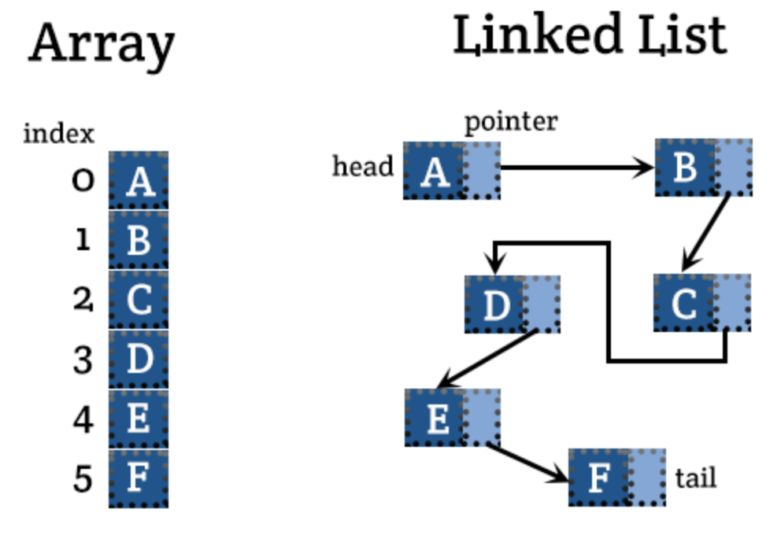
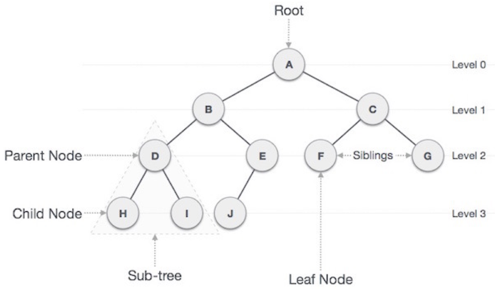
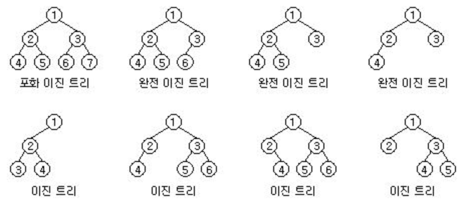
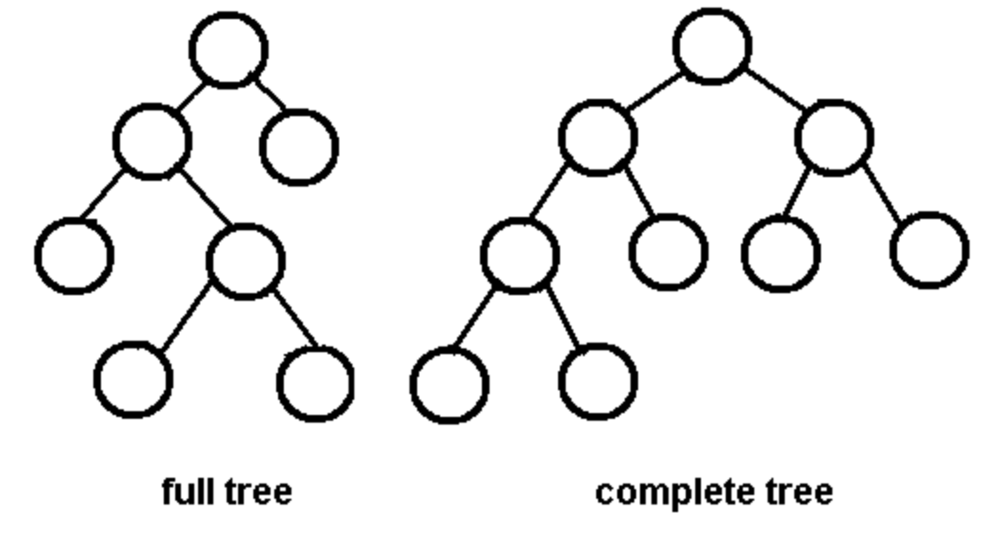
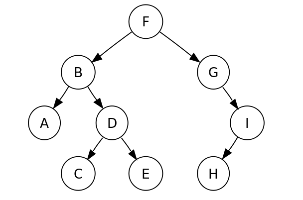
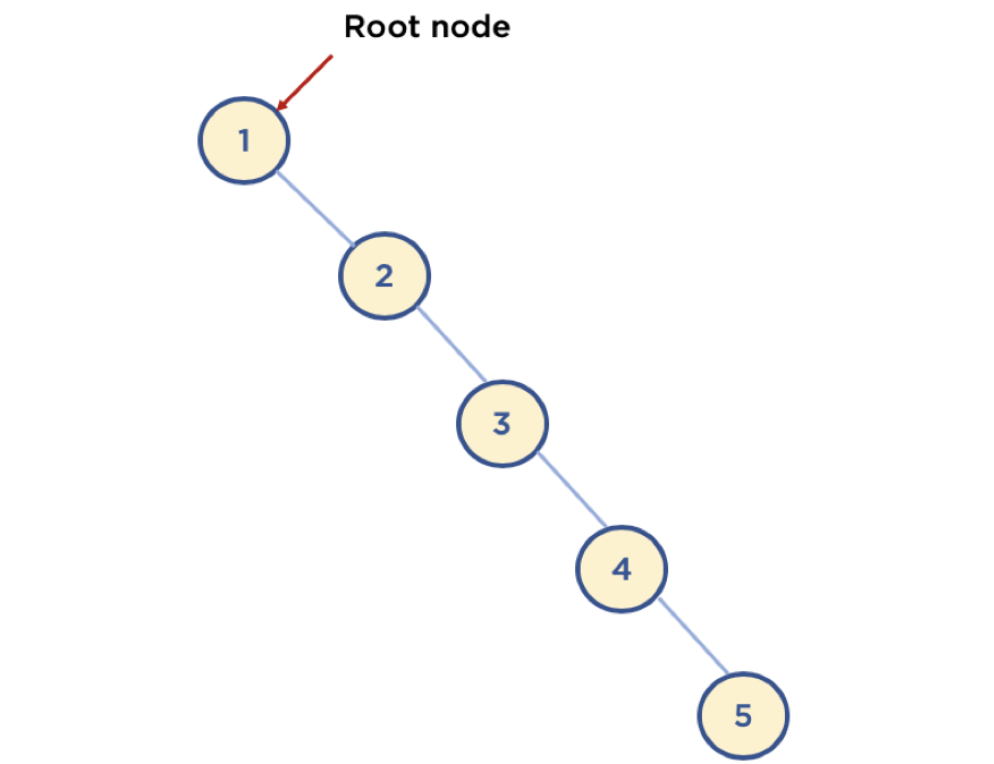
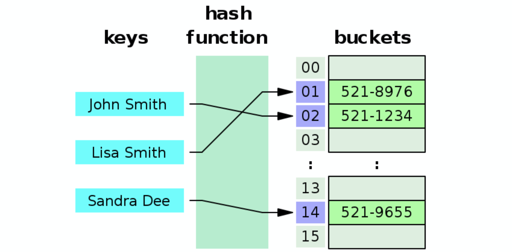

# 자료구조 관련 질문

## 목차
- [Q. 자료구조란?](#q-자료구조란)
- [Q. Array VS Linked List](#q-array-vs-linked-list)
- [Q. 큐(Queue)와 스택(Stack)](#q-큐queue와-스택stack)
- [Q. 트리(Tree)](#q-트리tree)
- [Q. Hash Table](#q-hash-table)
- [Q. 그래프(Graph)](#q-그래프graph)


## Q. 자료구조란?
자료구조는 데이터(자료)를 논리적으로 구성된 규칙에 의해 나열하는 방식입니다. 자료구조의 목적은 데이터를 효율적으로 관리하고 사용하기 위해서입니다. 자료구조의 효율이 좋다는 것은 저장공간을 적게 사용하고, 빠르게 데이터를 찾을 수 있다는 것입니다.

자료구조를 선택하는 기준은 다음과 같습니다.
- 자료의 처리 시간
- 자료의 크기
- 자료의 활용 빈도
- 자료의 갱신 정도
- 프로그램의 용이성

자료구조의 구분은 크게 선형 자료구조와 비선형 자료구조로 나뉩니다. 선형 자료구조는 데이터가 저장되는 구조가 일렬로 나열되어 있는 형태입니다. 반면에 비선형 자료구조는 일렬이 아닌 특정한 형태를 가지고 있습니다. 선형 자료구조는 대표적으로 Array, Linked List, Queue, Stack 등이 있고, 비선형 자료구조는 Tree, Graph 등이 있습니다.


## Q. Array VS Linked List
### Array
Array는 가장 기본적인 자료구조로, 데이터를 일렬로 순차적으로 저장하는 형태입니다. 이를 논리적인 저장 순서와 물리적인 저장 순서가 일치한다고 표현합니다. 실제 메모리에 순차적으로 저장하기 때문에 캐시 효율이 높습니다. 그리고 index로 해당 원소에 O(1) 시간만에 접근하여 원소를 반환하거나 변경할 수 있습니다. 하지만 중간에 위치한 배열을 삽입 및 삭제하려면 그 위치의 뒤에 있는 모든 원소를 앞이나 뒤로 shift를 해야하므로 O(N) 시간을 소요합니다. 물론 맨 뒤에 있는 원소를 삽입 및 삭제하는 연산은 O(1) 시간을 소요합니다.

### 동적 배열(Dynamic Array)
일반적인 배열은 정적 배열로 처음 초기화할 때 크기가 정해지며, 이는 변경할 수 없습니다. 이를 해결하기 위해 대부분의 언어는 동적 배열 자료구조를 제공합니다. C++의 `vector`나 Java의 `ArrayList`가 그 예입니다. 동적 배열은 정적 배열의 특징을 모두 가지고 있으며, 추가적으로 배열 크기를 변경하는 `resize()` 연산과 배열 원소의 맨 끝에 데이터를 추가하는 `append()` 연산을 지원합니다.

`resize()` 연산은 내부적으로 변경될 크기에 만큼 `new`나 `malloc`으로 메모리를 할당 받은 후, 기존의 데이터를 복사하는 형식으로 동작합니다. 따라서 O(N)의 시간이 소요됩니다.

`append()` 연산은 맨 끝에 데이터를 하나 추가하는 연산으로 자주 사용됩니다. 따라서 이는 효율적으로 동작해야합니다. 그래서 자료구조 내부에 `capacity`라는 실제 할당한 크기를 가지고 있습니다. 이는 배열의 실제 size보다 큰 값으로 초기화하기 때문에 `append()` 연산을 할 때 배열을 재할당할 필요가 없습니다. 하지만 capacity 크기를 넘어서게 되면 역시 재할당이 필요한데, 이는 현재 capacity의 2배 크기로 재할당하는 방법으로 구현되어 있습니다. 간단히 말하면 capacity의 크기를 넘어서 재할당이 필요할 때 그 때마다 1개의 크기를 늘리는 연산을 하는 것보다 현재 크기의 2배를 늘리면 재할당 연산을 훨씬 줄일 수 있고, 평균 시간복잡도는 O(1)이 됩니다.

### Linked List
Linked List는 데이터와 다음 데이터를 가리키는 주소로 이루어진 자료구조입니다. 이는 배열과 달리 물리적으로 순차되지 않고, 메모리 곳곳에 흩어져 있습니다. 따라서 Linked List에서 원소를 찾기 위해서는 첫 번째 위치부터 하나하나 다음 위치로 따라가야하므로 O(N)의 시간이 소요됩니다. 하지만 삽입 및 삭제 연산은 데이터를 가리키는 주소만 상수 개수의 횟수로 변경하면 되기 때문에 O(1) 시간이 소요됩니다.

Linked List의 또다른 문제점은 삽입 및 삭제를 할 때 그 위치를 찾아야 한다는 것입니다. 따라서 이를 찾는데 O(N)의 시간이 소요되므로, 삽입 및 삭제 연산도 결과적으로 O(N)의 시간이 걸립니다.

결국 Linked List는 배열보다 큰 이점을 찾을 수는 없지만 Tree와 같은 비선형 자료구조를 구현하는데 기본이 되는 자료구조이므로 많이 사용됩니다.


출처: <https://open4tech.com/array-vs-linked-list-vs-hash-table/>


## Q. 큐(Queue)와 스택(Stack)
### Queue
큐는 선형 자료구조로서, 먼저 넣은 데이터가 먼저 나오는 FIFO(First In First Out) 형식입니다. 큐는 우선순위에 따라 먼저 나오는 우선순위 큐(또는 Heap)로 구현할 수도 있습니다. 큐는 일상생활에서도 흔히 사용되는 개념이고, 프로그래밍에서는 스케줄링 관련해서 자주 사용됩니다.

### Stack
스택은 큐와 반대로 가장 마지막에 넣은 데이터가 가장 먼저 나오는 LIFO(Last In First Out) 형식입니다. 대표적으로 프로그래밍에서 함수를 실행할 때 저장하는 데이터를 스택 방식으로 사용합니다. 이 외에 괄호 검사, 뒤로 가기나 실행 취소와 같은 상태를 되돌리는 작업에 자주 사용됩니다.


## Q. 트리(Tree)
트리는 비선형적 자료구조로서, 계층적 관계(Hierarchical Relationship)를 표현하는데 집중한 자료구조입니다. 전체적인 모습은 루트 노드를 중심으로 자식 노드들이 연결되어 있으며, 각 노드들이 또 다시 부모 노드와 자식 노드의 관계를 가지는 재귀적인 특징이 있습니다.

### Tree 구성 요소


출처: <https://gmlwjd9405.github.io/2018/08/12/data-structure-tree.html>

- Node(노드): 트리의 구성 요소
- Edge(간선): 노드와 노드를 연결하는 선
- Root Node(루트 노드): 트리 구조에서 최상위 노드
- Leaf Node(단말 노드): 자식이 없는 노드
- Internal Node(내부 노드): 단말 노드가 아닌 노드(루트 노드 포함)
- Sibling(형제): 같은 부모를 가지는 노드
- 노드 크기: 자신을 포함한 모든 자손 노드의 개수
- 노드 깊이: 루트 노드에서 해당 노드까지 도달하기 위해 거처야 하는 간선의 수
- 노드 레벨: 트리의 특정 깊이에 해당하는 노드의 집합
- 노드 차수(degree): 하위 트리 개수/간선 수
- 트리 차수: 트리의 최대 개수
- 트리 높이: 루트 노드에서 가장 멀리 떨어진 노드의 깊이

### 이진 트리(Binary Tree)
이진 트리는 트리에서 자식 노드가 2개 이하인 트리를 말합니다. 루트 노드를 중심으로 모든 노드는 자식 노드가 2개 이하여야 합니다.

이진 트리의 유형은 다음과 같습니다.


출처: <http://blog.naver.com/PostView.nhn?blogId=jerrypoiu&logNo=221038260559>


출처: <https://www.cs.cmu.edu/~adamchik/15-121/lectures/Trees/trees.html>

- 포화 이진 트리: 리프 노드를 제외한 모든 노드가 자식 노드를 2개 가지고 있는 형태
- 완전 이진 트리: 위에서 아래로, 왼쪽에서 오른쪽 순서로 노드가 차곡차곡 채워진 형태
- 정 이진 트리: 모든 노드가 자식 노드를 0개 또는 2개 가진 형태

이진 트리의 순회는 전위 순회(pre-order traversal), 중위 순회(in-order traversal), 후위 순회(post-order traversal)로 나뉩니다.

- 전위 순회: 현재 노드 -> 왼쪽 서브 트리 -> 오른쪽 서브 트리

```cpp
void preorder(TreeNode* node) {
    if (node == NULL) {
        return;
    }

    visit(node);
    preorder(node->left);
    preorder(node->right);
}
```

- 중위 순회: 왼쪽 서브 트리 -> 현재 노드 -> 오른쪽 서브 트리

```cpp
void inorder(TreeNode* node) {
    if (node == NULL) {
        return;
    }

    inorder(node->left);
    visit(node);
    inorder(node->right);
}
```

- 후위 순회: 왼쪽 서브 트리 -> 오른쪽 서브 트리 -> 현재 노드

```cpp
void postorder(TreeNode* node) {
    if (node == NULL) {
        return;
    }

    postorder(node->left);
    postorder(node->right);
    visit(node);
}
```


출처: <https://ko.wikipedia.org/wiki/%ED%8A%B8%EB%A6%AC_%EC%88%9C%ED%9A%8C>

- 전위 순회: F, B, A, D, C, E, G, I, H (root, left, right)
- 중위 순회: A, B, C, D, E, F, G, H, I (left, root, right)
- 후위 순회: A, C, E, D, B, H, I, G, F (left, right, root)
- 레벨 순서 순회: F, B, G, A, D, I, C, E, H

### 이진 탐색 트리(Binary Search Tree, BST)
이진 탐색 트리는 이분 탐색이라는 데이터를 빠르게 찾는 방법과 이진 트리를 합친 자료구조입니다. 이분 탐색은 정렬된 배열에서 데이터를 찾을 때 범위를 반씩 줄이는 탐색 방법입니다. 이분 탐색의 문제점은 배열을 사용하므로 데이터를 추가하거나 삭제하는데 비용이 크다는 것이었습니다. 이 문제를 해결하기 위해 배열 대신 이진 트리를 사용했습니다.

이진 탐색 트리를 구성하기 위해서는 아래의 4가지 규칙을 준수해야합니다.

1. 이진 탐색 트리의 노드에 저장된 키는 유일하다.
2. 부모의 키가 왼쪽 자식 노드의 키보다 크다.
3. 부모의 키가 오른쪽 자식 노드의 키보다 작다.
4. 왼쪽과 오른쪽 서브트리도 이진 탐색 트리이다.

이진 탐색 트리의 검색, 삽입, 삭제 연산의 시간 복잡도는 O(logN)이 아닌 정확히는 O(h) 입니다. (N은 전체 데이서 개수, h는 트리의 높이)



여기서 문제점은 위 그림처럼 이진 탐색 트리 모양이 한쪽으로 치우치는 형태라면, 최악의 시간복잡도는 O(N)과 같습니다. 이는 이진 탐색 트리를 사용한 의미가 없어집니다. 이를 해결하기 위해 규칙을 추가해서 균형잡힌 트리의 모양을 유지하는데, 대표적으로 AVL Tree, Red-Black Tree가 있습니다.


## Q. Hash Table
해시 테이블은 해시 함수를 사용하여 키와 값의 쌍으로 저장되는 연관배열 구조를 말합니다. 해시 테이블을 사용하는 이유는 값을 O(1) 시간으로 데이터를 빠르게 찾기 위함입니다.

해시 테이블은 해시 함수를 이용하여 key를 해시화를 합니다. 이 해시화된 값은 인덱스 혹은 주소값이며, 해당 메모리 공간에 키와 값을 저장합니다. 해시 함수를 계산하는 시간 복잡도는 O(1)이기 때문에 해당 키로 값을 검색할 때 O(1) 시간이 소요됩니다.


출처: <https://ratsgo.github.io/data%20structure&algorithm/2017/10/25/hash/>

위 예제는 전화번호부를 저장하기 위해 `<사람, 전화번호>`의 형태로 데이터를 저장해야합니다. 이를 해시 테이블로 사용하면 사람을 key값으로 해시화하여 위 그림처럼 해당 인덱스의 buckets에 저장합니다. buckets에는 실제로 `<사람, 전화번호>`와 같이 `<key, value>`의 형태로 저장됩니다.

이러한 해시 테이블은 대부분 언어에서 가지고 있는 set, map으로 구현되어 있습니다. set은 key값만을 저장하고, map은 <key, value> 형태로 저장합니다. 둘 모두 key를 기준으로 해시함수를 사용한 해시 테이블을 기반으로 합니다.

### 해시 함수(Hash Function)
해시 함수는 임의의 데이터가 입력으로 들어왔을 때 고정 길이의 데이터로 매핑해주는 함수입니다. 해시 함수의 특징은 다음과 같습니다.
- 같은 입력 값에 대해 항상 같은 해시 또는 해시 코드를 반환합니다. 
- 입력의 길이에 상관없이 항상 일정한 길이의 데이터로 반환합니다.
- 해시 또는 해시 코드로 입력된 데이터를 알아내기가 매우 힘듭니다.(단방향 함수)

이러한 특성으로 해시 테이블뿐 아니라 암호, checksum과 같은 곳에도 활용합니다. 하지만 해시 함수의 문제점은 **다른 입력이지만 완전히 같은 해시로 결과**가 반환될 수 있다는 것입니다. 이를 해시 충돌이라고 합니다. 이는 해시 테이블에서 같은 주소를 가리키는 것이므로 기존의 데이터가 사라질 수 있습니다.

해시 충돌은 해시 함수에서 큰 문제점이기 때문에 어떤 해시 함수를 사용하는지도 중요합니다.

### 해시 충돌(Hash Collision)
해시 충돌은 서로 다른 입력값에 대해 같은 해시값이 나오는 현상을 말합니다 현재까지 나온 해시 함수는 모두 해시 충돌이 발생하므로, 해시 테이블에서 데이터를 안전하게 저장하기 위해서는 충돌이 발생했을 때 어떻게 저장해야하는지 고민해야 합니다.

해시 테이블에서 해시 충돌을 방지하는 방법은 기본적으로 Open Address 방식과 Separate Chaining 방식 두 가지가 있습니다.

#### 1. Open Address 방식
Open Address 방식은 해시 충돌이 발생하면 비어있는 해시 버킷을 찾아 그 곳에 데이터를 저장하는 방식입니다. 따라서 비어있는 공간을 찾는 알고리즘이 시간복잡도를 좌우합니다. 그리고 비어있는 공간이 없으면 안되므로, 버킷이 일정량이 채워지면 버킷 크기를 늘려줍니다.(현재 크기보다 2배의 크기로 늘리는 방식을 사용한다고 합니다.)

비어있는 공간을 찾아다니는 방법을 probing이라고 하며, 대표적으로 세 가지 방식이 있습니다.
- Linear Probing(선형 탐사): 충돌한 위치에서 고정폭(ex, 1칸)으로 움직이며 찾는 것을 말합니다.
- Quadratic Probing(제곱 탐사): 충돌한 위치에서 1^2칸 이동 후 또 충돌하면 2^2칸, 또 충돌하면 3^2칸 방식으로 고정폭 크게 늘리는 방식입니다.
- Double Hashing: 해시 함수를 2개 사용하여, 하나는 최초의 해시값을 얻을 때 사용하고 하나는 해시 충돌이 발생했을 때 이동할 폭을 계산하기 위해 사용합니다.

#### 2. Separate Chaining 방식
Separate Chaining 방식은 한 버킷에 저장되는 데이터 개수를 제한하지 않는 방법입니다. 따라서 해시 충돌이 발생하면 해당 해시 버킷에 모두 저장합니다. 이 방식은 버킷 원소에 사용하는 자료구조에 따라 성능이 달라집니다.
- 연결리스트를 사용하는 방식: 연결리스트를 탐색하는 시간복잡도는 O(N)입니다.
- 트리를 사용하는 방식: 트리는 대표적으로 레드-블랙 트리를 사용하며, 탐색 시간복잡도는 O(logN)입니다.

#### Open Address VS Separate Chaining
두 방식 모두 최악의 시간복잡도는 같지만, 데이터의 개수가 적을 때는 Open Address 방식이 효율적입니다. 왜냐하면 해시 버킷만을 사용하고, 이는 순차적으로 저장되어 있어 배열과 같이 캐시 효율성이 높습니다. 하지만 속도면에서는 평균적으로 Separate Chaining 방식이 빠르다고 합니다.


## Q. 그래프(Graph)
그래프는 노드(node)와 간선(edge)을 하나로 모아놓은 자료구조를 말합니다.

그래프와 트리의 차이는 다음과 같습니다.

|  | 그래프 | 트리 |
|-----------|-------------------------------------------------------|-----------------------------------------------------------|
| 정의 | 노드와 그 노드를 연결하는 간선을 하나로 모은 자료구조 | 그래프의 한 종류로, DAG(Directed Acyclic Graph)의 한 종류 |
| 방향성 | 방향, 무방향 모두 존재 | 방향 |
| 사이클 | 사이클이 가능하며, 순환/비순환 그래프가 모두 존재 | 사이클이 불가능하며, 비순환 그래프 |
| 루트 노드 | 없음 | 한 개의 루트 노드만 존재 |
| 부모-자식 | 없음 | 있음 |
| 모델 | 네트워크 모델 | 계층 모델 |
| 순회 | DFS, BFS | pre-order, in-order, post-order |
| 간선의 수 | 그래프에 따라 다르며, 없을 수도 있음 | 노드가 N개이면 항상 N-1개의 간선을 가짐 |

그래프는 인접 행렬과 인접 리스트 두 가지 방식으로 구현이 가능합니다.

그래프의 탐색은 DFS, BFS 두 가지로 나뉩니다.

### DFS(Depth First Search)
- 한 길을 깊게 파고드는 방식으로 방문하지 않은 정점을 하나씩 방문하면서 그래프를 탐색합니다.
- 스택(Stack)과 재귀를 이용하여 구현합니다.
- 시간 복잡도: 인접 행렬 - O(V^2), 인접 리스트 - O(V+E) (V : 정점, E : 간선)

```cpp
#include <cstdio>
#include <algorithm>
#include <vector>
using namespace std;
vector<int> num[1001];
bool check[1001];

void DFS(int node)  //using STACK
{
	check[node] = true;
	printf("%d ", node);
	for (int i = 0; i < num[node].size(); i++) {
        	int next = num[node][i];
	        if (check[next] == false)
        	    DFS(next);
	}
}

int main(void)
{
	int n, m, start;
	scanf("%d %d %d", &n, &m, &start);
	for (int i = 0; i < m; i++) {
	        int u, v;
        	scanf("%d %d", &u, &v);
	        num[u].push_back(v);
        	num[v].push_back(u);
	}
	for (int i = 1; i <= n; i++)
	        sort(num[i].begin(), num[i].end());

	DFS(start);

	return 0;
}
```

### BFS(Breath First Search)
- 한 정점에서 연결된 모든 간선의 정점을 방문하면서 그래프를 탐색합니다.
- 큐(Queue)를 이용하여 구현합니다.
- 시간 복잡도 : 인접 행렬 - O(V^2), 인접 리스트 - O(V+E) (V : 정점, E : 간선)

```cpp
#include <cstdio>
#include <algorithm>
#include <vector>
using namespace std;
vector<int> num[1001];
bool check[1001];

void BFS(int start)  //using QUEUE
{
	queue<int> que;
	memset(check, false, sizeof(check));
	check[start] = true;
	que.push(start);
	while (!que.empty()) {
        	int node = que.front();
	        que.pop();
        	printf("%d ", node);
	        for (int i = 0; i < num[node].size(); i++) {
        	    int next = num[node][i];
	            if (check[next] == false) {
        	        check[next] = true;
	                que.push(next);
        	    }
	        }
	}
}

int main(void)
{
	int n, m, start;
	scanf("%d %d %d", &n, &m, &start);
	for (int i = 0; i < m; i++) {
	        int u, v;
	        scanf("%d %d", &u, &v);
        	num[u].push_back(v);
	        num[v].push_back(u);
	}
	for (int i = 1; i <= n; i++)
        	sort(num[i].begin(), num[i].end());

	BFS(start);

	return 0;
}
```

## Reference
- [자료구조란?[블로그]](https://andrew0409.tistory.com/148)
- [해싱, 해시함수, 해시테이블[블로그]](https://ratsgo.github.io/data%20structure&algorithm/2017/10/25/hash/)
