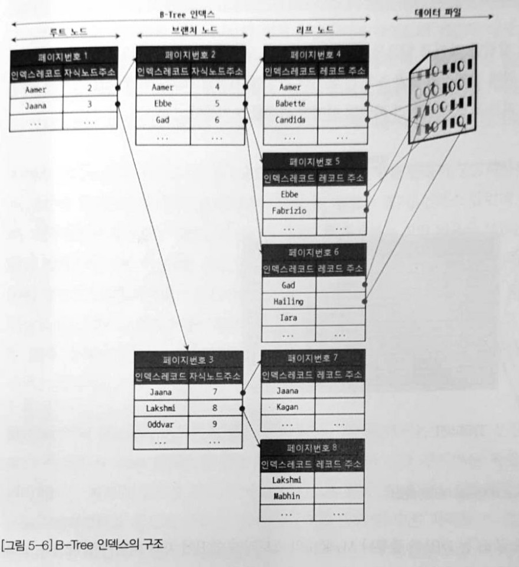
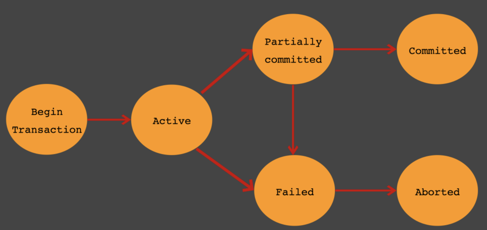
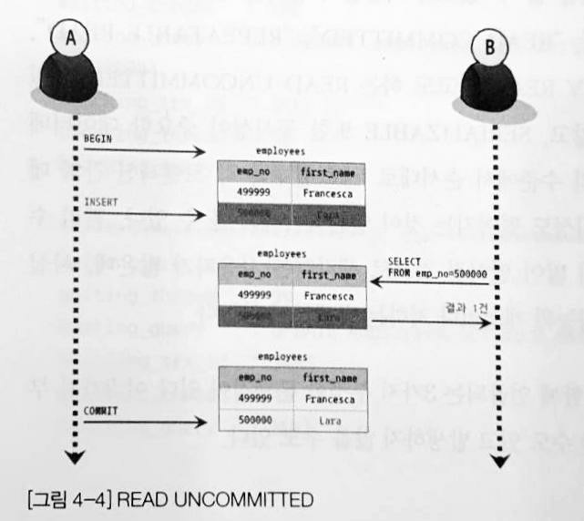
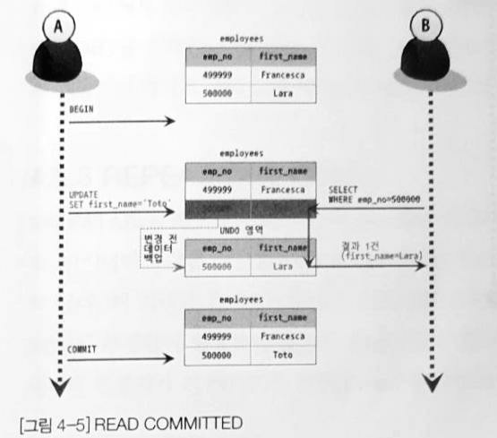
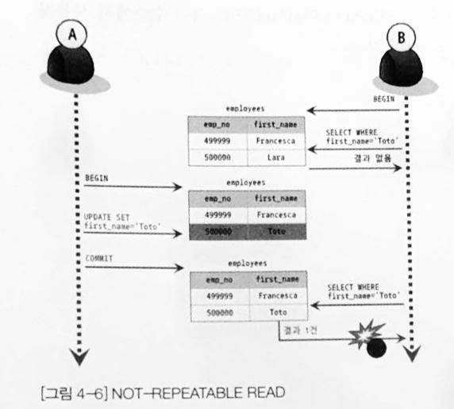
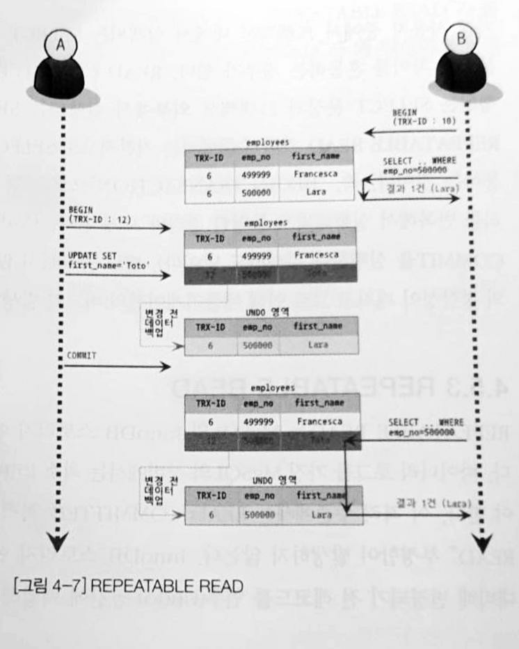
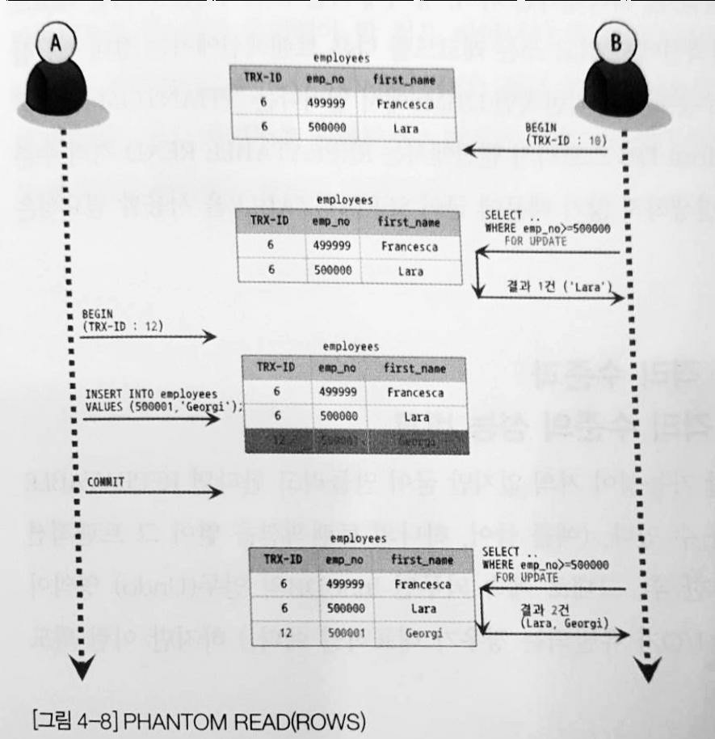

# 데이터베이스 관련 질문

## 목차
- [Q. 스토리지 엔진에 대해 설명하시오.](#q-스토리지-엔진에-대해-설명하시오)
- [Q. 인덱스(Index)에 대해 설명하시오.](#q-인덱스index에-대해-설명하시오)
- [Q. 트랜잭션(Transaction)에 대해 설명하시오.](#q-트랜잭션transaction에-대해-설명하시오)
- [Q. SQL Injection에 대해 설명하시오.](#q-sql-injection에-대해-설명하시오)
- [Q. NoSQL에 대해 설명하시오.](#-q-nosql에-대해-설명하시오)

- [Reference](#reference)

## Q. 스토리지 엔진에 대해 설명하시오.
스토리지 엔진은 실제 디스크에서 읽기/쓰기 작업을 수행하는 역할을 말합니다. MySQL을 예로 들면 대표적인 스토리지 엔진은 MyISAM과 InnoDB 두 가지가 있습니다. MyISAM보다 InnoDB가 더 최근에 나온 스토리지 엔진이며, 모든 부분이 성능적으로 뛰어나기 때문에 대부분 이를 사용합니다.

### InnoDB
InnoDB의 특징은 다음과 같습니다.

#### 1. 프라이머리 키에 의한 클러스터링
InnoDB의 모든 테이블은 기본적으로 프라이머리 키를 기준으로 클러스터링되어 저장됩니다. 이는 프라이머리 키 값의 순서대로 디스크에 저장된다는 의미이며, 그 결과 프라이머리 키에 의한 레인지 스캔은 상당히 빨리 처리될 수 있습니다.

#### 2. 잠금이 필요 없는 일관된 읽기(Non-locking consistent read)
InnoDB 스토리지 엔진은 MVCC(Multi Version Concurrency Control)라는 기술을 이용해 락을 걸지 않고 읽기 작업을 수행합니다.

#### 3. 외래 키 지원
외래 키에 대한 지원은 InnoDB 스토리지 엔진 레벨에서 지원하는 기능으로 MyISAM이나 MEMORY 테이블에서는 사용할 수 없습니다.

#### 4. 자동 데드락 감지
InnoDB는 그래프 기반의 데드락 체크 방식을 사용하기 때문에 데드락이 발생함과 동시에 바로 감지되고, 감지된 데드락은 관련 트랜잭션 중에서 ROLLBACK이 가장 용이한 트랜잭션을 자동으로 강제 종료합니다.
- ROLLBACK이 가장 용이한 트랜잭션 = ROLLBACK 했을 때 복구 작업이 가장 작은 트랜잭션 = 레코드를 가장 적게 변경한 트랜잭션

#### 5. 자동화된 장애 복구
InnoDB에는 손실이나 장애로부터 데이터를 보호하기 위한 여러 가지 메커니즘이 탑재돼 있다.

### Undo 로그
언두 로그 영역은 UPDATE나 DELETE와 같은 문장으로 데이터를 변경했을 때 변경되기 전의 데이터를 보관하는 곳입니다. 이 로그는 두 가지 역할을 수행합니다.
- 트랜잭션이 rollback할 때 언두 로그 데이터를 사용합니다.
- 트랜잭션의 격리 수준을 유지하면서 높은 동시성을 제공합니다.
    - 언두 로그를 이용해 MVCC 기술을 사용하며 이 기술을 통해 잠금이 필요없는 읽기가 가능하도록 동시성을 높였습니다.

## Q. 인덱스(Index)에 대해 설명하시오.
인덱스를 비유적으로 표현하면 책의 제일 끝에 있는 "찾아보기"(또는 색인)로 볼 수 있습니다. 찾아보기는 책의 내용과 이에 해당하는 페이지 번호의 쌍으로 되어 있는데, 인덱스 역시 책의 내용은 데이터 파일로, 페이지 번호는 해당 레코드가 저장된 주소로 해서 키와 값의 쌍으로 저장해둡니다.
- 찾아보기: ("사과", 100p)
- 인덱스: ('사과', 6)

그리고 찾아보기에서 내용을 빨리 찾을 수 있는 이유는 'ㄱ','ㄴ',...순으로 정렬되어 있기 때문입니다. 인덱스 역시 칼럼의 값을 주어진 순서로 정렬하여 보관합니다.

인덱스가 정렬을 보장하기 때문에 데이터를 변경할 때는 내부의 데이터가 다시 정렬을 해야 해서 비용이 큽니다. 하지만 정렬이 되어있기 때문에 원하는 값을 빠르게 찾을 수 있습니다.

인덱스의 대표적인 알고리즘은 B-Tree 인덱스, Hash 인덱스 두가지가 있습니다.

### B-Tree 인덱스
B-Tree의 B는 "Balanced"를 의미하며 균형잡힌 트리입니다. 이 알고리즘은 가장 많이 사용되고 오래되어 안정적입니다. 그리고 칼럼 값을 변경하지 않고 인덱스 내에 항상 정렬된 상태를 유지합니다. DBMS에서는 일반적으로 B+-Tree 또는 B*-Tree를 사용합니다.

B-Tree의 정렬은 왼쪽 값을 기준으로 하기 때문에 몇가지 주의해야할 점이 있습니다.
- `LIKE '%??'` 경우 인덱스가 적용되지 않습니다.
- 다중 컬럼의 인덱스인 경우에도 왼쪽 값부터 정렬되므로 쿼리에 왼쪽 값에 대한 조건이 없으면 비효율적으로 동작할 수 있습니다.

B-Tree 알고리즘의 구조는 다음과 같습니다.

- **루트 노드**: 최상위 노드
- **브랜치 노드**: 중간 노드
- **리프 노드**: 가장 하위에 있는 노드, 실제 데이터 레코드의 주소 값 저장

위 그림과 같이 인덱스의 리프노드에서 실제 데이터를 읽는 I/O가 발생하는데, 이는 랜덤 I/O입니다. I/O는 순차 I/O와 랜덤 I/O로 나뉘는데, 디스크의 특성상 원판을 움직이는 횟수가 적은 순차 I/O가 더 효율적입니다. 테이블 풀 스캔은 순차 I/O를 사용하고, 인덱스 레인지 스캔은 위처럼 랜덤 I/O를 사용합니다.

인덱스가 데이터를 읽을 때 순차보다 느린 랜덤 I/O를 사용하기 때문에 DBMS(MySQL) 옵티마이저는 인덱스를 사용하는 것이 사용하지 않을 때보다 4~5배 느리다고 판단합니다. 따라서 전체 레코드의 20~25%보다 많은 양을 읽을 때는 인덱스를 사용하지 않는 것이 더 효율적입니다. 이는 옵티마이저가 알아서 판단하여 적용하는 것으로 알고 있습니다.

### Hash 인덱스
해시 인덱스는 B-Tree 인덱스와 달리 칼럼값을 해시화하기 때문에 변경이 일어납니다. 그래서 동등 비교 검색에는 빠르지만, 범위 검색이나 정렬된 결과를 가져오지는 못합니다. 그래서 일반적인 DBMS에서는 잘 사용하지 않고, 메모리 기반의 데이터베이스에서 주로 사용합니다.

### 클러스터링 인덱스
DB 엔진에 따라 클러스터링 기능을 사용할 수 있습니다. 대표적인 MySQL의 InnoDB 스토리지 엔진은 기본적으로 클러스터링으로 동작합니다.

클러스터링은 비슷한 집단끼리 모아놓은 것을 말하며, 클러스터링 인덱스는 값이 비슷한 것들을 묶어서 저장하는 형태를 말합니다. 클러스터링은 테이블을 저장하는 방식이기도 해서 클러스터링 테이블이라고도 불립니다.

InnoDB에서 테이블을 저장할 때는 기본적으로 프라이머리 키를 중심으로 클러스터링 하여 저장합니다. 만약 프라이머리 키값이 변경되면 물리적인 위치를 변경시켜 다시 재정렬해야해서 비용이 큽니다. 하지만 프라이머리키로 검색할 때는 매우 빠른 성능을 보입니다.

InnoDB에 프라이머리 키가 없다면 다음과 같은 순서로 동작합니다.
1. 프라이머리 키가 있으면 기본적으로 프라이머리 키를 클러스터 키로 선택
2. NOT NULL 옵션의 유니크 인덱스 중 첫 번째 인덱스를 클러스터 키로 선택
3. 자동으로 유니크한 값을 가지도록 증자하는 칼럼을 내부적으로 추가한 후, 클러스터 키 선택 (이는 외부에 공개하지 않으므로 개발자가 사용할 수 없어 비효율적입니다.)

### 인덱스 설정시 주의사항
B-Tree 기준으로 인덱스를 설정할 때는 선택도 또는 기수성을 봐야합니다. 이는 인덱스로 선택된 키 값이 얼마나 유니크한지를 나타냅니다.

인덱스 키값 중 중복이 많을수록 기수성이 낮아지고 선택도가 떨어집니다. 이는 검색대상이 많아진다는 의미이므로 인덱스로서 효율이 낮아집니다.

프라이머리 키는 인덱스로서 가장 효율적입니다. 그리고 InnoDB와 같은 클러스터링 인덱스를 사용한다면 더욱 효율적으로 사용할 수 있을 것입니다. 그래서 대부분 테이블을 만들 때 정수형 Auto-Increment로 프라이머리 키를 설정하며, 이를 기본적으로 인덱스로 설정합니다.

## Q. 트랜잭션(Transaction)에 대해 설명하시오.
트랜잭션은 논리적인 작업의 완정성을 보장해주는 것으로, 작업을 모두 완벽하게 처리하거나 처리하지 못하는 경우 원 상태로 복구하여 작업의 일부만 적용되는 현상을 막아주는 기능입니다.

트랜잭션은 동시성을 제어하기도 하지만 중요한 것은 데이터의 정합성을 보장하는 것입니다. 이러한 이유가 잠금(Lock)과의 차이이기도 합니다.

### 트랜잭션의 특징(ACID)
- **Atomicity(원자성)**: 트랜잭션의 모든 연산은 정상적으로 수행 완료하거나 전혀 어떠한 연산도 수행되지 않은 상태를 보장해야 합니다.(all or nothing)
- **Consistency(일관성)**: 트랜잭션 수행 전후의 데이터베이스 상태는 각각 일관성을 보장되는 서로 다른 상태여야 합니다. 예를 들어, 기본 키, 외래 키 제약과 같은 명시적인 무결성 제약뿐 아니라, 계좌 입출금 상황에서 두 계좌의 금액 합은 동일해야한다와 같은 비명시적인 일관성 조건이 있습니다.있다.
- **Isolation(독립성)**: 여러 트랜잭션이 동시에 수행되더라도 각각의 트랜잭션은 다른 트랜잭션의 수행에 영향을 받지 않고 독립적으로 수행되어야 합니다. 독립성이 보장되어야 트랜잭션이 원래 상태로 돌아갈 수 있습니다.
- **Durability(지속성)**: 트랜잭션이 성공적으로 완료되어 커밋되면, 해당 트랜잭션에 의한 모든 변경은 향후 어떤 소프트웨어나 하드웨어 장애가 발생해도 보존되어야 합니다.

### 트랜잭션 상태

- **Active**: 트랜잭션이 실행중인 상태
- **Partially committed**: 트랜잭션의 commit 명령어에 도착한 상태, SQL과 같은 모든 작업이 완료되고 commit만 남은 상태를 말합니다.
- **committed**: 트랜잭션 완료 상태, 트랜잭션이 정상적으로 완료된 상태를 말합니다.
- **Failed**: 트랜잭션 실패 상태, 트랜잭션 수행 중 오류가 발상해여 중단한 상태를 말합니다.
- **Aborted**: 트랜잭션 철회 상태, 트랜잭션이 비정상적으로 종료되어 rollback을 수행한 상태를 말합니다.

### 트랜잭션 격리 수준(Isolation Level)
트랜잭션의 격리 수준이란 동시에 여러 트랜잭션이 처리될 때, 특정정 트랜잭션이 다른 트랜잭션에서 변경하거나 조회하는 데이터를 볼 수 있도록 허용할지 말지를 결정하는 것입니다.

격리 수준에 따라 발생할 수 있는 부정합 문제는 3가지가 있습니다. 3가지가 모두 발생하는 것은 아니고, 격리 수준에 따라 발생여부가 다릅니다.
- **Dirty Read**: 트랜잭션 T1, T2가 수행 중일 때, T1이 데이터 A에 접근하여 B로 변경했습니다. T1이 commit 되기 전, T2가 해당 데이터에 접근하여 B를 읽었습니다. 만약 T1이 중간에 오류가 발생하여 rollback을 수행한다면 이미 B를 읽은 T2의 데이터는 데이터 정합성을 읽게 됩니다.
- **Non-Repeatable Read**: 트랜잭션 T1, T2가 수행 중일 때, T1이 데이터 A를 여러 번 읽은 과정이 있다고 가정합니다. T1이 A를 다 읽기 전에 T2가 데이터 A에 접근하여 이 데이터를 B로 변경하거나 삭제한 후 commit을 하면 T1은 변경된 데이터 또는 삭제된 데이터를 읽게 됩니다.
- **Phantom Read**: 트랜잭션 T1, T2가 수행 중일 때, T1이 한 조건으로 여러 번 검색하는 과정이 있다고 가정합니다. T1의 검색 중간에 T2가 해당 조건의 데이터를 일부 추가 및 삭제를 하면 T1은 의도하지 않은 데이터를 읽게 됩니다. 만약 T2가 오류가 발생하여 rollback이 된다면 T1의 데이터는 꼬이게 됩니다.

트랜잭션 격리 수준의 종류는 4가지가 존재하며, 뒤로 갈수록 트랜잭션 간의 격리 정도가 높아지며, 동시성이 떨어집니다.

#### READ UNCOMMITTED
READ UNCOMMITTED는 RDBMS 표준에서 트랜잭션의 격리 수준으로 인정하지 않을 정도로 데이터 정합성에 문제가 많습니다. 

이 격리 수준에서는 **Dirty read**가 발생하는데, 이는 트랜잭션에서 처리한 작업이 완료되지 않았는데도 다른 트랜잭션에서 볼 수 있는 경우를 말합니다.

위 그림과 같이 트랜잭션 A, B가 수행 중일 때, A가 "Lara"라는 새로운 직원을 추가합니다. A가 commit되기 전, B가 직원 "Lara"를 SELECT 하면 정상적으로 결과를 가지고 옵니다. 만약 A가 B의 SELECT 작업 후 오류가 발생해 rollback이 발생하면 데이터에 문제가 발생합니다.

#### READ COMMITTED
READ COMMITTED는 오라클 DBMS에서 기본적으로 사용되는 격리 수준이며, 온라인 서비스에서 가장 많이 선택되는 격리 수준입니다. 

이 격리 수준에서는 어떤 트랜잭션에서 변경한 내용이 **commit되기 전까지는 다른 트랜잭션에서 해당 변경 내역을 조회할 수 없습니다.** 따라서 Dirty read는 발생하지 않습니다.

위 그림에서 트랜잭션 B는 트랜잭션 A가 직원의 `first_name`을 "Lara"에서 "Toto"로 UPDATE하는 작업이 commit되기 전에 이를 조회합니다. 하지만 READ COMMITTED 격리 수준에서는 commit되기 전의 변경 사항은 읽을 수 없으므로 언두 영역에 있는 "Lara"를 읽게 됩니다.(트랜잭션 수행 중 모든 변경사항은 언두 영역에 저장됩니다.)

하지만 이 격리 수준에서는 **NON-REPEATABLE READ**라는 부정합 문제가 발생합니다.

트랜잭션 B가 작업 내에 여러 번 직원의 `first_name`이 "Toto"인 것을 SELECT한다고 했을 때, 중간에 위 그림과 같이 변경사항이 commit된다면 이전 SELECT문과 다른 결과를 초래합니다.

#### REPEATABLE READ
REPEATABLE READ는 MySQL의 InnoDB 스토리지 엔진에서 기본적으로 사용되는 격리 수준입니다.

이 격리 수준에서는 NON-REPEATABLE READ 부정합 문제가 발생하지 않습니다. 둘 다 commit되기 전이라면 언두 영역의 데이터를 읽는 것은 동일하지만 REPEATABLE READ 격리 수준은 이에 더해 언두 영역에서 해당 트랜잭션 이후에 변경된 내용은 읽지 않습니다.

위 그림에서 처럼 트랜잭션 B는 ID가 10이고, 그 이후의 트랜잭션인 A는 ID가 12입니다. 따라서 A의 변경은 B에 영향을 주지 않습니다.

하지만 이 격리 수준에서는 **PHANTOM READ** 정합성 문제가 발생합니다.(InnoDB에서는 발생하지 않는다고 합니다.) 이는 한 트랜잭션 안에서 일정 범위의 레코드를 두 번 이상 읽을 때, 첫 번째 쿼리에서 없던 레코드가 두 번째 쿼리에서 나타나는 현상을 말합니다.

#### SERIALIZABLE
SERIALIZABLE 격리 수준은 읽기 작업까지 잠금을 하면서 다른 트랜잭션이 절대 접근할 수 없도록 막는다. 이는 동시 처리 능력이 매우 떨어지므로, 성능적으로 효율이 좋지 않다.

|  | DIRTY READ | NON-REPEATABLE READ | PHANTOM READ |
|:----------------:|:-------------:|:-------------------:|:-------------------:|
| READ UNCOMMITTED | 발생 | 발생 | 발생 |
| READ COMMITTED | 발생하지 않음 | 발생 | 발생 |
| REPEATABLE READ | 발생하지 않음 | 발생하지 않음 | 발생(InnoDB 발생 X) |
| SERIALIZABLE | 발생하지 않음 | 발생하지 않음 | 발생하지 않음 |

### 트랜잭션 사용시 주의할 점
트랜잭션의 길이는 최대한 짧게 하는 것이 좋습니다. 왜냐하면 트랜잭션 수행 중 모든 변경사항은 언두 영역에 저장되는데, 이 크기가 커질수록 성능에 악영향을 미치기 때문입니다.

## Q. SQL Injection에 대해 설명하시오.
SQL Injection은 보안상 취약점을 이용하여 임의의 SQL문을 주입하여 악의적으로 데이터베이스가 비정상적으로 동작하도록 만드는 행위입니다. 대표적으로 `Statement` 구문과 같이 다이나믹 SQL을 사용하는 시스템에 임의의 SQL문을 덧붙여 주입하는 사례가 있습니다. 이는 `PreparedStatement` 구문을 사용하는 것으로 간단히 해결할 수 있습니다. `PreparedStatement`는 쿼리를 수행하기 전에 미리 컴파일을 하기 때문에 덧붙인 부분은 단순히 문자열로 인식하여 무시하거나 에러가 발생합니다.

## Q. NoSQL에 대해 설명하시오.
NoSQL은 특정 데이터 모델에 따라 그 목적에 맞게 구축되는 유연한 스키마를 갖추고 있습니다. 즉, 기존의 관계형 데이터베이스에서는 하지 못했던 여러 기능을 추가하여 데이터에 맞게 효율적으로 사용하는 것을 말합니다.

## Reference
- RealMySQL(이성욱 지음, 위키북스)[책]
