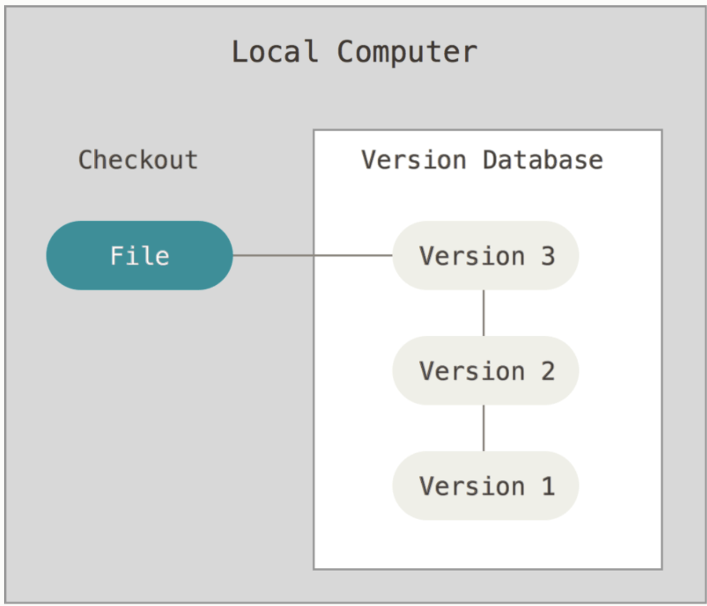
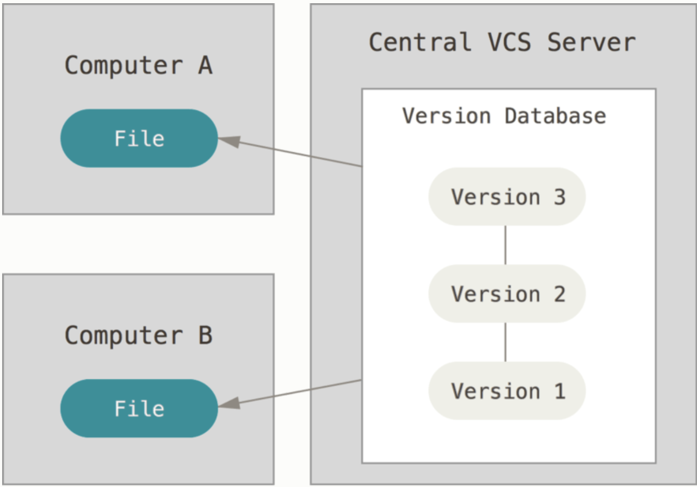
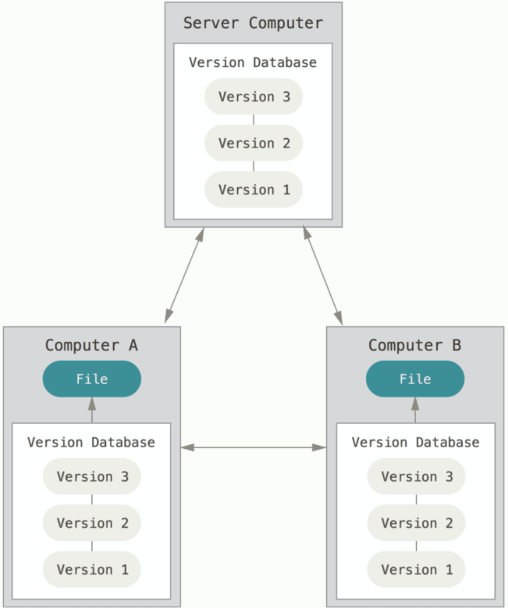
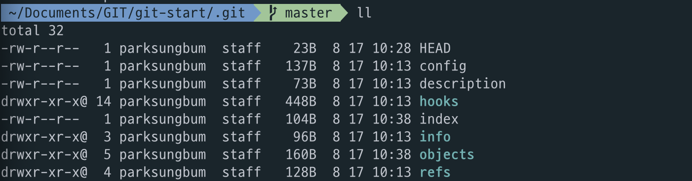

# Git
## Git이란?
Git은 **VCS**(Version Control System) 중 하나이며 그 중에서도 **Distribted VCS**에 속한다.

### Version Control System(VCS)
VCS는 문서나 설계도, 소스 코드 등의 **변경점**(버전)을 관리해주는 소프트웨어를 말한다.

#### VCS를 사용하는 이유
VCS는 **버전 관리를 빠르고 편하게 하기 위함**이다. 버전 관리는 프로젝트 크기가 클수록 협업하는 사람이 많을수록 중요하다. 버전 관리는 기본적으로 과거 이력을 저장하고 추적할 수 있다. 이를 통해 코드 이해, 버그 분석을 할 수 있다. 또한 언제든지 과거의 코드로 돌아갈 수 있기 때문에 코드를 변경하는데 부담을 줄일 수 있다.

VCS는 버전 관리를 용이하게 해준다. 과거 이력들을 저장하고 확인하고 빠르게 되돌아갈 수도 있다. 브랜치와 같은 기술로 코드를 분기하고 병합도 가능하다. 현재에는 이슈, PR과 같은 외부 소프트웨어와 잘 연동되어 더욱 코드 관리를 쉽게 하여 협업하는데 많은 도움을 준다.

### VCS 종류
#### Local VCS



Local VCS는 한 컴퓨터 내부에서 버전 관리를 하는 것이다. 따라서 해당 컴퓨터의 데이터가 손실되면 복구할 방법이 없다. 그리고 다른 개발자와 협업할 수가 없다.

#### Centralized VCS(CVCS)



CVCS는 모든 파일과 변경 기록(버전 관리)를 중앙 서버에서 수행하는 것이다. 이를 사용할 클라이언트는 중앙 서버에서 파일을 받아온 후 개발을 한다. 그리고 변경사항을 다시 중앙 서버에 반영해야 한다.

CVCS의 단점은 중앙 서버에서 장애가 발생하면 버전 관리를 할 수 없다. 만약 데이터가 손실된다면 복구할 수 없는 경우가 발생할 수 있다. 그리고 중앙서버의 코드는 공유자원이므로 race condition이 발생한다. 따라서 충돌이 많이 발생할 수 있고, 반영하는데 있어 많은 비용이 발생할 수 있다.

CVCS의 대표적인 소프트웨어는 SubVersion이 있다.

#### Distribted VCS(DVCS)



CVCS의 단점을 보완하기 위해 나온 것이 DVCS이다. DVCS 역시 CVCS와 같이 버전 관리를 하는 중앙 서버가 존재한다. 하지만 버전 관리를 중앙 서버에서만 하는 것이 아닌 이를 사용하는 클라이언트들 모두가 버전 관리를 할 수 있다. 따라서 CVCS의 문제점처럼 중앙 서버에 문제가 생겨도 언제든지 클라이언트의 정보로 복구할 수가 있다. 또한 로컬에서 모든 버전 관리가 가능하므로 부담없이 작업할 수 있다.(최종적으로 서버에 올릴 때만 신경써주면 된다.)

다시 Git으로 돌아가자.

Git은 대표적인 DVCS이다. Git은 리눅스를 만든 리누스 토발즈가 리눅스 개발 과정에서 무료 오픈소스 리눅스를 개발하는 과정에서 유료 버전의 VCS를 쓴다는 것이 논란이 되어 자신이 직접 개발하였다.

Git은 현재 가장 높은 점유율을 갖는 DVCS로 빠른 속도, 단순한 구조, 분산을 통해 수 많은 브랜치를 동시에 개발가능하다. 하지만 다른 VCS에 비해 어렵고 대용량을 다루기가 힘들다. 이 부분은 지속적으로 발전하면서 문제를 해결하고 있다.

Git은 발전해오면서 점점 더 복잡해졌다. 개발하는 것도 복잡한데, 버전 관리까지 복잡한 Git을 쓴다는 게 이해하지 못할 수도 있다. 짧은 경험으로 느낀 점을 말해보면 복잡한 프로젝트가 버전관리가 엉망일수록 그 복잡도는 산처럼 커진다. 프로젝트의 복잡도가 100이라고 하고, Git이 20이라고 하자. 이러면 단순히 복잡도가 120으로 더 커지는 것처럼 보이지만, Git이 주는 이점을 계산하지 않았다. Git은 20보다 훨씬 큰 이점을 제공한다. 이는 능숙하게 사용할수록 이점은 더 커진다고 생각한다. Git은 이론으로 공부하는 것이 아니다.(물론 알고는 있어야 한다고 생각함...그래서 정리하는 것이기도 하고) 지속적으로 사용해보고 많은 상황을 경험해봐야 한다.

## Git 뜯어보기

### git init
해당 디렉토리에서 git을 시작하려면 `git init` 명령어를 사용한다.

```
git init
```

위 명령어를 사용하면 하위 디렉토리로 `.git`를 만든다. `.git` 디렉토리 내부에는 다음과 같은 파일 및 디렉토리가 있다.


- `HEAD`: 현재 가리키기고 있는 브랜치가 저장되어 있다.

```
ref: refs/heads/master
```

- `config`
- `description`
- `/hooks`
- `/info`
- `/objects`: git에서 추적하고 있는 파일 정보가 저장되어 있다.
- `/refs`: 생성된 브랜치의 정보가 저장되어 있다.

git init 상태에서는 아무 파일도 추적하고 있지 않아 브랜치에 대한 정보나 파일 정보가 아무것도 없다.

### git add
git에서 추적할 파일을 추가해보자.

a라는 내용을 가진 f1.txt를 생성한다.

```
echo "a" > f1.txt
```

f1.txt를 git이 추적하도록 추가한다.

```
git add f1.txt
```

`git add`를 하면 git은 add한 파일을 추적하기 위해 이 정보를 index 파일에 저장한다. 최초의 `git add`를 수행하면 위에서 `git init`한 디렉토리 상태에서 index 파일이 다음과 같이 추가된 것을 볼 수 있다.



```
.git/objects
├── 78
│   └── 981922613b2afb6025042ff6bd878ac1994e85
├── info
└── pack
```


## 자주 쓰는 Git 명령어

## Git Flow

## 참고자료
- [ProGit-한국어](https://git-scm.com/book/ko/v2)
- [생활코딩-GIT](https://opentutorials.org/course/3838)