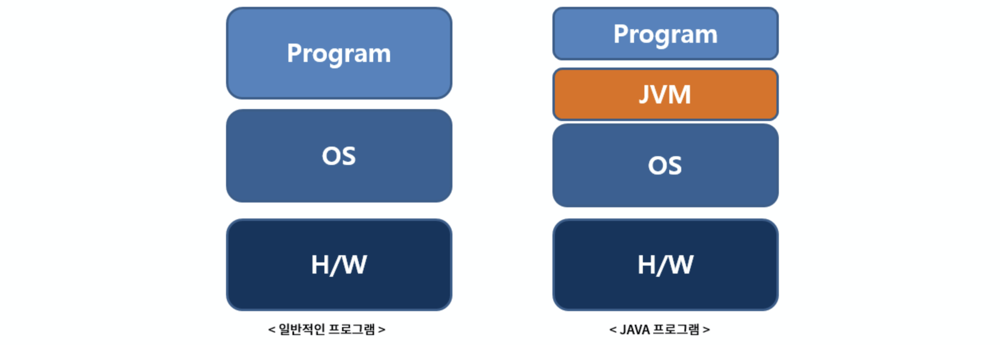
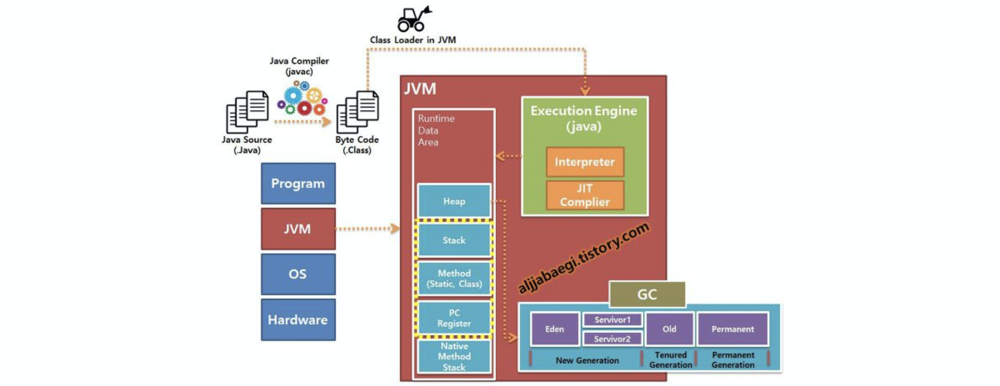
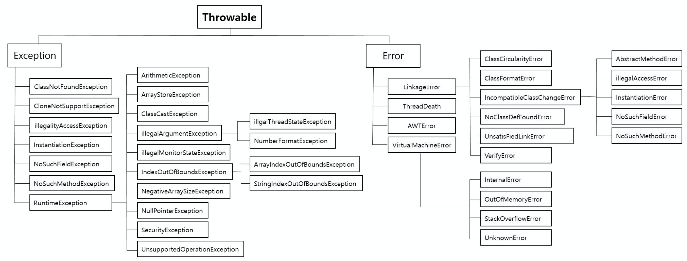
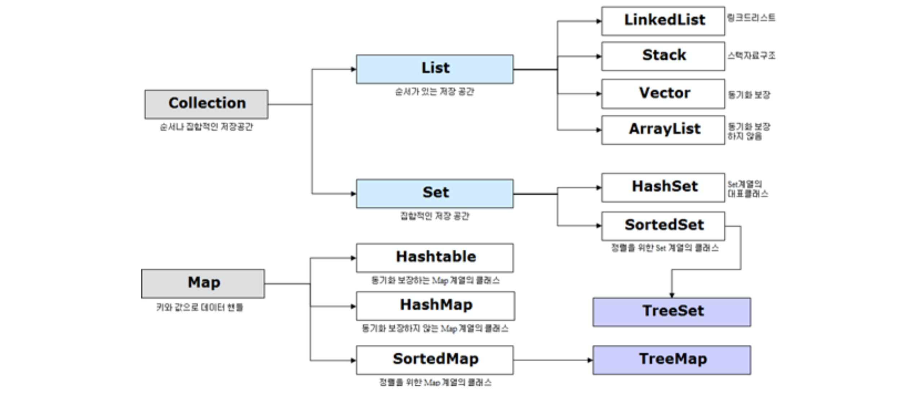

# 자바 관련 질문
## 목차

- [Q. Java](#q-java)
- [Q. `final` 키워드](#q-final-키워드)
- [Q. Error와 Exception](#q-error와-exception)
- [Q. 문자열 클래스](#q-문자열-클래스)
- [Q. Java8](#q-java8)
- [Q. Collection](#q-collection)
- [Q. 추상 클래스(abstract class)와 인터페이스(interface)](#q-추상-클래스abstract-class와-인터페이스interface)
- [Q. Generic(제네릭)](#q-generic제네릭)
- [Q. 롬복(Lombok)이 생성하는 메서드가 만들어지는 시점](#q-롬복lombok이-생성하는-메서드가-만들어지는-시점)
- [Q. JUnit의 생명주기에 설명하시오.](#q-junit의-생명주기에-설명하시오)

## Q. Java
자바는 Sun Microsystems에서 제임슨 고슬링과 연구원들이 만든 객체 지향 프로그래밍 언어로 1995년에 출시되었습니다.


출처: <https://steady-snail.tistory.com/67>

위 그림과 같이 자바 언어가 다른 언어와 다른 특징은 JVM(Java Virtual Machine, 자바 가상 머신)위에서 동작한다는 것입니다.

자바 언어는 자바 컴파일러에 의해 바이트 코드라는 특수한 바이너리 형태로 변환되고, JVM이 이를 실행시켜주는 형식으로 동작합니다. 따라서 자바 언어(정확히 말하면 컴파일로 변환된 바이트 코드)는 JVM이 설치된 환경이라면 어떤 플랫폼에 상관없이 동작하며, 이를 플랫폼 독립적이라고 합니다. 하지만 JVM은 OS에 따라 그에 호환되는 버전을 설치해야합니다.

### 자바 특징
- 객체지향 언어입니다.
- JVM이 설치되어 있는 환경이라면 어느 플랫폼이든 관계없이 동작합니다.(플랫폼 독립)
- JVM 내부의 GC(Garbage Collector)에 의해 메모리가 자동으로 관리됩니다.
- 자바 내부에서 스레드 생성 및 제어 API를 제공하므로, OS에 관계없이 스레드를 쉽게 사용할 수 있습니다.
- 동적 로딩을 지원하여 클래스가 필요한 순간에 메모리에 적재됩니다. 이는 변경이 발생해도 비교적 적은 비용으로 처리할 수 있습니다.
- TCP/IP 라이브러리, HTTP 프로토콜을 기본적으로 내장되어 있어 분산환경을 지원합니다.

### 자바 프로그램
- **Servlet(서블릿)**: 서블릿은 웹 환경에서 클라이언트의 요청을 받아 이를 처리하여 응답하는 과정에 대한 규칙 또는 인터페이스를 말합니다. 이는 기존 웹 서버에서 동적인 처리를 담당했던 CGI를 개선하여 자바 언어로 만든 것입니다.
- **JSP(Java Server Page)**: JSP는 HTML에 자바 코드가 포함되어 있는 형태로 동적인 웹 페이지를 만들기 위함입니다. 이전의 서블릿은 자바 코드안에 HTML이 있어 HTML이 변경될 때마다 재컴파일되어야 하는 단점이 있었는데, JSP는 이를 해결했습니다. JSP 내부의 자바 코드는 서버에서 실행한 후 클라이언트에게 전달합니다. 일반적으로 서블릿은 웹 요청/응답을 처리하는 Controller 역할을 수행하고, JSP는 응답 결과인 View 페이지 역할을 합니다.
- **Bean(빈)**: 자바에서 클래스(객체)를 다루는 규약이나 규칙으로 bean이라는 단어를 많이 사용합니다. (아마 자바가 커피라서 그런 것 같습니다...) 그래서 자바 객체를 나타내는 여러 용어들에 대해 살펴보겠습니다.
    - **Java Beans**: 자바 빈은 빌더 형식의 개발도구에서 가시적으로 조작이 가능하고 또한 재사용이 가능한 소프트웨어 컴포넌트라고 정의되어 있습니다. 이를 위해 몇 가지 규약을 지키고 있습니다.(JSP에서 비지니스 로직을 사용하기 위해 자바 빈을 사용했습니다.)
        - 기본 생성자를 가지고 있다.
        - 클래스의 속성은 getter/setter 메서드에 의해 접근한다.
        - 직렬화가 가능하다.(`java.io.Serializable`를 구현한다.)
    - **POJO(Plain Old Java Object)**: 오래된 방식의 자바 객체라는 뜻으로, 어떠한 기술에도 의존하지 않는 순수한 자바 객체를 의미합니다. 마틴 파울러를 중심으로 여러 개발자가 사용하기 시작한 단어입니다.
    - **Spring Bean**: 스프링 빈은 Spring Framework에서 관리되는 객체를 의미합니다. 좀 더 자세히 말하면 Spring Framework 컨테이너에서 인스턴스화되고 구성 및 관리되는 객체를 말합니다.

### 자바 실행 과정


출처: <https://aljjabaegi.tistory.com/387>

자바 언어가 수행하는 과정을 단순하게 살펴보겠습니다.
1. 자바 컴파일러는 작성된 자바 소스 파일(.java)를 컴파일하여 바이트 코드(.class)로 변환합니다.
    - 자바 바이트 코드 : JVM이 이해할 수 있는 코드로 아직 컴퓨터는 읽을 수 없는 반기계어입니다. 자바 바이트 코드의 각 명령어는 1바이트 크기의 Opcode와 추가 피연산자로 이루어져 있습니다.
2. 컴파일된 바이트 코드를 JVM의 클래스 로더에게 전달합니다.
3. 클래스 로더는 동적로딩(Dynamic Loading)을 통해 필요한 클래스들을 로딩 및 링크하여 런타임 데이터 영역(Runtime Data area), 즉 JVM의 메모리에 올립니다.
    - 로드 : 클래스 파일을 가져와서 JVM의 메모리에 로드합니다.
    - 검증 : 자바 언어 명세(Java Language Specification) 및 JVM 명세에 명시된 대로 구성되어 있는지 검사합니다.
    - 준비 : 클래스가 필요로 하는 메모리를 할당합니다. (필드, 메서드, 인터페이스 등등)
    - 분석 : 클래스의 상수 풀 내 모든 심볼릭 레퍼런스를 다이렉트 레퍼런스로 변경합니다.
    - 초기화 : 클래스 변수들을 적절한 값으로 초기화합니다. (static 필드)
4. 실행 엔진(Execution Engine)은 JVM 메모리에 올라온 바이트 코드들을 명령어 단위로 하나씩 가져와서 실행합니다. 이때, 실행엔진은 2가지 방식으로 동작할 수 있습니다.
    - 자바 인터프리터 : 바이트 코드 명령어를 하나씩 읽어서 해석하고 실행합니다. 하나하나의 실행은 빠르나, 전체적인 실행 속도가 느리다는 단점을 가집니다.
    - JIT 컴파일러(Just-In-Time Compiler) : 인터프리터의 단점을 보완하기 위해 도입된 방식으로 바이트 코드 전체를 컴파일하여 바이너리 코드로 변경하고 이후에는 해당 메서드를 더이상 인터프리팅 하지 않고, 바이너리 코드로 직접 실행하는 방식입니다. 하나씩 인터프리팅하여 실행하는 것이 아니라 바이트 코드 전체가 컴파일된 바이너리 코드를 실행하는 것이기 때문에 전체적인 실행속도는 인터프리팅 방식보다 빠릅니다.

### JVM, GC
#### 읽을거리
- <https://www.holaxprogramming.com/2017/10/09/java-jvm-performance/#JVM%EC%9D%98-%EB%8B%A4%EC%96%91%ED%95%9C-Garbage-Collector>
- <https://homoefficio.github.io/2019/01/31/Back-to-the-Essence-Java-%EC%BB%B4%ED%8C%8C%EC%9D%BC%EC%97%90%EC%84%9C-%EC%8B%A4%ED%96%89%EA%B9%8C%EC%A7%80-1/>


## Q. `final` 키워드
자바에서 final은 단 한 번만 할당할 수 있도록 제한해주는 키워드입니다. 그리고 클래스, 메서드, 변수에 선언함에 따라 각각 특징을 가지고 있습니다.
- 클래스에 선언하는 경우, 해당 클래스는 다른 클래스가 상속할 수 없습니다.
- 메서드에 선언하는 경우, 해당 메서드는 오버라이드를 할 수 없습니다.
- 변수에 선언하는 경우, 해당 변수를 불변으로 만들어줍니다.

만약 이를 시도할 경우 컴파일 에러가 발생합니다.


## Q. Error와 Exception


출처: <https://sjh836.tistory.com/122>

자바에서 예외 처리를 위한 객체의 최상위 객체는 Throwable 객체이며, Error와 Exception이 이를 상속합니다.(Throwable 객체는 Object 객체를 상속받고 있습니다.) 위는 대표적인 클래스들의 이름이며, 실제로는 훨씬 많습니다.

Error는 애플리케이션이 아닌 시스템 수준에서의 비정상적인 상황입니다. 대표적으로 stack overflow, out of memory 에러가 있으며, 이는 개발자가 조치할 수 없는 수준입니다.

Exception은 애플리케이션에서 발생하는 비정상적인 상황으로 대부분 개발자가 처리할 수 있는 영역입니다. 자바에서 Exception은 또 다시 checked exception과 unchecked exception으로 나뉩니다. (위 그림에서 RuntimeException은 Unchecked Exception을 말하며, 그 외에는 모두 Checked Exception 입니다.)

### Checked Exception과 Unchecked Exception 차이
Checked Exception은 컴파일 시간에 확인하는 예외로 반드시 try/catch나 throw로 처리해야합니다. 트랜잭션 범위 내부에서 checked exception이 발생한 경우 roll-back을 수행하지 않습니다.

Unchecked exception은 런타임 시간에 확인하는 예외로 코드상으로 처리를 하지 않아도 컴파일 에러가 발생하지 않습니다. unchecked exception이 트랜잭션 범위 내에서 발생할 시 roll-back을 수행합니다.

개발을 하며 대부분은 unchecked exception인 RuntimeException을 상속받아 사용했습니다. 왜냐하면 checked exception은 try/catch 문 또는 throw 문을 반드시 선언해줘야 하는 불편함이 있습니다. 그리고 throw문은 메서드의 시그니처를 변경하므로 reverse dependency 문제점이 발생합니다. reverse dependency는 하위 클래스에서 checked exception이 발생하여 throw문을 사용하게 되면 상위 클래스의 메서드 시그니처도 변경해야하는 문제점입니다. 

따라서 checked exception을 사용할 때는 반드시 catch하여 로직을 수행해야 하는 경우나 외부 API가 강제하는 경우 외에는 unchecked exception을 사용했습니다.


## Q. 문자열 클래스
자바는 문자열 클래스로 `String`, `StringBuilder`, `StringBuffer` 세 가지가 있습니다. 각 상황에 따라 성능 차이가 발생합니다.

### `String` 클래스
`String`은 문자열을 자정하는 객체입니다. 이 객체의 특징은 불변 객체이고 선언하는 방법에 따라 다른 메모리에 저장된다는 것입니다. `String`을 선언하는 방법은 크게 2가지가 있습니다.

```java
// 1. `new` 연산자 사용
String str1 = new String("Hello World");

// 2. 리터럴 사용("")
String str2 = "Hello World";
```

`new` 연산자는 보통 객체를 선언하는 방법입니다. 이 연산자를 사용하면 객체의 실제 데이터는 Heap 영역에 저장됩니다. 반면에 리터럴을 사용하면 **string constant pool**이라는 영역에 저장되는데, 말 그대로 불변 문자열 데이터가 저장되는 공간입니다.

string constant pool은 Java6 버전까지는 Perm 영역에 저장되었는데, 이 영역은 고정 크기이기 때문에 메모리 부족 문제점(Out Of Memory)이 있었습니다. 따라서 Java7 버전부터는 string constant pool을 Heap 영역에 저장하는 것으로 변경되었습니다. 이는 string constant pool은 GC의 대상이 되었고 메모리 부족 문제를 해결했습니다.

리터럴로 선언하면 내부적으로 `intern()` 메서드를 호출하는데, 이는 해당 문자열이 있는지 없는지 검사한 후, 없으면 spring constant pool 영역에 생성하고 있으면 기존에 존재하는 영역의 주소값을 반환합니다. 따라서 같은 문자열을 여러 번 선언한다 해도 결국 하나의 메모리에 존재하기 때문에 공간적으로 효율적입니다.(`intern()` 메서드는 명시적으로 선언하여 사용할 수 있습니다.)

출처: [Java String 의 메모리에 대한 고찰](https://medium.com/@joongwon/string-%EC%9D%98-%EB%A9%94%EB%AA%A8%EB%A6%AC%EC%97%90-%EB%8C%80%ED%95%9C-%EA%B3%A0%EC%B0%B0-57af94cbb6bc)

`String` 객체는 불변 객체이므로 다른 문자열과 더하기 연산을 할 때 기존의 객체를 지우고 새로운 객체를 할당해야하는 방식으로 비효율적으로 동작합니다. 이를 해결하기 위해 나온 객체가 `StringBuilder`와 `StringBuffer`입니다.

### `StringBuilder` VS `StringBuffer`
`StringBuilder`와 `StringBuffer` 객체 모두 변경 가능한 객체이므로 문자열 연산 시 기존 객체를 지우고 새로 할당하는 방식이 아닌 내부의 데이터를 변경하는 방식으로 동작합니다.

이 두 객체의 차이는 `StringBuilder`는 동기화 작업을 하지 않아 Thread-safe하지 않고, `StringBuffer`는 내부적으로 **synchronized** 키워드를 통해 동기화 작업을 수행하므로 Thread-safe한 객체입니다.

따라서 멀티 스레드 환경에서 서로 문자열을 공유해야 하고 데이터를 안전하게 사용하러면 `StringBuffer`를 사용해야 하고, 싱글 스레드 환경이나 여러 스레드 접근에 신경쓰지 않아도 되는 환경에서는 `StringBuilder`를 사용해야 합니다. 동기화 작업을 수행한다는 것은 내부적으로 더 많은 연산을 한다는 의미이므로 무조건 `StringBuffer`가 좋지는 않습니다.


## Q. Java8
자바8에서 추가된 기능은 대표적으로 람다식, 스트림 API, Optional 등이 있습니다. 
(그 외에 default 키워드, computable future, LocalDateTime 등이 있음.)

### 1. Lambda Expressions
람다식은 메서드로 전달할 수 있는 익명 클래스를 단순화한 것입니다. 람다식은 익명 함수이므로 이름은 없지만, 파라미터 리스트, 바디, 반환 형식, 예외 리스트는 가질 수 있습니다. 람다의 특징은 다음과 같습니다.

- **익명**: 일반 메서드와 달리 이름이 없습니다.
- **함수**: 특정 클래스에 종속되지 않으므로 함수라고 볼 수 있습니다.
- **전달**: 람다식은 메서드 인수로 전달하거나 변수로 저장할 수 있습니다.
- **간결성**: 익명 클래스처럼 많은 정형화된 형식을 구현할 필요 없습니다.

#### 1.1 람다식이 생긴 과정

아래 코드 예제를 통해 람다식이 생긴 과정을 살펴보겠습니다. 인터페이스 `ApplePredicate`는 하나의 메서드를 가진 함수형 인터페이스입니다.(함수형 인터페이스는 그 다음에 설명하겠습니다.) 이는 인터페이스이므로 구현에 따라 여러 동작을 나타낼 수 있습니다. 그리고 `filterApples()` 메서드에서 해당 인터페이스를 매개변수로 사용하고 있습니다.

```java
public interface ApplePredicate {
    boolean test(Apple apple);
}

public static List<Apple> filterApples(List<Apple> inventory, ApplePredicate p) {
    // ...
}
```

1. 인터페이스 추상화를 통한 동작 파라미터화

```java
List<Apple> heavyApples = FilteringApples.filterApples(inventory, new AppleHeavyWeightPredicate());
List<Apple> greenApples = FilteringApples.filterApples(inventory, new AppleGreenColorPredicate());
```

초기에는 단순히 구현 클래스를 만들었습니다. 구현 클래스를 재사용하지 않는다면 클래스 파일을 따로 만드는 것은 비효율적인 작업입니다.

동작 파라미터화는 메서드가 다양한 동작(전략)을 받아서 내부적으로 다양한 동작을 수행하는 것을 말합니다. 위는 인터페이스를 매개변수로 여러 구현 클래스를 통해 여러 동작을 수행하기 때문에 동작 파라미터화입니다.

2. 익명 클래스를 통한 동작 파라미터화

```java
List<Apple> heavyApples = FilteringApples.filterApples(inventory, new ApplePredicate() {
    @Override
    public boolean test(Apple apple) {
        return apple.getWeight() > 150;
    }
});
List<Apple> greenApples = FilteringApples.filterApples(inventory, new ApplePredicate() {
    @Override
    public boolean test(Apple apple) {
        return "green".equals(apple.getColor());
    }
});
```

다음은 익명 클래스를 사용하는 방법입니다. 익명 클래스는 말 그대로 이름이 없는 클래스로 클래스 선언과 인스턴스화를 동시에 할 수 있습니다. 따라서 클래스 파일을 따로 만들지 않고 즉석에서 필요한 구현을 사용할 수 있습니다. 하지만 익명 클래스는 위처럼 `@Override`와 함께 정형화된 형식이 있습니다. 이를 반복하는 것 역시 비효율적입니다.

3. 람다식을 통한 동작 파라미터화

```java
List<Apple> heavyApples = FilteringApples.filterApples(inventory, 
    (Apple apple) -> apple.getWeight() > 150);
List<Apple> greenApples = FilteringApples.filterApples(inventory,
    (Apple apple) -> "green".equals(apple.getColor()));
```

람다식은 익명 클래스를 단순화한 것입니다. 위처럼 익명 클래스의 정형화된 방식을 모두 생략했습니다. 하지만 너무 많은 생략때문에 람다식을 남발하면 오히려 가독성이 떨어진다는 평가도 있습니다.

#### 1.2 함수형 인터페이스
함수형 인터페이스는 추상 메서드가 단 한 개인 인터페이스를 말합니다. 람다식은 함수형 인터페이스의 추상 메서드의 구현을 직접 구현하여 전달할 수 있습니다. 즉, 람다 표현식 자체가 함수형 인터페이스의 구현체로 사용할 수 있습니다. 

함수형 인터페이스를 인수로 받는 메서드에만 람다식을 사용할 수 있는 이유는 언어 설계자들이 이미 자바에서 하나의 추상 메서드를 갖는 인터페이스가 익숙했고, 복잡하지 않게 사용하기 위함이라고 합니다.(자바8의 디폴트 메서드로 인터페이스에서도 구현체 메서드를 사용할 수 있지만, 디폴트 메서드를 무시하고 추상 메서드가 하나면 함수형 인터페이스입니다.)

Java8에서는 기본적으로 제공하는 함수형 인터페이스가 있습니다.

| 함수형 인터페이스 | 함수 디스크립터 | 기본형 특화 |
|---------------------|-------------------|--------------------------------------------------------------------------------------------------------------------------------------------------------------------------------------------------|
| Predicate<T> | T -> boolean | IntPredicate, LongPredicate, DoublePredicate |
| Consumer<T> | T -> void | IntConsumer, LongConsumer, DoubleConsumer |
| Function<T, R> | T -> R | IntFunction<R>, IntToDoubleFunction, IntToLongFunction,  LongFunction<R>, LongToDoubleFunction, LongToIntFunction,  DoubleFunction<R>, ToIntFunction<T>, ToDoubleFunction<T>,  ToLongFunction<T> |
| Supplier<T> | () -> T | BooleanSupplier, IntSupplier, LongSupplier,  DoubleSupplier |
| UnaryOperator<T> | T -> T | IntUnaryOperator, LongUnaryOperator, DoubleUnaryOperator |
| BinaryOperator<T> | (T, T) -> T | IntBinaryOperator, LongBinaryOperator, DoubleBinaryOperator |
| BiPredicate<L, R> | (L, R) -> boolean |  |
| BiConsumer<T, U> | (T, U) -> void | ObjIntConsumer<T>, ObjLongConsumer<T>, ObjDoubleConsumer<T> |
| BiFunction<T, U, R> | (T, U) -> R | ToIntBiFunction<T, U>, ToLongBiFunction<T, U>, ToDoubleBiFunction<T, U> |

- **함수 디스크립터**: 람다 표현식의 시그너처를 서술하는 메서드
- **기본형 특화**: 자바에서 제네릭은 모두 참조형 형식을 지원합니다. 하지만 자바에서는 기본형과 참조형 두 가지 형식이 존재하는데, 참조형을 기본형으로 바꾸는 언박싱과 기본형을 참조형으로 바꾸는 박싱 연산에 비용이 발생합니다. 이러한 비용을 없애고자 기본형을 사용할 때는 기본형 특화를 제공합니다.

람다식에서는 매개변수뿐 아니라 지역 변수와 인스턴스 변수 모두 사용할 수 있습니다. 이를 람다 캡처링이라고 하는데, 지역 변수는 람다 캡처링을 단 한 번만 하므로 `final`로 선언된 지역 변수를 사용해야 합니다.

#### 메서드 래퍼런스
메서드 래퍼런스는 람다를 축약한 형태로, 메서드 이름을 명시적으로 나타내어 가독성을 높여줍니다.

메서드 레퍼런스는 총 세 가지로 구분할 수 있습니다.
1. 정적 메서드 레퍼런스
2. 다양한 형식의 인스턴스 메서드 레퍼런스
3. 기존 객체의 인스턴스 메서드 레퍼런스


### 2. Stream API
스트림은 java8에서 컬렉션 데이터를 선언형으로 처리하는 API입니다. 선언형은 SQL 질의어와 같이 내부 동작이 어떻게 동작하는지 신경쓰지 않고 **무엇을 하는지를 직접적으로 표현합니다.**

스트림 API를 사용함으로써 세 가지 장점을 얻을 수 있습니다.
1. 선언형이므로 간결하고 가독성을 높일 수 있습니다.
2. `map`, `collet`와 같은 여러 API를 제공하며, 이는 결과로 스트림을 반환하기 때문에 이를 조립하며 사용할 수 있습니다.
3. 병렬을 처리해주는 기능을 제공하여 좀 더 안전하게 성능을 높일 수 있습니다.

스트림 API의 특징은 두 가지가 있습니다.
1. 파이프라이닝이 가능합니다. 스트림 연산은 스트림을 반환할 수 있기 때문에 이를 연결해서 파이프라인을 구성할 수 있습니다.
2. 기존의 for문이 외부 반복을 하는 것과는 달리 내부 반복을 수행합니다.

#### Stream API VS Collection
스트림과 컬렉션의 차이는 세 가지가 있습니다.
1. 데이터를 언제 계산하는지입니다. 컬렉션에 추가되는 데이터는 이미 모든 계산이 끝난 상태입니다. 반면에 스트림은 요청할 때 데이터를 계산하여 추가할 수 있습니다.
2. 스트림은 단 한번만 탐색할 수 있습니다. 이전의 데이터를 다시 탐색하고 싶다면 같은 데이터로 새로운 스트림을 만들어야 합니다.
3. 컬렉션은 외부 반복을 사용하고, 스트림은 내부 반복을 수행합니다.

### 3. Optional
Optional은 널의 위험성을 해결하기 위해 객체를 한 번더 캡슐화한 클래스입니다. Optional은 객체가 비어있다면 null이 아닌 Optional.empty()라는 메서드를 반환합니다. Optional을 사용함으로써 해당 객체가 없을 수 있다는 것을 명시적으로 알려줄 수 있습니다.

#### NULL때문에 발생하는 문제점
자바에서 NULL의 가장 큰 문제는 NullPointException이라고 생각합니다. 이는 NULL인 객체를 참조하려고 할 때 발생합니다. 그리고 NULL이라는 것은 값이 없음을 의미할 수도 있고, 개발자의 실수일 수 도 있습니다. 따라서 어떤 의미인지 알기 힘듭니다.

#### 4. Date Type
자바8 이전의 Date 타입은 특정 날짜로부터 오프셋을 사용하거나 쓰레드에 안전하지 않는 등의 문제점이 많았습니다. 그래서 서드파티 라이브러리를 사용했었는데, 자바8에서는 이를 해결하고자 `LocalDate`, `LocalTime`과 같은 타입을 제공하고 있습니다.


## Q. Collection
컬렉션은 데이터를 다루는 여러 자료구조에 대한 인터페이스를 만들어 데이터를 효율적으로 조작하기 위함입니다. 상위 인터페이스로는 List, Map, Set이 존재하며, 이를 상속하여 기능에 따라 여러 구현체가 존재합니다. 따라서 같은 자료구조라도 상황에 따라 어떤 구현체를 사용하는지에 따라 성능에 차이가 발생할 수 있습니다.



- **List**: 대표적인 구현체는 ArrayList와 LinkedList 두 가지가 존재합니다. ArrayList는 배열로 기존의 Vector를 개선한 것입니다. 그리고 사용자가 직접 `@Override`로 정의하여 사용할 수도 있습니다.
- **Map**: Map은 중복되지 않은 key를 기준으로 <key, value> 형태로 저장되는 자료구조입니다. 대표적인 구현체는 HashMap, HashTable이 있으며 둘 다 자료구조 해시 테이블을 기반으로 합니다. Map은 기본적으로 key의 순서를 보장하지 않는데, 이를 보장해주는 구현체 SortedMap이 존재합니다.
- **Set**: Set은 중복되지 않는 key값을 저장하는 자료구조입니다. 대표적인 구현체는 HashSet이 존재하며, 자료구조 해시 테이블 기반입니다. Set도 Map과 같이 Key 순서를 보장하지 않으며, 이를 보장해주는 SortedSet 구현체를 따로 제공합니다.

### HashMap 시간복잡도
HashMap은 해시 함수를 사용한 Map 자료구조입니다. 해시를 사용하므로 충돌이 발생할 수 있는데, 자바8 이전에는 Linked List로 관리하여 최악 시간복잡도는 O(N)이었습니다. 자바8 이후로는 Linked List가 아닌 Balanced Tree를 사용하므로 최악의 시간복잡도는 O(logN)으로 성능이 향상되었습니다.


## Q. 추상 클래스(abstract class)와 인터페이스(interface)
추상 클래스와 인터페이스는 둘 다 자바에서 다형성을 하기 위한 방법 중 하나입니다. ([다형성 참고](https://github.com/CODEMCD/technical-interview-speaking/blob/master/OOP/README.md#q-%EB%8B%A4%ED%98%95%EC%84%B1polymorphism%EC%97%90-%EB%8C%80%ED%95%B4-%EC%84%A4%EB%AA%85%ED%95%B4%EC%A3%BC%EC%84%B8%EC%9A%94)) 다형성은 간단히 하나의 대상이 여러가지 행동을 하는 것입니다. 추상 클래스와 인터페이스 모두 상속을 통해 다형성을 수행합니다.(자바에서 인터페이스는 정확히 구현이라고 말합니다.)

추상 클래스는 추상 메서드가 하나 이상 가지고 있는 클래스를 말합니다.(사실 추상 메서드가 없어도 추상 클래스로 선언할 수 있습니다.) 추상 메서드는 메서드의 구현부가 없는 메서드를 말하며, 일반적으로 `abstract` 키워드가 선언되어 있습니다. 물론 추상 클래스도 `abstract` 키워드를 가지고 있습니다. 이 추상 메서드는 해당 클래스를 상속받는 하위 클래스에서 구현해주어야 합니다. 따라서 하위 클래스가 여러 개라면 각 클래스마다 같은 메서드이지만 행동을 다르게 할 수 있습니다. 그리고 추상 메서드가 아니라도 상위 클래스를 상속하는 하위 클래스에서 `@Override`를 통해 메서드를 재정의하여 다형성을 수행할 수 있습니다.

인터페이스는 추상 메서드만 가지고 있는 클래스를 의미합니다. 자바에서는 `class`대신 `interface`라는 키워드로 선언합니다. 추상 메서드만 가지고 있으므로 이를 구현하는 클래스에서 모든 메서드를 구현해주어야 합니다. 따라서 추상 클래스보다 더 유연하게 사용할 수 있으며 이를 추상화 단계가 더 높다고 표현합니다. 인터페이스는 자신의 구현체를 가지고 있지 않기 때문에 다중 상속을 할 수 있습니다.

추상 클래스와 인터페이스 둘 다 구현부가 없는 추상 메서드를 가지고 있기 때문에 인스턴스화를 할 수 없습니다.

### 다중 상속의 문제점
일반 클래스로 다중 상속을 수행하면 두 가지 문제점이 있습니다. 예를 들어 아래와 같은 다중 상속 구조를 가지고 있다고 가정하겠습니다.


다중 상속을 받고 있는 `Liger`의 첫 번째 문제는 `Animal`객체를 두 개 가지고 있다는 것입니다. 만약 `Animal` 객체의 정보를 사용하려고 하면, `Tiger`의 부모 `Animal`과 `Lion`의 부모 `Animal` 중 무엇을 쓸 지 모르는 문제점과 같은 데이터가 두 번 할당되는 메모리 낭비 문제가 있습니다.(클래스 다중 상속이 가능한 C++에서는 `virtual` 키워드로 이 문제를 해결할 수 있지만 이 역시 비효율적인 부분이 많습니다.)

두 번째 문제는 `Tiger` 객체와 `Lion` 객체에 이름이 같은 메서드가 있으며, 이를 `Liger` 객체에서 사용하려고 하면 어느 객체의 메서드를 사용해야할 지 모호해집니다. (C++에서는 부모의 클래스를 직접 선언해주는 것으로 해결하고 있습니다.) 자바의 인터페이스는 실제 구현은 하위 클래스인 `Liger`가 구현하므로 `Tiger`와 `Lion` 중 같은 시그니처의 메서드가 있어도 관계가 없습니다.

이와 같은 문제점으로 자바에서는 클래스 다중 상속을 지원하지 않습니다.

### 추상 클래스와 인터페이스를 구분하는 이유
추상 클래스와 인터페이스는 둘 다 [상속](https://github.com/CODEMCD/technical-interview-speaking/blob/master/OOP/README.md#q-%EC%83%81%EC%86%8Dinheritance%EC%97%90-%EB%8C%80%ED%95%B4-%EC%84%A4%EB%AA%85%ED%95%B4%EC%A3%BC%EC%84%B8%EC%9A%94)을 이용하는 방법입니다. 상속은 두 가지로 나뉩니다. 상위 클래스의 타입을 상속받는 sub-typing과 코드를 물려받는 sub-classing이 있습니다.

추상 클래스는 sub-typing과 sub-classing 둘 다를 수행할 수 있습니다. 추상 클래스는 상위 클래스에서 코드가 존재하기 때문에 하위 클래스로 상속하는 것은 확장의 개념에 가깝습니다. 하지만 이 코드가 존재하기 때문에 하위 클래스에서 다형성을 깨뜨릴 위험이 큽니다. 그래서 추상 클래스의 상속이라 함은 **Is-A**관계에서만 사용하라는 제약도 이와 같은 이유로 생각됩니다. Is-A관계는 `학생은 사람이다.`, `강아지는 동물이다.`와 같이 하위 타입이 상위 타입에 완전히 속해있습니다. 이처럼 제약하는 이유는 객체지향의 SOLID 원칙중 [LSP](https://github.com/CODEMCD/technical-interview-speaking/blob/master/OOP/README.md#%EB%A6%AC%EC%8A%A4%EC%BD%94%ED%94%84-%EC%B9%98%ED%99%98-%EC%9B%90%EC%B9%99lsp-liskov-substitution-principle)를 준수하기 위함이고, 이를 지켜야 정상적인 다형성을 수행할 수 있습니다.

반면에 인터페이스는 sub-typing만 수행할 수 있습니다. 인터페이스는 내부에 변수와 구현체가 전혀없기 때문입니다.(자바8의 디폴트 메서드는 제외하겠습니다.) 따라서 추상 클래스와 같은 제약사항이 없습니다. 인터페이스는 보통 설계도, 명세와 같은 역할을 하기 때문에 추상화를 위해 여러방면으로 사용될 수 있습니다.


## Q. Generic(제네릭)
제네릭은 데이터의 타입을 일반화하는 것입니다. 일반화된 제네릭 타입을 선언하고, 사용하는 곳에서 타입을 지정할 수 있도록 합니다. 그리고 이 타입에 대해서 컴파일 시간에 타입 검사를 하여 여러 이점을 가지고 있습니다.

제네릭의 장점은 다음과 같습니다.
1. 타입 검사를 컴파일 시간에 하므로, 미리 오류를 잡는 등 안정성을 확보할 수 있습니다.
2. 타입 변환이 필요없어 번거로움을 줄여주고, 타입 변환에 대한 비용도 제거했습니다.


## Q. 롬복(Lombok)이 생성하는 메서드가 만들어지는 시점
롬복은 AnnotationProcessor을 이용하는데, 이는 컴파일 시점에 Annotation별로 코드를 생성하는 역할을 합니다. 따라서 롬복 역시 컴파일 시점에 생성됩니다.


## Q. JUnit의 생명주기에 설명하시오.
