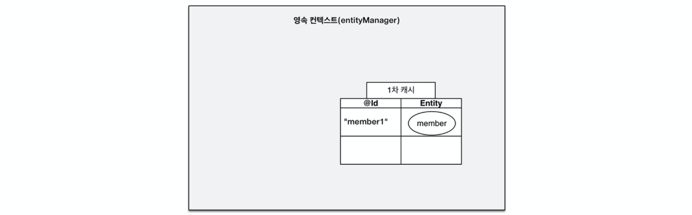
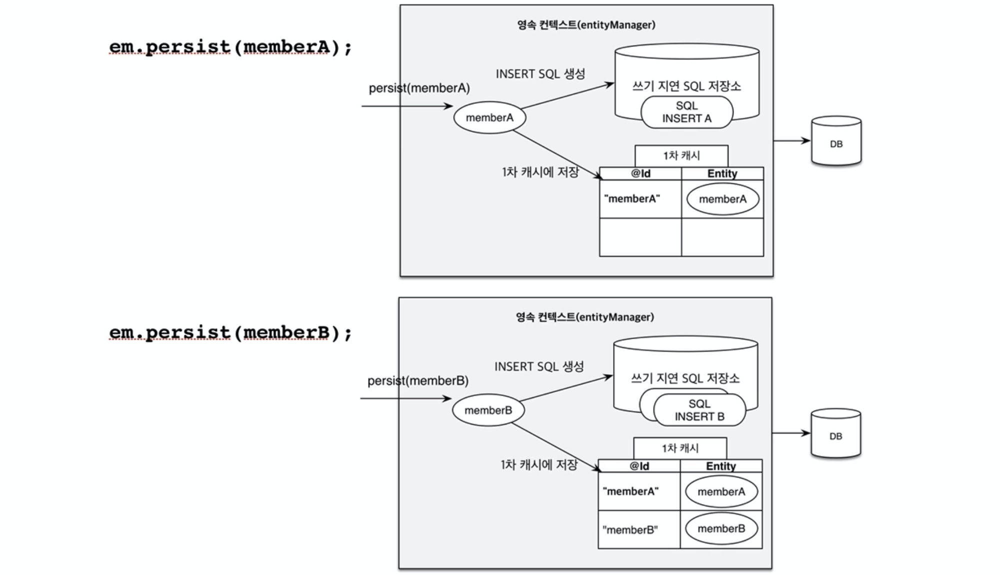
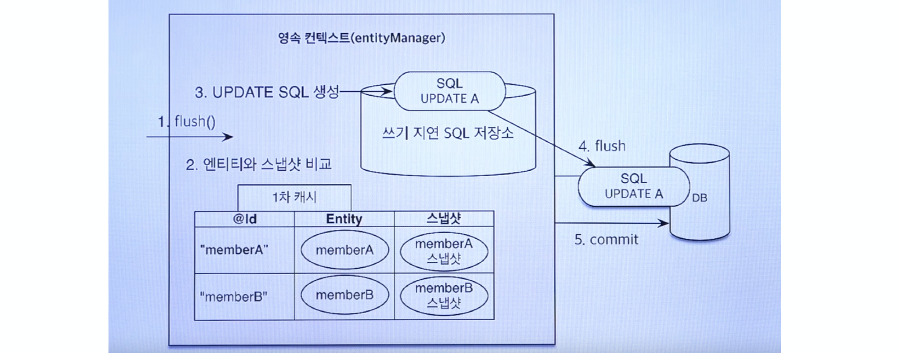

# JPA 관련 질문

## 목차
- [Q. JPA(Java Persistence API)란?](#q-jpajava-persistence-api란)
- [Q. 영속성 컨텍스트](#q-영속성-컨텍스트)


## Q. JPA(Java Persistence API)란?
자바 ORM 기술에 대한 API 명세로, Java에서 제공하는 API입니다. 주의할 점은 JPA는 라이브러리가 아니라 단순히 **ORM을 사용하기 위한 인터페이스 모음**이라는 것입니다. 따라서 JPA를 구현하는 Hibernate, EclipseLink, DataNucleus 등과 같은 ORM 프레임워크를 사용해야합니다.


출처: <https://velog.io/@adam2/JPA%EB%8A%94-%EB%8F%84%EB%8D%B0%EC%B2%B4-%EB%AD%98%EA%B9%8C-orm-%EC%98%81%EC%86%8D%EC%84%B1-hibernate-spring-data-jpa>

### ORM(Object-Relation Mapping)
ORM은 객체와 데이터베이스 테이블을 매핑해주는 기술입니다. 즉, 자바와 같은 언어에서 **객체가 데이터베이스의 테이블이 될 수 있도록 매핑** 시켜주는 것을 의미합니다. 따라서 자바 언어에 국한된 것이 아닌 여러 언어에서 사용하는 기술입니다.

ORM의 장점은 쿼리를 직접 작성하지 않고 메서드와 같은 코드를 통해 데이터베이스의 데이터를 조작할 수 있습니다. 따라서 생산성이 매우 높아집니다. 반면에 복잡한 데이터를 다루기에는 실제 쿼리보다는 성능이 안좋은 단점이 있습니다. 일반적으로 간단한 CRUD는 JPA를 사용하며, 복잡한 조회 쿼리와 같은 것은 실제로 쿼리를 작성하는 것이 좋습니다.

#### ORM VS SQL Mapper
데이터베이스를 다루는 Persistance Framework는 크게 ORM과 SQL Mapper로 나뉩니다.

ORM은 객체와 데이터베이스 테이블을 매핑하여 SQL을 직접 작성할 필요가 없습니다.

SQL Mapper는 객체와 SQL을 매핑하는 기술로 SQL은 직접 작성해야 합니다. 그리고 ORM은 객체간의 관계를 중점적으로 생각하지만, SQL Mapper는 단순히 SQL 쿼리 결과와 객체를 매핑해주는데 중점을 둡니다. SQL Mapper는 대표적으로 iBatis, MyBatis, Oracle SQLJ 등이 있습니다.

#### ORM이 나온 배경
ORM이 만들어진 계기는 크게 두 가지가 있습니다.
- 유사한 CRUD 쿼리의 단순 반복 작업
- 객체지향 프로그래밍과 관계형 데이터베이스 간의 패러다임 불일치

유사한 CRUD 쿼리의 단순 반복 작업은 말 그대로 JDBC API, SQL Mapper를 사용하면 쿼리를 직접 만들어야 합니다. 테이블이 많아질수록 이는 단순 반복 작업만 많아지고 생산성이 매우 떨어집니다.

객체지향 프로그래밍이 추구하는 것은 추상화, 캡슐화, 상속, 다형성 등을 통한 객체를 중심으로 유연한 코드를 작성하는 것입니다. 그에 반에 관계형 데이터베이스는 데이터 중심으로 테이블간의 관계(모델링)가 중심이며, 데이터의 중복을 없애는 것이 중요합니다. 소프트웨어는 사용자를 위해 유연한 코드를 작성하는 객체지향 프로그래밍이 중요하지만 데이터베이스와의 패러다임 불일치로 인해 포기해야할 부분이 많았습니다.

이를 해결하기 위해 객체지향 프로그래밍에서 상속 관계, 객체 간의 관계 등을 데이터베이스의 테이블로 매핑해주는 ORM 기술을 만들었습니다.

### JDBC
JDBC는 자바 언어로 다양한 종류의 관계형 데이터베이스에 접속하고 SQL문을 수행하여 처리하고자 할 때 사용되는 표준 SQL 인터페이스 API입니다. JDBC는 자바 표준에서 지원하는 데이터베이스 접속 방법이므로 ORM, SQL Mapper 등 어떤 Persistance Framework 든지 상관없이 **데이터베이스에 접근하기 위해서는 내부적으로 JDBC API를 사용**해야 합니다.


출처: <https://velog.io/@adam2/JPA%EB%8A%94-%EB%8F%84%EB%8D%B0%EC%B2%B4-%EB%AD%98%EA%B9%8C-orm-%EC%98%81%EC%86%8D%EC%84%B1-hibernate-spring-data-jpa>

### Spring Data JPA
Spring Data JPA는 Spring에서 제공하는 모듈 중 하나로, 개발자가 좀 더 JPA를 쉽고 편하게 사용하기 위해 만들어진 것입니다. 이는 **JPA를 한 단계 추상화한 Repository라는 인터페이스를 제공하는 함으로써 이루어집니다.** 개발자는 `Repository` 인터페이스를 구현하여 규칙에 따라 필요한 메서드를 구현하면 Spring에서 해당 메서드에 필요한 Bean을 등록하여 JPA가 동작하도록 합니다.


출처: <https://suhwan.dev/2019/02/24/jpa-vs-hibernate-vs-spring-data-jpa/>

Spring Data JPA를 사용하기 때문에 기존 JPA에서 사용하는 `EntityManager`를 구현할 필요가 없어졌습니다.(`Repository` 내부에 구현되어 있습니다.) 그리고 또 하나의 장점은 Spring Framework의 모듈이므로 쉽게 다른 저장소 모듈로 쉽게 교체할 수 있습니다.


## Q. 영속성 컨텍스트(Persistance Context)
영속성 컨텍스트는 JPA에서 **엔티티를 관리하는 논리적인 개념**입니다. 실제로 영속성 컨텍스트를 수행하는 것은 `EntityManager`입니다.

### Entity
엔티티는 데이터베이스 테이블과 매핑되는 객체를 말합니다.

### `EntityManagerFactory`, `EntityManager`
`EntityManagerFactory`는 말 그대로 `EntityManager`를 만들어주는 공장 역할을 합니다. 이는 쓰레드 세이프하지만 애플리케이션당 하나의 `EntityManagerFactory`만 있어야 합니다.

`EntityManager`는 엔티티를 실질적으로 관리하는 역할이며, JPA의 핵심입니다. `EntityManagerFactory`는 트랜잭션 하나당 하나의 `EntityManager`를 생성하며, 동시성을 제어하지 않으므로 `EntityManager`는 쓰레드간 공유할 수 없습니다. 이는 여러 트랜잭션이 서로간 영향을 주면 안되기 때문이기도 합니다. 따라서 쓰레드당 하나의 `EntityManager`를 생성하고, 쓰레드가 끝나면 해당 `EntityManager`도 종료됩니다.

### 영속성 컨텍스트 생명주기


- 비영속(new/transient)
    - 영속성 컨텍스트와 전혀 상관없는 상태
- 영속(managed)
    - Entity가 영속성 컨텍스트에 저장되어 관리되고 있는 상태
    - 영속성 컨텍스트에 저장되어 있다고 해서 바로 DB에 저장되지는 않음(`flush()` 명령어를 호출해야 DB에 반영됨)
- 준영속(detached)
    - Entity가 영속 상태에서 분리된 상태
- 삭제(removed)
    - Entity가 영속성 컨텍스트에서도 DB에서도 삭제된 상태

### 영속성 컨텍스트 장점
영속성 컨텍스트를 사용함으로써의 얻을 수 있는 장점을 살펴보겠습니다.

#### 1차 캐시



위 그림과 같이 영속성 컨텍스트 내부에는 1차 캐시가 존재합니다. Entity를 영속성 컨텍스트에 저장하는 순간 Entity 내부의 `@Id`로 선언된 컬럼과 해당 Entity 그 자체(Entity가 저장되어 있는 메모리 주소)를 테이블로 저장해둡니다.

Entity를 조회하는 `find()`가 호출될 때 DB가 아닌 1차 캐시를 먼저 살펴봅니다. 만약 1차 캐시에 존재하면 DB에 조회할 필요없이 바로 반환합니다. 만약 1차 캐시에 없으면 DB에 조회 후 해당 Entity를 가져온 후 반환하는데, 이 때 가져온 Entity를 1차 캐시에 저장해둡니다.

1차 캐시는 `EntityManager` 하나 당 하나가 존재합니다. 즉, **쓰레드 하나에 1차 캐시가 하나가 존재**하는 형식입니다. 따라서 다른 쓰레드에서 공유할 수 없음을 주의해야 합니다.

#### 동일성(Identity) 보장
영속성 컨텍스트는 영속된 Entity에 대해 동일성을 보장합니다. 영속성 컨텍스트는 1차 캐시를 사용하므로 같은 트랜잭션 내부에서 한 Entity를 여러 번 호출하면 같은 Entity의 주소를 반환합니다. 주소가 같다는 것은 같은 객체임을 보장할 수 있습니다.

한 트랜잭션에서 같은 Entity를 여러 번 조회했을 때 1차 캐시에서 같은 Entity를 가져오므로 이는 **트랜잭션 격리수준에서 REPEATABLE READ 수준을 보장**합니다.(DB가 아닌 애플리케이션에서 제공) 트랜잭션에서 여러 번 조회하는 중간 단계에서 만약 해당 Entity가 변경되더라도 1차 캐시에 이미 Entity가 있는 상태라면 변경사항을 반영하지 않기 때문입니다.

```java
Member a = em.find(Member.class, "Member1");
Member b = em.find(Member.class, "Member1");
​
Systen.out.println(a == b); // true
```

#### 트랜잭션을 지원하는 지연 쓰기(Transactional Write-behind)
지연 쓰기라는 것은 영속성 컨텍스트에서 영속된 Entity에 대한 SQL이 발생할 때마다 DB에 접근하는 것이 아니라 이를 모아놓고 한 번에 DB에 요청하는 것을 말합니다. 이는 DB IO수를 줄이기 위함입니다.



위 그림처럼 멤버 2명을 DB에 저장하고 싶은 경우가 있습니다. 이 두 멤버를 저장하는 로직이 한 트랜잭션 내부에서 일어난다면, 영속성 컨텍스트는 `persist()`를 요청받을 때마다 **쓰기 지연 SQL 저장소에 SQL을 저장한 후 해당 트랜잭션이 commit되는 시점에 모아둔 SQL을 보냅니다.**(설정에 따라 동시 또는 한 번에 하나씩 보냄) 쓰기 지연 SQL 저장소에는 INSERT, UPDATE, DELETE SQL이 저장되어 있습니다.

사실 SQL을 한 번에 모아서 보내는 시점은 정확히 `EntityManager.flush()`를 요청한 시점입니다. `flush()`는 DB와 싱크를 맞추는 역할을 합니다. 만약 트랜잭션에서 commit을 실행하면 영속성 컨텍스트는 자동으로 `flush()`를 수행하므로 SQL을 한 번에 보낼 수 있습니다. `flush()`는 1차 캐시를 비우지 않는 것에 주의해야 합니다.

#### 변경 감지(Dirty Checking)
변경 감지는 Entity 내용을 수정할 때 개발자가 수정 요청을 하거나 그 순간 DB에 UPDATE 쿼리를 요청하는 것이 아닌 **Entity의 내용을 단순히 변경만 하면 개발자가 신경쓸 필요 없이 영속성 컨텍스트가 내부적으로 DB에 적용하는 것을 말합니다.**



영속성 컨텍스트에서 변경 감지를 하는 방법은 사실 Entity를 1차 캐시에 저장할 때 **스냅샷**을 같이 저장합니다. 스냅샷은 현재 저장된 Entity의 내용을 말합니다. 만약 트랜잭션이 commit되어 `flush()`가 발생하게 되면 영속성 컨텍스트는 1차 캐시의 Entity와 스냅샷을 비교하여 Entity가 변경되었다면 그에 맞는 SQL을 DB에 요청합니다.

JPA에서 이와 같이 수정을 복잡하게 구현한 이유는 Java의 Collection의 동작 방식 때문입니다. Collection 역시 내부 데이터를 수정하려면 단순히 수정할 데이터를 같은 공간에 덮어쓰기만 하면 됩니다. JPA는 Java를 사용하는 만큼 이와 같은 동작으로 편의성을 높여준 것입니다.

#### Entity 삭제
영속성 컨텍스트에서 Entity를 삭제하려면 `remove()`를 호출하면 됩니다. 이 역시 트랜잭션이 commit되는 시점에 `flush()`에 의해 DELETE 쿼리를 보내 DB에서도 삭제하게 됩니다.

### `flush()`
`flush()`는 영속성 컨텍스트에서 현재 Entity등의 정보를 DB에 반영하는 작업을 수행합니다. 즉 DB와 싱크를 맞추는 작업입니다. `flush()`가 호출되면 영속성 컨텍스트 내부의 쓰기 지연 SQL 저장소에 저장되어 있는 SQL을 DB에 요청합니다. 그리고 `flush()`가 발생한다 해도 **1차 캐시 정보는 지워지지 않습니다.**

#### `flush()`가 발생하는 시점
- `EntityManager.flush()`를 직접 호출하는 경우
- 데이터베이스의 트랜잭션이 Commit 되는 경우
- JPQL 쿼리가 발생한 경우

**JPA는 기본적으로 데이터의 일관성이나 동시성 관련된 것은 데이터베이스의 트랜잭션에 위임합니다.**

### Reference
- [[JPA] 영속성 컨텍스트와 플러시 이해하기](https://ict-nroo.tistory.com/130)

