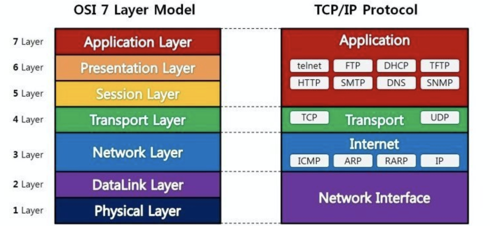
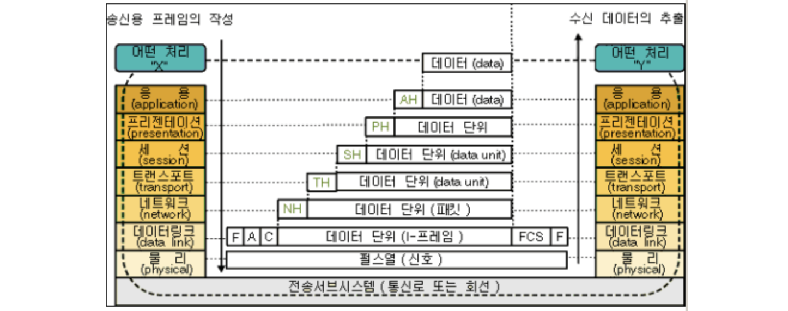

# 네트워크 관련 질문

## OSI(Open Systems Interconnection) 7 계층
OSI 7 계층은 네트워크가 통신하는 과정을 7개의 단계로 나눈 것을 말합니다. 계층을 나눈 이유는 복잡한 네트워크 과정을 쉽게 파악하고 관리하기 위함입니다.

출처: <https://shlee0882.tistory.com/110>

계층마다 기능을 실행하기 위해서는 그에 맞는 헤더 데이터가 필요합니다. 전송할 데이터는 가장 상위 계층인 애플리케이션 계층에서 만들어지며, 이를 전송하기 위해 아래 계층으로 내려가며 필요한 헤더 데이터를 추가합니다. 목적지에 도착하면 전송된 데이터를 사용할 애플리케이션으로 가기 위해 가장 하위 계층인 물리 계층부터 해당 헤더 데이터를 보고 분석한 후 제거하는 과정을 거칩니다.

출처: <http://blog.naver.com/PostView.nhn?blogId=cache798&logNo=130008997630&parentCategoryNo=&categoryNo=4&viewDate=&isShowPopularPosts=true&from=search>

### 1계층 - 물리 계층(Physical Layer)
- 전기적, 기계적 특성을 이용하여 통신 케이블로 전기적 신호를 전송합니다.
- 데이터 단위는 비트이며, 0/1 또는 on/off로 표현됩니다.
- 제어와 같은 기능없이 데이터 전달 기능만을 합니다.
- 케이블, 리피터, 허브

### 2계층 - 데이터링크 계층(DataLink Layer)
- 물리적인 연결을 바탕으로 인접한 두 장치간의 신뢰성있는 정보 전송 기능을 합니다.
- 데이터 단위는 프레임입니다.
- 목적지 장치의 **맥 주소(Mac Address)** 정보를 가지고 있고, 오류와 흐름제어 기능을 수행합니다.
- 브리지, 스위치

### 3계층 - 네트워크 계층(Network Layer)
- 데이터를 목적지까지 가장 안전하고 빠르게 전달하는 라우팅 기능을 합니다.
- 데이터 단위는 패킷입니다.
- 논리 주소인 IP 주소를 부여하고, 라우팅, 흐름 제어, 세그멘테이션, 오류 제어, 인터네트워킹 등의 기능을 수행합니다.
- 라우터, L3 스위치
- IP 계층
    - IP(Internet Protocol): 패킷 전달
        - 신뢰성 및 흐름제어 없음
        - 비연결성
        - 헤더에 논리 주소 포함(IPv4 헤더, IPv6 헤더, IP 주소)
    - ICMP: 패킷 전달 에러의 보고 및 진단
    - 라우팅 프로토콜: 경로 찾기

### 4계층 - 전송 계층(Transport Layer)
- 종단 간(End-To-End)에 신뢰성 있고 정확한 데이터 전송 기능을 합니다.
- 데이터 단위는 세그먼트입니다.
- 데이터의 전송이 유효한지 확인하고 전송이 실패한 데이터를 다시 보내는 역할을 합니다.(오류검출 및 복구, 흐름제어, 중복 검사 등)
- TCP(Transmission Control Protocol)
    - IP의 신뢰성있는 통신을 보장
    - 신뢰성: 패킷 손실, 중복, 순서 보장
    - 연결지향: 연결, 전송, 해제 과정이 필요
    - 헤더에 발신지 및 목적지 포트 번호를 포함
- UDP(User Datagram Protocol)
    - 비연결성, 신뢰성 없음
    - 헤더가 단순함
    - TCP보다 빠른 요청 및 응답 가능(실시간 응용 및 멀티태스킹 가능)

### 5계층 - 세션 계층(Session Layer)
- 데이터 통신을 위한 논리적인 연결 기능을 합니다.
- 통신하는 사용자들을 동기화하고 오류복구 명령들을 수행합니다.
- 통신을 하기 위한 세션을 확립/유지/중단 역할을 합니다.

### 6계층 - 프리젠테이션 계층(Presentation Layer)
- 데이터 표현의 차이가 있는 애플리케이션 프로세스의 독립성을 제공하고, 암호화하는 역할을 합니다.
- MIME 인코딩, 암호화, 확장자 구분, 압축 등의 역할을 합니다.

### 7계층 - 응용 계층(Application Layer)
- 사용자와 가장 밀접한 계층이며, 애플리케이션 서비스를 수행합니다.
- HTTP, FTP, SMTP, POP3, IMAP, Telnet 등과 같은 프로토콜이 있습니다.

### Reference
- [OSI 7 계층이란?, OSI 7 계층을 나눈 이유](https://shlee0882.tistory.com/110)