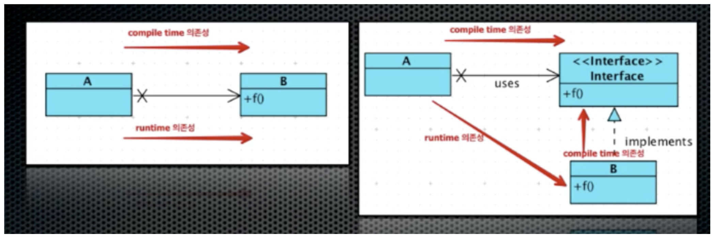

# Object-Oriented Programming(OOP) 관련 질문

## 목차
- [Q. 객체지향 프로그래밍(OOP)이란?](#q-객체지향-프로그래밍oop이란)
- [Q. 책임(Responsibility)](#q-책임responsibility)
- [Q. 클래스(Class) VS 인스턴스(Instance)](#q-클래스class-vs-인스턴스instance)
- [Q. 추상화(Abstraction)](#q-추상화abstraction)
- [Q. 캡슐화(Encapsulation)](#q-캡슐화encapsulation)
- [Q. 상속(Inheritance)](#q-상속inheritance)
- [Q. 다형성(Polymorphism)](#q-다형성polymorphism)
- [Q. SOLID 원칙](#q-solid-원칙)

## Q. 객체지향 프로그래밍(OOP)이란?
객체지향 프로그래밍은 프로그래밍 패러다임 중 하나로서, 말 그대로 객체를 중심으로 프로그래밍을 하는 방법입니다. 여기서 객체는 적절한 책임에 따라 분리된 것이며, 이러한 여러 객체들 사이에서 협력을 통해 프로그램이 동작하는 형식입니다.

OOP의 대표적인 특징은 4가지로 추상화, 캡슐화, 상속, 다형성이 있습니다. 그리고 대표적인 설계 원칙으로는 SOLID 원칙이 있습니다.

OOP는 절차지향보다 설계가 어렵고 성능적인 이슈가 있지만, 성능적인 이슈는 하드웨어의 발전으로 충분하게 되었고 무엇보다 유연성있는 프로그램을 만들 수 있는 큰 장점을 가지고 있습니다.

## Q. 책임(Responsibility)
책임은 객체가 설계된 기능적 목적 즉 객체가 해야할 일을 말합니다.

## Q. 클래스(Class) VS 인스턴스(Instance)
클래스는 객체의 틀이고, 객체를 구현하는 한 방법입니다. 자바나 C++의 경우는 class라는 키워드로 객체를 생성할 수 있지만, Javascript는 class라는 키워드가 존재하지 않지만 객체를 생성할 수 있습니다.

인스턴스는 객체라고도 하며, 실제 메모리가 할당되어 동작하는 객체지향의 최소단위라고 볼 수 있습니다. 클래스가 개념이라면 인스턴스는 실제 데이터를 가지고 동작하는 실체라 생각합니다.

## Q. 추상화(Abstraction)
추상화는 복잡성을 이해하기 쉬운 정도로 단순화하는 것입니다. 먼저 구체적인 사물들 간의 공통점을 추출한 후, 여기서 불필요한 부분을 버리는 방법으로 추상화가 이루어집니다.

객체지향 프로그래밍에서는 추상화를 통해 객체를 책임에 따라 분리하거나 인터페이스나 상속으로 하나의 타입으로 묶어주는 등 객체를 모델링하는 데 사용됩니다.

## Q. 캡슐화(Encapsulation)
캡슐화는 정보를 은닉하는 방법 중 하나로 필드와 메서드를 묶어 하나의 객체로 만들어 타입을 부여하고, 이에 대해 외부에 공개해야 할 것과 공개하지 않을 것을 구분하여 설정하는 행위를 말합니다.

캡슐화를 통해 은닉된 정보는 외부에서 접근할 수 없으므로 외부에 대한 영향을 최소화할 수 있습니다. 영향을 최소화한다는 것은 외부의 변경에 의해 객체 내부가 변경될 일을 최소화한다는 것입니다. 그리고 공개된 정보와 비공개된 정보를 계층화하여 좀 더 이해하기 쉽도록 도와줍니다.(보통 공개된 정보가 중요하므로 먼저 이해하는 식으로 이루어진다고 합니다.)

## Q. 상속(Inheritance)
상속은 상위 클래스의 정보를 하위 클래스에게 물려주는 것입니다. 상속은 두 가지 방식으로 이루어지는데,
1. 상위 클래스의 타입을 하위 클래스에게 물려주는 것입니다.(하위 타입을 은닉한다고 말할 수 있습니다.) 타입을 물려준다는 것은 상위 클래스를 사용하는 곳을 하위 클래스로 변경해도 정상적으로 동작해야한다는 것입니다.(리스코프 치환 법칙) 이를 통해 코드의 유연성을 확보할 수 있습니다. 그리고 이 방법으로 상속을 했을 때 다형성을 수행할 수 있습니다.(sub-typing)
2. 상위 클래스의 코드를 하위 클래스에게 물려주는 것입니다. 이는 단순히 코드의 중복을 줄이는 방법입니다.(sub-classing)

## Q. 다형성(Polymorphism)
다형성은 하나의 대상이 여러가지 타입을 가지는 것을 말합니다. 다형성을 하는 방법은 상속입니다. 상속을 통해 상위 타입은 여러 하위 타입을 가질 수 있으며, 메서드 재정의(overriding)를 통해 각 하위 타입들은 다른 행동을 수행할 수 있습니다. 따라서 상위 타입을 가지고 여러 하위 타입의 행동을 수행할 수 잇습니다.

다형성은 객체지향에서 유연성을 확보할 수 있는 방법으로 절차지향과의 큰 차이점입니다.

### Overriding VS Overloading
Overriding은 상위 클래스의 메서드를 하위 클래스에서 재정의하는 것입니다. 메서드의 시그니처는 완전히 동일하지만, 내부의 동작이 달라집니다.

Overloading은 메서드의 이름은 같지만 매개변수의 수나 종류가 다른 것입니다. 하지만 반환값은 영향을 주지 않으므로 메서드 이름과 매개변수가 같고 반환값만 다른 경우에는 overloading이 되지 않습니다.

## Q. SOLID 원칙
### 1. 단일 책임 원칙(SRP, Single Responsibility Principle)
단일 책임 원칙은 객체에 책임은 한 개여야 한다는 원칙입니다. 책임이 한 개라는 의미는 변경되는 이유가 단 하나라는 말과 같습니다.

### 2. 개방 폐쇄 원칙(OCP, Open-Closed Principle)
개방 폐쇄 원칙은 확장에는 열려있지만, 변경에는 닫혀있어야 한다는 원칙입니다. 이 의미는 기능을 확장할 때 기존 코드를 변경하지 않는다는 것입니다. 이는 객체지향 코드가 유연성을 같는 이유와 같습니다.

이를 가능하게 하기 위해서 리스코프 치환 원칙과 의존 역전 원칙을 사용합니다. 대표적으로 전략 패턴, DI와 같은 방식을 말합니다.

다운 캐스팅을 하거나 if-else문이 반복되는 경우 OCP가 깨지지 않았는지 주의깊게 살펴봐야합니다.

### 3. 리스코프 치환 원칙(LSP, Liskov Substitution Principle)
리스코프 치환 원칙은 상위 타입의 객체를 하위 타입의 객체로 치환해도 상위 타입을 사용하던 기존의 프로그램은 정상적으로 동작해야 한다는 원칙입니다.

LSP는 상속에서 서브-타이핑을 의미하며, 다형성을 하기 위해 필수적으로 지켜야할 원칙입니다.

`instanceof`로 하위타입을 확인할 때나 하위 타입의 리턴값이 상위 타입의 리턴 값 범위를 벗어난다면 LSP가 깨진 것입니다. LSP가 지켜지지 않는다면 OCP도 같이 깨집니다.

### 4. 인터페이스 분리 원칙(ISP, Interface Segregation Principle)
인터페이스 분리 원칙은 인터페이스는 그 인터페이스를 사용하는 클라이언트 기준으로 분리해야 한다는 원칙입니다. 각 클라이언트가 사용하는 인터페이스를 분리하여, 사용하지 않는 인터페이스에 변경이 일어나도 이를 사용하지 않는 클라이언트에는 영향을 미치지 않도록 한다는 것입니다. 이는 단일 책임 원칙과 관련이 깊습니다.

ISP가 깨지는 대표적인 사례는 C++의 .h 파일에 사용하지 않는 .cpp가 있는 경우 이 .cpp가 변경되면 해당 .h 파일을 갖고 있는 다른 .cpp파일까지 재컴파일해야 합니다.

### 5. 의존 역전 원칙(DIP, Dependency Inversion Principle)
의존 역전 원칙은 고수준 모듈은 저수준 모듈에 의존하면 안되고 고수준 모듈에서 정의한 추상 타입에 의존해야 한다는 원칙입니다.

고수준 모듈은 인터페이스와 같이 기능을 제공하는 API를 말하고, 저수준 모듈은 이 기능을 실제로 구현하는 클래스로 볼 수 있습니다.

왼쪽 그림은 고수준 모듈 A가 저수준 모듈 B에 의존하는 모습입니다. 이에 DIP를 적용하면 오른쪽 그림과 같이 저수준 모듈을 인터페이스로 추상화하여 A는 B가 아닌 고수준 모듈인 인터페이스에 의존합니다. 따라서 저수준 모듈 B가 다른 것으로 변경되어도 A에는 전혀 영향을 미치지 않습니다. 영향을 미치지 않는다는 것은 코드의 변경이 필요없다는 의미입니다.

DIP는 런타임 시간의 의존을 역전시키는 것이 아닌 컴파일 시간의 의존을 역전시키는 것입니다. 코드상의 변경은 컴파일 타임에 이루어지기 때문입니다.

## Q. 객체지향 생활체조
1. 한 메서드에 오직 한 단계의 들여쓰기만 사용한다.
2. `else` 예약어를 쓰지 않는다.
3. 모든 원시값과 문자열을 포장한다.
4. 한 줄에 점을 하나만 찍는다.(디미터 법칙)
5. 줄여쓰지 않는다.
6. 모든 객체를 작게 유지한다.
7. 2개 이상의 인스턴스 변수를 가진 클래스를 쓰지 않는다.
8. 일급 컬렉션을 사용한다.
9. `getter`/`setter`/프로퍼티를 쓰지 않는다.

### Reference
- <https://developerfarm.wordpress.com/2012/02/03/object_calisthenics_summary/>