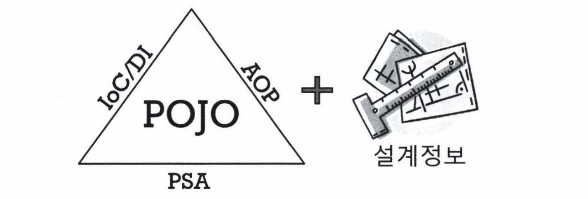

# Spring Framework 관련 질문

## 목차
- [Q. Spring Framework란?](#q-spring-framework란)
- [Q. Spring Bean](#q-spring-bean)
- [Q. Bean Factory VS Application Context](#q-bean-factory-vs-application-context)
- [Q. Spring IoC 컨테이너](#q-spring-ioc-컨테이너)
- [Q. Spring MVC](#q-spring-mvc)
- [Q. AOP](#q-aop)
- [Q. Spring Framework VS Spring Boot](#q-spring-framework-vs-spring-boot)

## Q. Spring Framework란?
스프링 프레임워크는 **자바 엔터프라이즈 개발을 편하게 해주는 오픈소스 경량급 애플리케이션 프레임워크**입니다.

> 자바 플랫폼, 엔터프라이즈 에디션(Java Platform, Enterprise Edition; Java EE)은 자바를 이용한 서버측 개발을 위한 플랫폼이다. Java EE 플랫폼은 PC에서 동작하는 표준 플랫폼인 Java SE에 부가하여, 웹 애플리케이션 서버에서 동작하는 장애복구 및 분산 멀티티어를 제공하는 자바 소프트웨어의 기능을 추가한 서버를 위한 플랫폼이다. 이전에는 J2EE라 불리었으나 버전 5.0 이후로 Java EE로 개칭되었다. - [위키백과](https://ko.wikipedia.org/wiki/%EC%9E%90%EB%B0%94_%ED%94%8C%EB%9E%AB%ED%8F%BC,_%EC%97%94%ED%84%B0%ED%94%84%EB%9D%BC%EC%9D%B4%EC%A6%88_%EC%97%90%EB%94%94%EC%85%98) -

스프링 프레임워크는 애플리케이션 프레임워크로서 로깅, 트랜잭션, 보안, 에러 처리 등 애플리케이션을 개발하는데 필요한 전 영역을 제공해주는 프레임워크입니다. 이에 더해 IoC/DI 기술로 의존성을 프레임워크에서 관리하여 개발자 입장에서 쉽게 객체지향을 기반한 유연한 코드를 작성할 수 있도록 도와줍니다.

경량급이라는 것은 스프링이 작은 규모라는 의미가 아닌 불필요한 의존이 없다는 것입니다. 스프링은 단순한 서버환경인 톰캣(Tomcat)이나 제티(Jetty)에서도 완벽하게 동작합니다.

스프링 프레임워크는 오픈소스로 개발되며 많은 사람이 참여하고 있어 이슈가 빠르게 발견됩니다. 그리고 스프링 개발자는 기업에 속해 있어 기존 오픈소스의 문제점이었던 개인 개발자에 의존이 심했던 것을 해결하여 발생한 문제에 대해 빠르게 해결해나아가고 있습니다.

스프링 프레임워크의 핵심 기능은 IoC/DI, AOP, PSA(Portable Service Abstraction) 세 가지입니다. 이 세 가지 기능을 바탕으로 스프링 프레임워크는 POJO로 개발할 수 있도록 만들었습니다.

출처: 토비의 스프링 3.1 Vol.1

POJO(Plain Old Java Object)는 순수 자바 객체라는 의미로 마틴 파울러가 만든 용어입니다. POJO는 **객체지향적이면서, 환경과 기술에 종속되지 않고 필요에 따라 재활용될 수 있는 방식으로 설계된 오브젝트**입니다.

스프링 프레임워크가 관리하는 Spring Bean이 POJO를 만족하는 객체를 말합니다. POJO로 개발하는 것의 장점은 객체에 외부 환경과 기술에 관련된 코드가 없어 깔끔하고 복잡하지 않습니다. 따라서 디버깅과 테스트하기 쉽습니다. 또한 객체지향적으로 설계할 수 있어 유연한 코드를 만들 수 있습니다.

## Q. Spring Bean
빈 또는 빈 오브젝트는 스프링이 IoC 방식으로 관리하는 오브젝트라는 뜻이다. 관리되는 오브젝트(managed object)라고도 부른다. 주의할 점은 스프링에서 사용하는 모든 오브젝트가 빈은 아니라는 것이다. 스프링이 직접 제어를 담당하는 오브젝트만을 빈으로 부른다.

### Bean 생성 방법
스프링 부트 빈 생성관련해서 실제 코드와 함께 블로그 글 작성하기, 번외로 스프링 부트가 아닌 스프링에서 빈 생성을 작성하여 비교하기
- <https://lazymankook.tistory.com/67>
- <https://cbw1030.tistory.com/54>
- <https://jeong-pro.tistory.com/167>
- <https://gmlwjd9405.github.io/2018/11/10/spring-beans.html>
- <https://tomining.tistory.com/74>

#### Bean 생성 시 순환참조 해결법

### Bean Scope

Bean은 싱글톤 패턴으로 생성되는데, 프로그램에서 단 하나의 객체만 존재하는 것입니다. 이와 같은 이유는 Spring Framework는 대부분 서버 환경을 위한 애플리케이션으로 많은 사용자가 있다는 것을 가정합니다. 이러한 많은 사용들이 요청에 따라 객체를 만든다면 많은 과부화가 예상되어 싱글톤으로 만들었습니다.

Bean을 생성하는 방법은 세 가지가 있습니다.
1. xml에 등록하는 방법
2. `@Configuration` 어노테이션을 선언한 객체에 `@Bean`을 선언한 메서드를 구현합니다. 그 결과 해당 메서드의 반환값이 Bean으로 등록됩니다.
3. `@Component`, `@Controller`, `@Service`, `@Repository`와 같은 빈 등록 어노테이션을 빈으로 등록할 객체에 선언합니다.

## Q. Bean Factory VS Application Context
두 인터페이스 모두 IoC 컨테이너에서 빈 객체를 관리하는데 사용합니다.

### Bean Factory
스프링의 IoC를 담당하는 핵심 컨테이너를 가리킨다. 빈을 등록하고, 생성하고, 조회하고, 둘려주는 등 빈을 관리하는 기능을 담당한다. 보통은 이 빈 팩토리를 바로 사용하지 않고 이를 확장한 애플리케이션 컨텍스트를 이용한다. `BeanFactory`라고 붙여쓰면 빈 팩토리가 구현하고 있는 가장 기본적인 인터페이스의 이름이 된다. 이 인터페이스에 `getBean()`과 같은 메소드가 정의되어 있다.

### Application Context
빈 팩토리를 확장한 IoC 컨테이너다. 빈을 등록하고 관리하는 기본적인 기능은 빈 팩토리와 동일하다. 여기에 스프링이 제공하는 각종 부가 서비스를 추가로 제공한다. `ApplicationContext`는 `BeanFactory`를 상속한다.

빈 팩토리라고 부를 때는 주로 빈의 생성과 제어의 관점에서 이야기하는 것이고, 애플리케이션 컨텍스트라고 할 때는 스프링이 제공하는 애플리케이션 지원 기능을 모두 포함할 때라고 볼 수 있다.

## Q. Spring IoC 컨테이너
> 일반적으로 Spring 컨테이너 = IoC 컨테이너 = DI 컨테이너 와 같이 혼용해서 사용합니다.

IoC 컨테이너는 기존에는 객체의 생명주기 관리를 개발자가 맡아서 했던 것을 역전시켜 IoC 컨테이너가 수행하는 것을 말합니다.

- IoC(Inversion of Control): 제어의 역전
- 컨테이너: 인스턴스의 생명주기를 관리하는 곳 + 생성된 인스턴스에게 추가 기능 제공

IoC 컨테이너를 구현하는 방법은 두 가지가 있습니다.
1. **DL(Dependency Lookup)**: 저장소에 저장되어 있는 Bean에 접근하기 위해 개발자가 직접 컨테이너에서 제공하는 API를 이용하여 사용할 Bean을 Lookup 하는 것을 말합니다. 따라서 컨테이너와의 종속성이 생깁니다.

2. **DI(Dependency Injection)**: DI는 의존성을 주입해주는 방법으로, 사용할 Bean, Bean을 실제 사용하는 클라이언트, 이 둘을 연결해주는 제 3의 존재가 있습니다. 여기서 제 3의 존재가 IoC 컨테이너입니다. 즉 IoC 컨테이너는 런타임 시간에 Bean을 클라이언트에 주입시켜 줍니다.

DI는 `@Autowired` 어노테이션을 사용하며 세 가지 방법이 있습니다.
1. Field Injection
2. Constructor Injection
3. Setter Injection

이 중에서 Constructor Injection을 대부분 사용하였는데, 그 이유는 bean 주입을 생성자로 명시하였기 때문에 개발자가 필요에 따라 bean을 변경할 수 있습니다. 특히 테스트에서 bean을 Mock으로 대체할 때 유용하게 사용했습니다.

## Q. Spring MVC
Spring MVC는 MVC 패턴과 Front Controller 패턴이 합쳐진 형태입니다. 클라이언트의 모든 요청은 프론트 컨트롤러인 디스패처 서블릿으로 갑니다. 그 후 MVC 패턴에 의해 요청을 처리하는 형태입니다.

1. 클라이언트의 모든 요청은 front controller인 dispatcher servlet이 가로챈다.
2. Dispatcher servlet은 HandlerMapping에게 해당 URL이 어느 controller로 가야할 지 물어본다.
    - 요청 URL을 분석하여 매칭되는 RequestMapping이 있는 controller가 있는 찾는다.
    - Interceptor가 있다면 처리한다.(preHandler)
    - Argument Resolver가 있다면 처리한다.
    - Message Converter 처리(Controller에 `@RequestBody`가 있다면 HTTP 요청 본문을 메시지로 변환한다.)
3. 요청에 맞는 controller에 도달한다.(invoke)
4. 요청을 처리한다. (Service, Repository 등 활용)
5. 요청을 반환하는 것은 `@Controller`냐, `@Controller` + `@ResponseBody`(=`@RestController`)냐에 따라 다르다.
    - 단순히 `@Controller`인 경우 controller의 해당 메서드 반환값으로 view name을 반환한다.
        - Dispatcher Servlet은 반환받은 view name을 View Resolver한테 전달한다.
        - View Resolver는 view name에 알맞은 JSP나 thymeleaf 등을 찾아서 반환한다.
        - Dispatcher Servlet은 View Object를 View에게 넘겨 랜더링을 시킨 후 결과를 클라이언트에게 전달한다.
    - `@Controller` + `@ResponseBody`(=`@RestController`)인 경우  controller의 해당 메서드 반환값은 view name이 아닌 요청에 따른 형태로 만들어 반환한다.
        - Dispatcher Servlet은 반환받은 값을 Message Converter한테 전달한다.
        - Message Converter는 요청받은 형태로 데이터를 만들어 HTTPResponseBody로 변환후 클라이언트에게 전달한다.

### Filter VS Interceptor VS Argument Resolver VS AOP

- Filter
    - Tomcat에서 AOP를 구현한 방법으로, 스프링 영역 밖 즉 서블릿 단위의 전처리, 후처리를 담당한다.
- Interceptor
    - 스프링 영역 안에서 controller의 전처리, 후처리를 담당한다.
- Argument Resolver
    - 그림에는 안나와있지만 인터셉터 후에 동작합니다.(AOP와의 순서는 아직 잘 모릅니다.)
- AOP
    - 선택한 메서드의 전처리, 후처리를 담당한다.

## Q. AOP
AOP는 관심사를 분리하는 프로그래밍 기법으로, 애플리케이션의 핵심 기능에서 부가 기능을 분리하여 모듈로 만드는 것입니다. 

## Q. Spring Framework VS Spring Boot
스프링 부트는 스프링 프레임워크를 확장한 것으로, 기존의 스프링을 시작하기 위해 필요한 여러 설정을 기본으로 제공하여 빠르고 쉽게 개발을 시작할 수 있도록 하였습니다.

스프링 부트는 대표적으로 세 가지 기능을 제공합니다.
1. Starter Dependencies를 제공합니다. 이를 통해 프로젝트의 빌드와 설정을 간소화했습니다.
2. 내장 서버를 제공합니다. 이를 통해 배포의 복잡성을 줄였습니다. war파일이 아닌 jar파일로 배포가 가능하기 때문입니다.
3. Auto Configuration이 가능합니다. application.properties(yml)과 같은 파일로 쉽게 의존성을 설정하고 관리할 수 있습니다.

## 참고
- [토비의 스프링 3.1](http://www.kyobobook.co.kr/product/detailViewKor.laf?ejkGb=KOR&mallGb=KOR&barcode=9788960773431&orderClick=LAG&Kc=)