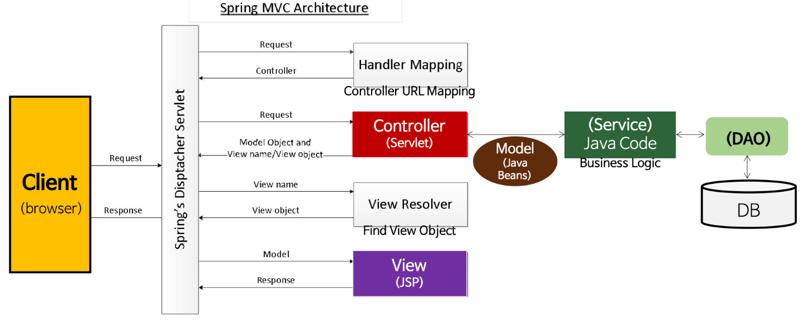
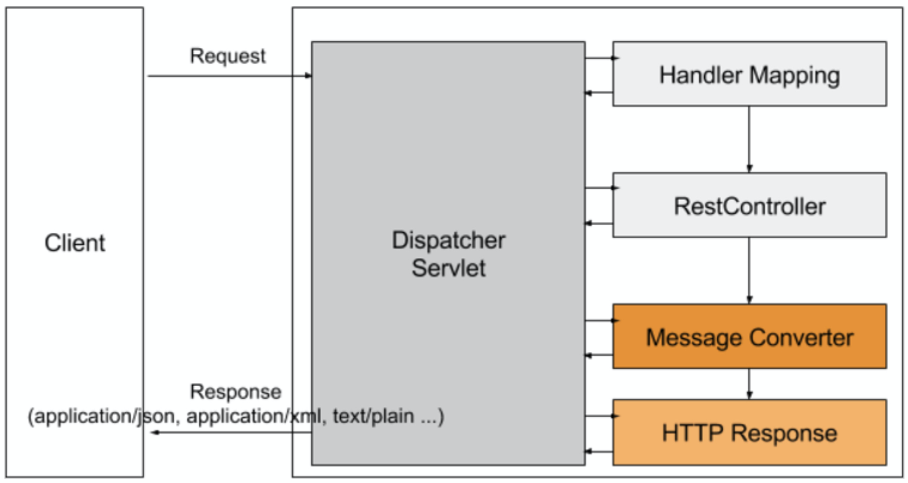

# Spring Framework 관련 질문

## Q. Spring Framework 사용하는 이유에 대해 설명하시오.
스프링 프레임워크는 의존성 관리를 프레임워크가 해주기 때문에 쉽게 유연성있는 코드를 구현할 수 있습니다. 그리고 로깅, 보안, 트랜잭션, 에러 처리 등 애플리케이션에 필요한 여러 공통 기능을 제공해주어 쉽게 기능을 추가할 수 있습니다.

## Q. Spring IoC 컨테이너에 대해 설명하시오.
> 일반적으로 Spring 컨테이너 = IoC 컨테이너 = DI 컨테이너 와 같이 혼용해서 사용합니다.

IoC 컨테이너는 기존에는 객체의 생명주기 관리를 개발자가 맡아서 했던 것을 역전시켜 IoC 컨테이너가 수행하는 것을 말합니다.

- IoC(Inversion of Control): 제어의 역전
- 컨테이너: 인스턴스의 생명주기를 관리하는 곳 + 생성된 인스턴스에게 추가 기능 제공

IoC 컨테이너를 구현하는 방법은 두 가지가 있습니다.
1. DL(Dependency Lookup): 저장소에 저장되어 있는 Bean에 접근하기 위해 개발자가 직접 컨테이너에서 제공하는 API를 이용하여 사용할 Bean을 Lookup 하는 것을 말합니다. 따라서 컨테이너와의 종속성이 생깁니다.

2. DI(Dependency Injection): DI는 의존성을 주입해주는 방법으로, 사용할 Bean, Bean을 실제 사용하는 클라이언트, 이 둘을 연결해주는 제 3의 존재가 있습니다. 여기서 제 3의 존재가 IoC 컨테이너입니다. 즉 IoC 컨테이너는 런타임 시간에 Bean을 클라이언트에 주입시켜 줍니다.

DI는 `@Autowired` 어노테이션을 사용하며 세 가지 방법이 있습니다.
1. Field Injection
2. Constructor Injection
3. Setter Injection

이 중에서 Constructor Injection을 대부분 사용하였는데, 그 이유는 bean 주입을 생성자로 명시하였기 때문에 개발자가 필요에 따라 bean을 변경할 수 있습니다. 특히 테스트에서 bean을 Mock으로 대체할 때 유용하게 사용했습니다.

## Q. Bean에 대해 설명하시오.
Bean은 POJO(Plain Old Java Object)이고, IoC 컨테이너에서 관리되는 객체를 말합니다. Bean은 Spring 애플리케이션에서 핵심적인 객체입니다.

POJO는 순수한 자바 객체를 뜻하며, 특정 기술에 의존하지 않는 객체를 말합니다. 하지만 뜻이 애매한 부분이 많으므로 토비의 스프링 책에서는 객체지향적인 원리에 충실한 객체라고 표현하기도 합니다.

Bean은 싱글톤 패턴으로 생성되는데, 프로그램에서 단 하나의 객체만 존재하는 것입니다. 이와 같은 이유는 Spring Framework는 대부분 서버 환경을 위한 애플리케이션으로 많은 사용자가 있다는 것을 가정합니다. 이러한 많은 사용들이 요청에 따라 객체를 만든다면 많은 과부화가 예상되어 싱글톤으로 만들었습니다.

Bean을 생성하는 방법은 세 가지가 있습니다.
1. xml에 등록하는 방법
2. `@Configuration` 어노테이션을 선언한 객체에 `@Bean`을 선언한 메서드를 구현합니다. 그 결과 해당 메서드의 반환값이 Bean으로 등록됩니다.
3. `@Component`, `@Controller`, `@Service`, `@Repository`와 같은 빈 등록 어노테이션을 빈으로 등록할 객체에 선언합니다.

## Q. Bean Factory VS Application Context
두 인터페이스 모두 IoC 컨테이너에서 빈 객체를 관리하는데 사용합니다.

Bean Factory는 빈 객체를 생성하고 관리하는 인터페이스로서, 디자인 패턴 중 팩토리 패턴을 구현한 것입니다. Bean Factory 컨테이너는 스프링이 시작할 때 빈 객체를 생성하는 것이 아닌 클라이언트의 요청이 있을 때(`getBean()`) 객체를 생성합니다.

Application Context는 Bean Factory를 상속받은 인터페이스입니다. 따라서 Bean을 관리하는 기능에 더해 여러 부가적인 기능이 있습니다. 현재에는 Application Context를 더 많이 사용하고 있습니다. Application Context는 Bean Factory와는 달리 시작 시점에 등록된 모든 빈을 스캔하여 객체화합니다.

## Q. Spring MVC에 대해 설명하시오.
Spring MVC는 MVC 패턴과 Front Controller 패턴이 합쳐진 형태입니다. 클라이언트의 모든 요청은 프론트 컨트롤러인 디스패처 서블릿으로 갑니다. 그 후 MVC 패턴에 의해 요청을 처리하는 형태입니다.

1. 클라이언트의 모든 요청은 front controller인 dispatcher servlet이 가로챈다.
2. Dispatcher servlet은 HandlerMapping에게 해당 URL이 어느 controller로 가야할 지 물어본다.
    - 요청 URL을 분석하여 매칭되는 RequestMapping이 있는 controller가 있는 찾는다.
    - Interceptor가 있다면 처리한다.(preHandler)
    - Argument Resolver가 있다면 처리한다.
    - Message Converter 처리(Controller에 `@RequestBody`가 있다면 HTTP 요청 본문을 메시지로 변환한다.)
3. 요청에 맞는 controller에 도달한다.(invoke)
4. 요청을 처리한다. (Service, Repository 등 활용)
5. 요청을 반환하는 것은 `@Controller`냐, `@Controller` + `@ResponseBody`(=`@RestController`)냐에 따라 다르다.
    - 단순히 `@Controller`인 경우 controller의 해당 메서드 반환값으로 view name을 반환한다.
        - Dispatcher Servlet은 반환받은 view name을 View Resolver한테 전달한다.
        - View Resolver는 view name에 알맞은 JSP나 thymeleaf 등을 찾아서 반환한다.
        - Dispatcher Servlet은 View Object를 View에게 넘겨 랜더링을 시킨 후 결과를 클라이언트에게 전달한다.
    - `@Controller` + `@ResponseBody`(=`@RestController`)인 경우  controller의 해당 메서드 반환값은 view name이 아닌 요청에 따른 형태로 만들어 반환한다.
        - Dispatcher Servlet은 반환받은 값을 Message Converter한테 전달한다.
        - Message Converter는 요청받은 형태로 데이터를 만들어 HTTPResponseBody로 변환후 클라이언트에게 전달한다.

### Filter VS Interceptor VS Argument Resolver VS AOP

- Filter
    - Tomcat에서 AOP를 구현한 방법으로, 스프링 영역 밖 즉 서블릿 단위의 전처리, 후처리를 담당한다.
- Interceptor
    - 스프링 영역 안에서 controller의 전처리, 후처리를 담당한다.
- Argument Resolver
    - 그림에는 안나와있지만 인터셉터 후에 동작합니다.(AOP와의 순서는 아직 잘 모릅니다.)
- AOP
    - 선택한 메서드의 전처리, 후처리를 담당한다.

## Q. AOP에 대해 설명하시오.
AOP는 관심사를 분리하는 프로그래밍 기법으로, 애플리케이션의 핵심 기능에서 부가 기능을 분리하여 모듈로 만드는 것입니다. 

## Q. Spring Framework와 Spring Boot와의 차이점에 대해 설명하시오.
스프링 부트는 스프링 프레임워크를 확장한 것으로, 기존의 스프링을 시작하기 위해 필요한 여러 설정을 기본으로 제공하여 빠르고 쉽게 개발을 시작할 수 있도록 하였습니다.

스프링 부트는 대표적으로 세 가지 기능을 제공합니다.
1. Starter Dependencies를 제공합니다. 이를 통해 프로젝트의 빌드와 설정을 간소화했습니다.
2. 내장 서버를 제공합니다. 이를 통해 배포의 복잡성을 줄였습니다. war파일이 아닌 jar파일로 배포가 가능하기 때문입니다.
3. Auto Configuration이 가능합니다. application.properties(yml)과 같은 파일로 쉽게 의존성을 설정하고 관리할 수 있습니다.