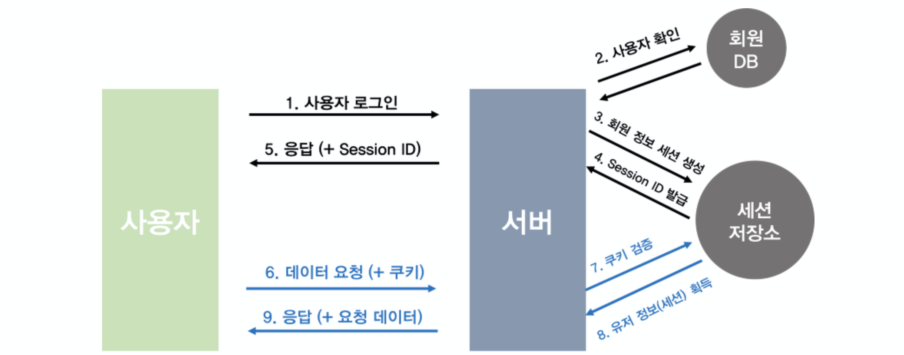
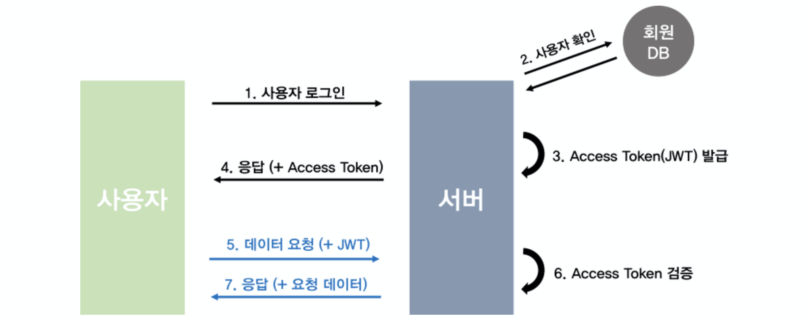
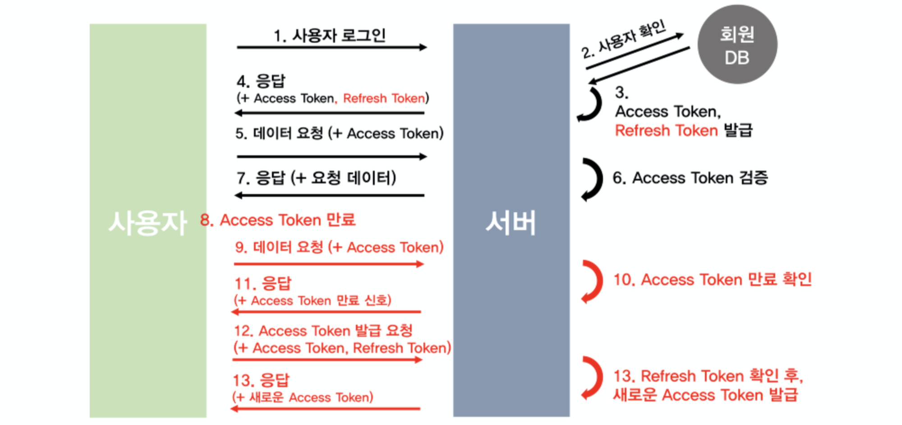
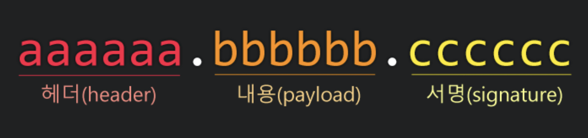

# WEB에 관한 질문

## 목차
- [Q. Web Server](#q-web-server)
- [Q. HTTP](#q-http)
- [Q. HTTPS](#q-https)
- [Q. 인증(Authentication)과 인가(Authorization)](#q-인증authentication과-인가authorization)
- [Q. 쿠키와 세션](#q-쿠키와-세션)
- [Q. JWT(Json Web Token)](#q-jwtjson-web-token)
- [Q. REST API(Restful API)](#q-rest-apirestful-api)
- [Q. CORS(Cross-Origin Resource Sharing)](#q-corscrossorigin-resource-sharing)
- [Q.Web Hacking](#qweb-hacking)
- [Q. 서버 사이드 렌더링 VS 클라이언트 사이드 렌더링](#q-서버-사이드-렌더링-vs-클라이언트-사이드-렌더링)
- [Q. Proxy](#q-proxy)
- [Q. 서버와 클라이언트 통신 과정](#q-서버와-클라이언트-통신-과정)

## Q. Web Server
웹 서버는 HTTP를 기반으로 클라이언트의 요청을 처리하는 서비스를 말합니다. 웹 브라우저와 같은 클라이언트의 요청에 따라 정적 페이지와 동적 페이지를 통해 응답을 하게 되는데, 정적 페이지를 처리하는 것이 **Web Server**이고 동적 페이지를 처리하는 것이 **Web Application Server**(**WAS**)입니다.

### 정적 페이지(Static Page) VS 동적 페이지(Dynamic Page)

출처: <https://gmlwjd9405.github.io/2018/10/27/webserver-vs-was.html>

정적 페이지는 서버에 **미리 저장된 파일**(**HTML, javascript, 이미지 파일 등**)을 말합니다. 클라이언트 요청에 따라 미리 저장된 파일을 전달하며, 페이지의 내용은 변하지 않습니다.

동적 페이지는 클라이언트의 요청에 따라 **데이터를 처리한 후** 만든 페이지입니다. 따라서 클라이언트의 요청에 따라 데이터가 변경되므로 같은 요청이라도 서로 다른 페이지가 될 수 있습니다. (위 그림의 Servlet은 자바에서 동적 페이지를 처리하는 인터페이스를 말합니다.)

### Web Server VS WAS(Web Application Server)
Web Server와 WAS 둘 다 HTTP를 기반으로 클라이언트의 요청을 처리하여 응답하는 서비스라는 점은 같습니다.

#### Web Server
Web Server는 클라이언트의 요청 중 정적인 처리를 담당합니다. 따라서 요청에 맞는 정적 페이지를 응답으로 보내는 역할을 합니다. Web Server는 대표적으로 Apache Server, Nginx, Microsoft IIS 등이 있습니다.

#### WAS(Web Application Server)
WAS는 클라이언트의 요청 중 동적인 처리를 담당합니다. 따라서 요청에 따라 DB 접속이나 비지니스 로직과 같은 동적인 처리 후 페이지를 만들어 응답으로 보내는 역할을 합니다. 

WAS는 웹 컨테이너(Web Container) 또는 서블릿 컨테이너(Servlet Container)라고도 불리며, Web Server 기능을 구조적으로 분산하여 서버의 부하를 줄이는 역할도 합니다. 따라서 WAS에서 정적 페이지와 동적 페이지 요청을 모두 처리할 수 있지만 부하를 줄이기 위해 분리하여 처리합니다.

WAS는 대표적으로 Tomcat, JBoss, Jeus, Web Sphere 등이 있습니다.

#### Web Service Architecture
웹 서버 구조는 일반적으로 Web Server와 WAS를 둘 다 사용합니다.

출처: <https://gmlwjd9405.github.io/2018/10/27/webserver-vs-was.html>

Java의 서블릿을 사용하는 웹 서버 구조는 일반적으로 위와 같습니다. Web Server를 앞단에 두고 정적 요청이면 이를 처리하여 바로 응답하고, 동적 요청이면 WAS로 전달합니다. 그리고 WAS 내부에서 서블릿과 같은 앱이 해당 요청을 처리하고 응답하는 구조입니다.

출처: <https://medium.com/@chrisjune_13837/web-%EC%9B%B9%EC%84%9C%EB%B2%84-%EC%95%B1%EC%84%9C%EB%B2%84-was-app%EC%9D%B4%EB%9E%80-692909a0d363>

Web Server는 여러 대의 WAS 서버를 가지고 로드 밸런싱 역할도 할 수 있습니다. 대표적으로 Nginx가 이러한 역할로 많이 사용하고 있습니다.

#### Web Server를 사용하는 이유
WAS에서 Web Server 역할을 모두 수행할 수 있는데, 정적 페이지를 처리하기 위한 기능 분리를 통해 서버 부하를 줄이기 위해 사용한다고 했습니다. 하지만 이는 여러 생각해 볼 점이 많다고 합니다. 실제로 Web Server를 앞단에 두는 것이 메모리적으로 더 비효율적일 수 있다는 이야기도 있습니다.

그래서 Web Server가 필요한 실제 사례로는 다음과 같다고 합니다.
- **보안**: Web Server가 해킹을 당해도 WAS에는 영향을 주지 않음
- **로드 밸런싱**: 위에서 본 것처럼 여러 WAS의 부하를 관리해줄 수 있음
- 하나의 Web Server에서 여러 개의 언어를 사용한 WAS가 있을 때

출처: <https://sieunlim.tistory.com/17> 

#### 대표적인 Web Server, WAS 예와 그 특징
- Web Server
    - Apache(아파치)
        - 세계에서 가장 많이 쓰는 무료 오픈소스 웹 서버
        - 다양한 기능과 구축이 쉬워 많이 사용
        - MPM(Multi Processing Module: 다중 처리 모듈) 방식
        - 느리고 여러 취약점이 있어 대형 서비스는 Nginx나 IIS를 사용
        - 기본적으로 80 포트 사용
    - Nginx
        - 아파치의 단점을 보완하고자 나왔으며, 동시접속 처리에 특화된 웹 서버
        - High Performance & High Concurrency & Low Resource Usage 지향
        - Event Driven 방식(비동기 처리)
        - Reverse Proxy 서버 역할 가능
- WAS
    - Tomcat
        - 아파치 재단에서 만든 WAS
        - 요청이 들어오면 자바 서블릿을 실행시키고 결과로 JSP가 포함된 웹 페이지를 만듦
        - 자체적으로 웹 서버가 있지만, 다른 웹 서버와 연동하여 사용 가능
        - 기본적으로 8080 포트 사용

## Q. HTTP
HTTP는 **웹에서 서버와 클라이언트 사이 HTML을 주고받기 위한 약속**입니다. 현재는 HTML뿐아니라 JSON, 멀티미디어 등 다양한 데이터를 주고받을 수 있습니다.

HTTP의 특징은 **비연결적이고 무상태**입니다. 이는 한번 요청과 응답이 끝나면 연결을 끊고 상태 정보를 유지하지 않는다는 것입니다. 이러한 특징으로 많은 수의 요청 처리를 처리할 수 있게 되었습니다. 하지만 문제는 서버에서 클라이언트가 누구인지, 어떤 상태인지 알아야 하는 경우가 빈번하게 발생합니다. 대표적으로 인증을 위한 로그인 기능이 있습니다. 이와 같이 클라이언트의 상태를 확인하기 위해 쿠키와 세션, 토큰과 같은 방법을 사용해야 합니다.

HTTP는 기본적으로 TCP/IP 통신 위에서 동작하며 80번 포트를 사용합니다.

HTTP는 요청 메시지와 응답 메시지로 나뉘며, 이 메시지들은 각각 헤더와 본문으로 나뉩니다. 이에 대한 자세한 정리는 아래의 링크에서 확인가능합니다.
- [HTTP 메시지](https://velog.io/@codemcd/HTTP-%EB%A9%94%EC%8B%9C%EC%A7%80-lqk14ernft)

## Q. HTTPS
- <https://opentutorials.org/course/228/4894>

## Q. 인증(Authentication)과 인가(Authorization)
인증은 사용자의 신원을 증명하는 것입니다. 대표적으로 로그인은 사용자가 누구인지 인증하는 과정입니다. 인가는 특정 리소스에 접근할 수 있는 권한을 부여하는 것입니다. 로그인을 통해 인증된 사용자일지라도 특정 리소스에 접근할 때는 권한이 있는지 검사하는 인가 과정이 필요합니다.

### 인증 방식
인증 방식은 로그인 기능을 통해 알아보도록 하겠습니다.

#### 1. 인증 정보를 HTTP 요청에 명시하는 경우
로그인 인증 정보는 ID, PASSWORD가 대표적입니다. 가장 무식한 방법은 이 정보를 HTTP 요청에 그대로 보내는 것입니다. 보안적으로 매우 위험한 방법이므로 절대 사용하면 안되는 방식입니다. 예를 들면 다음과 같습니다.
- `localhost:8080/login?id=admin&password=1234` 와 같이 URL에 정보를 담아 요청하는 경우(GET, POST 방식 모두 가능)
- `Cookie: id=admin; password=1234;` 와 같이 헤더에 정보를 담아 요청하는 경우

#### 2. 쿠키와 세션 방식
쿠키와 세션은 클라이언트와 서버 간의 상태를 저장하는 대표적인 방법입니다. 쿠키와 세션에 대한 자세한 이야기는 아래에 있습니다.([바로가기]()) 여기서는 쿠키와 세션으로 로그인 과정을 어떻게 수행하는지 살펴보도록 하겠습니다.

출처: <https://tansfil.tistory.com/58?category=255594>

1. 사용자가 최초로 로그인 요청을 서버에게 전달한다.
2. 로그인 요청을 받은 서버는 데이터베이스에 저장된 사용자 정보와 요청받은 사용자 정보가 일치한지 확인한다.
3. 일치한다면 회원 정보를 세션에 저장한다.
4. 해당 회원 정보를 식별할 Session ID를 발급한다.(대표적으로 JSESSIONID가 있음)
5. 서버는 발급한 Session ID를 `Set-Cookie` 헤더에 담아 사용자에게 응답한다.(로그인 완료)
6. 로그인 후 모든 사용자의 요청 헤더에는 `Cookie`에 서버에게 발급받은 Session ID를 담아서 서버에게 요청한다.
7. 서버는 쿠키에 담긴 Session ID가 세션 저장소에 있는지 확인한다.
8. 해당 Session ID에 저장된 회원 정보를 받아 요청을 처리한다.
9. 요청을 처리한 후 데이터를 사용자에게 응답한다.

세션 저장소로는 Redis라는 메모리 데이터베이스를 많이 사용합니다. 자세한 정보는 쿠키와 세션 파트에 있습니다.

- 장점
    - 인증에 대한 정보와 처리는 세션이 저장되어 있는 서버이므로 보안적으로 안전합니다.(쿠키는 단지 Session ID만을 들고 있을 뿐이며, 서버는 해킹하기 까다롭습니다.)
- 단점
    - 쿠키의 Session ID를 탈취당하면 인증 정보는 알 수 없지만 이를 통해 사용자 흉내를 낼 수 있습니다. 따라서 공격자가 탈취한 Session ID로 요청을 보내 여러 정보를 빼낼 수 있습니다.(세션 하이재킹 공격)
        - 세션 하이재킹 공격의 대응법으로는 HTTPS를 사용하거나, 쿠키 옵션인 `http-only`와 같이 쿠키 자체를 읽기 어렵게 하는 방법과 쿠키나 세션에 만료 기간을 설정하는 것입니다.
    - 세션은 서버에서 인증 과정을 수행하므로 서버에 부담을 줍니다.
    - 쿠키는 단일 도메인 및 서브 도메인에 한정되므로 CORS 문제로 관리가 까다롭습니다. 따라서 서버의 확장이 어렵습니다.

#### 3. 토큰(JWT) 기반 인증 방식
쿠키와 세션 방식의 단점을 해결하고자 나온 것이 토큰 기반 방식입니다. 대표적으로 [JWT(Json Web Token)]()이 있습니다. 클라이언트는 인증을 위해 쿠키 대신 토큰을 헤더에 담아 서버에 요청합니다.

1. 사용자가 최초로 로그인 요청을 서버에게 전달한다.
2. 로그인 요청을 받은 서버는 데이터베이스에 저장된 사용자 정보와 요청받은 사용자 정보가 일치한지 확인한다.
3. 일치한다면 서버는 해당 클라이언트에게 고유한 ID를 발급한 후 로그인 정보와 함께 payload에 추가한다. 그리고 JWT의 유효기간을 설정하고 SECRET KEY를 사용하여 암호화한 후 Access Token을 발급한다.
4. 서버는 로그인 요청에 대한 응답으로 발급한 Access Token을 담아 클라이언트에게 보낸다.
5. 클라이언트는 로그인 요청이 완료된 후에는 발급받은 JWT를 담아 서버에 요청한다.
6. 서버는 해당 토큰의 Verify Signature를 SECRET KEY로 복호화한 후 조작 여부, 유호기간을 확인한다.
7. 검증이 완료되면, payload를 디코딩하여 클라이언트의 ID에 맞는 데이터를 가져온 후 요청을 처리하고 응답한다.

- 장점
    - 서버는 쿠키/세션과 달리 별도의 저장소가 필요없고 토큰의 검증 로직만 있습니다. 이는 어떤 서버든지 검증 로직만 있으면 클라이언트를 인증할 수 있으므로 서버의 확장성(Scalability)을 높여줍니다. 그리고 상태를 저장할 필요가 없으므로 무상태를 유지하여 서버의 부담을 줄여줍니다.
    - 토큰 기반으로 하는 다른 인증 시스템에 접근이 가능합니다. Github 로그인, Facebook 로그인 등은 모두 토큰을 기반으로 하므로 해당 서비스를 사용할 수 있습니다.(확장성(Extensibility)이 높다.)
    - 토큰은 도메인에 종속적이지 않으므로 쿠키/세션과 달리 CORS 문제에 자유롭습니다.
- 단점
    - 이미 발급된 JWT는 만료 시간이 될 때까지 계속 사용해야 합니다. 따라서 중간에 탈취되더라도 어떤 조치를 취할 수 없습니다.
        - 이를 해결하는 방법은 Access Token의 유효기간을 짧게 하고, Refresh Token을 새로 발급하는 방식이 있습니다.(이 뒤에 바로 다룰 예정)
    - 토큰에 정보를 담는 payload는 보안에 취약하여 담을 수 있는 정보가 제한적입니다. payload는 단순히 인코딩을 하는 것이기 때문에 쉽게 디코딩하여 정보를 읽을 수 있습니다.
    - JWT의 길이는 쿠키보다 길어 헤더의 크기가 커집니다. 따라서 네트워크 비용이 증가합니다.

#### 4. Refresh Token이 추가된 JWT 인증 방식
기존의 JWT는 Access Token만을 사용하여 인증을 수행했습니다. 따라서 문제점이 Access Token이 탈취당할 경우 유효기간이 끝날 때까지 기다려야 합니다. 그렇다고 유효기간을 너무 짧게 하면 재발급하는 비용이 커집니다.

이러한 문제점을 해결하기 위해 나온 것이 Refresh Token입니다. Refresh Token은 Access Token과 같은 JWT입니다. Refresh Token은 **처음 로그인 요청시 Access Token과 함께 만들어지며, 긴 유효시간을 갖습니다.** 만약 Access Token의 유효기간이 만료되면 Refresh Token은 새로 발급해주는 데 키 역할을 합니다.

Refresh Token은 일반적으로 유효기간이 2주이며, Access Token은 1시간 정도입니다. 유효기간이 짧아 Access Token을 탈취당하더라도 금방 새로운 토큰이 발급되어 보안을 높일 수 있습니다. Refresh Token의 유효기간이 만료되면 클라이언트는 새로 로그인해야 하는 단점이 있습니다.

1 ~ 6번 과정은 위에서 살펴본 Access Token만을 활용한 JWT 방식과 비슷합니다. 차이점은 Access Token 발급과 함께 **Refresh Token을 발급하여 클라이언트에게 응답으로 보내는 것입니다.** 서버는 발급한 **Refresh Token을 유저 정보가 저장된 데이터베이스의 테이블에 같이 저장**합니다. 클라이언트는 **Refresh Token은 안전한 저장소에 저장한 후** Access Token이 만료되기 전까지 Access Token만을 담아서 요청합니다.

8. 발급된 Access Token이 만료됐습니다.
9. 클라이언트는 Access Token의 유효기간이 만료됨과 상관없이 토큰을 헤더에 담아 서버에게 요청합니다.
10. 서버는 해당 Access Token이 만료됨을 확인합니다.
11. 서버는 만료된 사실을 클라이언트에게 응답하여 알려줍니다.
12. 클라이언트는 Refresh Token과 Access Token을 함께 헤더에 담아 서버에게 Access Token 재발급 요청을 합니다.
13. 서버는 Access Token이 조작되지 않음을 확인한 후, 요청으로 받은 Refresh Token과 데이터베이스에 저장되어 있는 Refresh Token과 비요합니다. 해당 토큰이 동일하고 유효기간이 지나지 않았다면 새로운 Access Token을 발급한 후 응답으로 클라이언트에게 전달합니다.

사실 Access Token이 만료될 때마다 위 과정의 9~11을 수행할 필요는 없습니다. 클라이언트에서 Access Token의 payload를 통해 유효기간을 알 수 있어, 바로 위 과정의 12번 단계처럼 재발급 요청을 할 수 있습니다.

클라이언트 단에서 JWT 저장에 관해서는 여러 이야기가 있는 것 같습니다. 브라우저의 LocalStorage에 저장하면 브라우저를 끄고 다시 시작할 때 재로그인을 해야하고, 이를 해결하기 위해 쿠키에 저장하는 방법도 있습니다.

> Storing in localStorage = susceptible to xss
>
> Storing in cookie = susceptible to csrf
>
> The best option is to protect against both as described here.
>
> Store your tokens in http-only cookies and use a suitable targeted csrf defence as suggested
>
> 출처: <https://github.com/IdentityServer/IdentityServer3/issues/2039>

- 장점
    - 기존 Access Token만 있을 떄보다 보안상 안전합니다.
- 단점
    - 클라이언트, 서버 모두 구현하기가 복잡합니다.
    - HTTP 요청 횟수가 많아져 네트워크 비용이 커집니다.

#### 5. OAuth2.0

#### 6. SNS 로그인

### Reference
- [쉽게 알아보는 서버 인증 1편(세션/쿠키 , JWT)](https://tansfil.tistory.com/58?category=255594)
- [쉽게 알아보는 서버 인증 2편(Access Token + Refresh Token)](https://tansfil.tistory.com/59?category=255594)
- [쉽게 알아보는 서버 인증 3편(SNS 로그인, OAuth 2.0)](https://tansfil.tistory.com/60?category=255594)
- [JWT에 대해 알아보자!](https://medium.com/heumlabs/what-is-jwt-89889759ae37): 브라우저에서 JWT 저장과 재로그인 관련
- [[JWT] 토큰(Token) 기반 인증에 대한 소개](https://velopert.com/2350)

## Q. 쿠키와 세션
HTTP는 비연결성이므로 상태를 저장할 수 없는 무상태라는 특징이 있습니다. 서버는 클라이언트의 상태를 저장하지 않으므로, 해당 요청의 클라이언트는 항상 새로운 클라이언트로 인식합니다. 따라서 로그인 인증과 장바구니와 같은 기능을 구현할 수 없습니다. 서버 입장에서는 로그인을 해도 다음 페이지로 넘어가면 이전 상태를 저장하지 않으므로 이 클라이언트가 로그인한 것인지 알 수 없기 때문입니다.

이를 해결하는 대표적인 방법이 쿠키와 세션을 사용하는 것입니다.

### 쿠키(Cookie)
쿠키는 클라이언트(브라우저)에 저장하는 작은 데이터 조각입니다. 즉, 클라이언트의 상태를 직접 저장하고 있는 것입니다. 쿠키의 데이터 저장 방식은 다음과 같습니다.
- 브라우저 별로 저장됩니다.(크롬, 파이어폭스, 사파리 등 따로 저장)
- 호스트 별로 저장됩니다.(네이버, 구글 등 싸이트마다 따로 저장)
- DB 환경에 저장됩니다.(크롬은 SQLITE DB 환경)
- Key-Value 방식으로 저장됩니다.

쿠키를 저장하는 방법은 서버에서 응답 헤더로 `Set-Cookie`의 key-value 형태로 클라이언트에게 응답을 줍니다. 클라이언트는 `Set-Cookie`에 정의된 데이터를 쿠키에 저장합니다. 클라이언트는 요청을 보낼 때 자신이 가지고 있는 모든 쿠키를 요청 헤더 `Cookie`에 담아 서버에게 보냅니다. 물론 **해당 브라우저의 호스트에 저장되어 있는 쿠키 데이터만** 포함시킵니다.

쿠키 데이터가 많으면 많을 수록 HTTP Request 헤더 크기가 커져 네트워크에 부담이 갑니다. 그래서 쿠키는 **용량 제한, 시간 제한, 갯수 제한**을 둡니다. 브라우저마다 다르지만 용량 제한은 3KB정도, 개수는 30에서 50개 사이정도 입니다. 시간은 서버에서 설정함에 따라 다릅니다. **쿠키는 DB 환경에 저장되므로 브라우저가 종료되어도 시간 제한이 남아있으면 여전히 유지됩니다.**(시간 제한이 설정되어 있지 않으면 브라우저 종료시 쿠키는 소멸됩니다.)

쿠키의 문제점은 클라이언트에 저장되다보니 사용자에 의해 악의적으로 변경될 수 있고, 다른 사람에게 탈취되어 악의적인 방식으로 사용될 수 있습니다. 쿠키는 Javascript 코드로 읽을 수도 있는데, 이를 제한하기 위해 서버에서 `http only` 와 같은 설정으로 Javascript에서 해당 쿠키를 읽을 수 없도록 만들 수도 있습니다.(일반적으로 JSESSIONID는 httpOnly로 설정됩니다.) 이러한 보안상 문제점으로 숨겨야할 데이터는 서버의 세션에 저장하게 되었습니다.

### 세션(Session)
세션은 기본적으로 쿠키를 기반으로 하여 보안상 중요한 정보를 서버에 저장하기 위해 사용됩니다. 가장 대표적인 로그인 인증 과정을 살펴보겠습니다.

1. 클라이언트는 로그인 요청을 한다.
2. 서버는 요청받은 데이터를 확인 후 유저 정보를 세션에 저장한다.
3. 세션을 저장한 서버는 응답으로 set-cookie 헤더에 세션 id를 추가한다.
    - 보안상 유저 정보를 클라이언트에 저장할 수 없으므로, 세션 id를 쿠키에게 주고, 실제 유저 정보는 서버에 저장해둔다.
4. set-cookie 헤더를 받은 클라이언트는 쿠키를 저장한다.
5. 클라이언트는 저장된 쿠키가 있다면 이를 헤더에 담아서 서버에 요청한다.
    - 서버에서 설정한 만료기간이 끝날 때까지 이를 수행한다.

서버에서 세션은 요청 헤더의 쿠키 정보 중 발급해준 세션 ID(JSESSIONID)로 어떤 클라이언트인지 구분합니다. 클라이언트의 쿠키에 있는 세션 ID와 서버가 가지고 있는 세션 ID가 같다면 동일한 클라이언트로 인식합니다.

세션이 만료하는 시기는 두 가지가 있습니다.
1. 클라이언트의 쿠키가 소멸됨
2. 서버에서 세션을 삭제하거나 설정된 시간 제한이 지나감

세션이 만료되면 해당 세션 ID를 가진 쿠키 역시 사용할 수 없게 되며 새로운 세션 ID를 발급받아야 합니다.

세션을 저장하는 방식은 크게 3 가지가 있습니다. 
- 톰캣과 같은 WAS 세션을 사용한다.
    - WAS를 사용할 때 기본 설정이다.
    - 2대 이상의 WAS가 구동되는 환경에서는 WAS 간의 세션 공유를 위한 추가 설정이 필요하다.(Sticky Session)
- MySQL과 같은 데이터베이스를 사용한다.
    - 여러 WAS 간의 공용 세션을 사용할 수 있는 가장 쉬운 방법이다.
    - 세션 요청마다 DB IO를 사용해야 해서 성능상 이슈가 발생할 수 있다.
    - 로그인을 기준으로 로그인 요청이 많이 없는 백오피스, 사내 시스템 용도로 많이 사용한다.
- Redis, Memcached와 같은 메모리 DB를 사용한다.
    - B2C 서비스엫서 가장 많이 사용되는 방식이다.
    - 실제 서비스로 사용하기 위해서는 Embedded Redis와 같은 방식이 아닌 외부 메모리 서버가 필요하다.

### 쿠키와 세션 차이
쿠키와 세션의 공통점은 데이터를 유지한다는 점입니다.

차이점은 다음과 같습니다.
1. 쿠키는 클라이언트 환경에서 파일(경량 DB)에 저장되지만, 세션은 서버의 메모리에 저장됩니다.(쿠키, 세션 둘 다 저장 방식은 바꿀 수 있습니다.)
2. 쿠키는 클라이언트에 있어 쉽게 위변조가 가능하지만, 세션은 서버를 해킹해야 가능하므로 위변조가 어렵다.
3. 처리 속도는 쿠키가 더 빠르다고 하지만 큰 차이는 없다.
4. 쿠키는 클라이언트에서 처리하므로 서버에 부담을 주지 않는다. 세션은 많아질수록 서버에 부담이 커지게 된다.

세션은 서버에 부담이 커지고, 프로그래밍 언어에 종속적이라 서버의 구조를 변경하는데 어려움이 있어 최대한 사용을 하지 않는 것이 좋습니다.

### Reference
- [[Web][조금 더 자세히]서버와 클라의 연결고리, 상태를 서버에 저장하는 http session, cookie와의 비교](https://kamang-it.tistory.com/entry/Web%EC%A1%B0%EA%B8%88-%EB%8D%94-%EC%9E%90%EC%84%B8%ED%9E%88%EC%84%9C%EB%B2%84%EC%99%80-%ED%81%B4%EB%9D%BC%EC%9D%98-%EC%97%B0%EA%B2%B0%EA%B3%A0%EB%A6%AC-%EC%83%81%ED%83%9C%EB%A5%BC-%EC%84%9C%EB%B2%84%EC%97%90-%EC%A0%80%EC%9E%A5%ED%95%98%EB%8A%94-http-session-cookie%EC%99%80%EC%9D%98-%EB%B9%84%EA%B5%90?category=693872)
- [[HTTP] 쿠키( Cookie )와 세션( Session )](https://victorydntmd.tistory.com/34)

## Q. JWT(Json Web Token)
JWT의 모습은 다음과 같습니다.

출처: <https://velopert.com/2389>

JWT는 구분자 `.`를 기준으로 크게 3가지로 나뉘며 문자열로 이루어져 있습니다.

1. 헤더(Header)

헤더는 

### Reference
- [[JWT] JSON Web Token 소개 및 구조](https://velopert.com/2389)

## Q. REST API(Restful API)
REST API는 REST 제약조건을 준수하는 API를 말합니다. REST 제약조건은 다음과 같습니다.
- 서버-클라이언트 구조
- 캐시 처리 가능
- 무상태
- 계층화
- Code-on-demand
- 인터페이스 일관성

REST API는 HTTP를 기반으로 하기 때문에 인터페이스 일관성을 제외하고는 개발자가 신경쓰지 않고도 준수할 수 있습니다. 인터페이스 일관성의 조건은 다음과 같습니다.
1. 리소스는 URL로 식별하며, 명사로 표현한다.
2. 리소스에 대한 작업은 HTTP 메서드로 표현한다.
3. 메시지는 스스로를 설명해야 한다.
4. Hypermedia As The Engine Of Application State(HATEOAS)

위를 준수하는 게시글에 대한 간단한 REST API를 살펴보겠습니다.

| 작업        | URL                     | HTTP Method |
|-------------|-------------------------|-------------|
| 게시글 생성 | /articles               | POST        |
| 게시글 조회 | /articles, /articles/id | GET         |
| 게시글 수정 | /articles/id            | PUT         |
| 게시글 삭제 | /articles/id            | DELETE      |

위는 인터페이스 일관성의 첫 번째, 두 번째 조건을 만족한 모습입니다. REST API를 완전히 지키기 어려운 이유는 세 번째와 네 번째 규칙때문입니다. '메시지는 스스로 설명해야 한다'는 것은 메시지의 헤더로 표현합니다. 본문의 데이터 타입은 `Content-type`으로 표시한다던지, 목적지는 `Host`로 적는 등을 말합니다. HATEOAS는 Hyperlink를 통해 애플리케이션의 상태는 전이된다는 것입니다. 이는 특히 JSON으로 데이터 통신을 할 때 대부분 지켜지지 않습니다.

REST API를 보편적으로 말할 때는 인터페이스 일관성의 첫 번째와 두 번째 규칙을 지킨 것을 말합니다. REST API를 사용함으로써 얻는 장점은 웹을 개발하는 개발자 사이에서 의사소통이 편리해진다는 것입니다. URL과 HTTP Method를 보면 어떤 동작인지 쉽게 유추할 수 있기 때문입니다. 그리고 API의 표현 방식이 매우 간단하다는 장점도 있습니다.

하지만 REST API 요청으로 인해 불필요한 데이터까지 응답하는 경우가 많다는 단점이 있습니다. 이는 통신 비용을 높아져 비효율적입니다. 이를 해결하기 위해 나온 것이 GraphQL입니다.

### Reference
- [REST(REpresentational State Transfer)](https://velog.io/@codemcd/RESTREpresentational-State-Transfer-hgk2muj4l2)

## Q. CORS(Cross-Origin Resource Sharing)
현재 서버와 다른 도메인으로부터 자원을 요청하는 경우 해당 자원은 **Cross-Site HTTP 요청**이 됩니다. 다른 도메인이란 프로토콜, 호스트(IP + Port) 중 하나라도 다르면 다른 도메인이라고 합니다. 서브 도메인은 상관없습니다.

HTTP 요청은 기본적으로 Cross-Site HTTP 요청이 가능합니다. ``로 다른 도메인의 이미지를 가져오거나, `<link>`로 다른 도메인의 CSS 파일을 가져오거나, ``로 둘러싸인 스크립트는 **Same-Origin Policy**를 따르기 때문에 Cross-Site HTTP 요청이 불가능합니다. 

> Same-Origin Policy이란, 프로토콜, 호스트 모두가 같은 동일한 출처의 요청만 가능한 정책을 말합니다.

AJAX가 널리 사용되면서 ``로 생성되는 `XMLHttpRequest`에 대해서도 Cross-Site HTTP 요청이 가능해야 한다는 요구가 늘어나자 **W3C에서 CORS라는 권고안이 나오게 됩니다.**

Same-Origin Policy를 지키는 곳은 서버가 아닌 클라이언트인 브라우저입니다. 서버는 CORS인지 알지 못합니다. 브라우저에서 해당 요청의 헤더의 Host와 Origin을 비교하여 다르면 CORS로 인식합니다.(브라우저에서 강제로 Origin을 변경하지 못하도록 막아놓았습니다.)

### CORS 요청 종류
CORS의 요청 종류는 4가지 조합으로 나뉩니다.
- Simple Request
- Preflight Request
- Credential Request
- Non-Credential Request

브라우저는 요청 내용을 분석하여 위 4가지 중 하나로 서버에 요청을 보냅니다.

#### Simple Request
조건은 아래와 같습니다.
- GET, POST, HEAD 중 한 가지 방식을 사용합니다.
- POST 방식의 경우 `Content-type`이 아래의 세 가지 중 하나여야 합니다.
    - application/x-www-form-urlencoded
    - multipart/form-data
    - text/plain
- 커스텀 헤더를 사용하지 않습니다.

Simple Request는 클라이언트가 한 번 요청하고, 서버도 한 번 응답하고 종료합니다.

#### Preflight Request
Simple Request의 조건에 해당하지 않으면 브라우저는 Preflight Request 요청을 합니다.
- GET, POST, HEAD 외의 다른 요청이 가능합니다.
- POST 방식에서 `Content-type` 제약이 없습니다.
- 커스텀 헤더를 사용할 수 있습니다.

Preflight Request의 동작 과정은 다음과 같습니다.
1. 클라이언트는 서버로 Preflight Request(예비 요청)를 보냅니다.
    - 예비 요청은 OPTIONS 메서드로 보냅니다.
2. 서버는 클라이언트로 Preflight Response(예비 응답)을 보냅니다.
    - 서버는 `Access-Control-` 관련 헤더를 통해 CORS에 대한 설정을 응답합니다.
3. 클라이언트는 예비 응답을 통해 서버가 CORS를 처리할 수 있는지 판단합니다.
4. CORS가 가능하면 클라이언트는 서버로 본 요청(Actual Request)을 보냅니다.
5. 서버는 클라이언트로 본 요청에 대한 응답을 보냅니다.

Preflight Request는 개발자가 제어하는 것이 아니라 브라우저에서 내부적으로 요청을 2번 보냅니다.

#### Credential Request/Non-Credential Request
Credential Request는 HTTP Cookie와 HTTP Authentication을 인식할 수 있게 해주는 요청입니다.

Credential Request를 하기 위해서 클라이언트는 `xhr.withCredentials = true` 지정하여 서버로 요청합니다. 이에 대한 서버 응답은 헤더로 반드시 `Access-Control-Allow-Credentials: true`를 포함해야 하며, `Access-Control-Allow-Origin` 헤더 값으로 `*`가 아닌 구체적인 도메인을 명시해야 합니다.

Non-Credential Request는 `xhr.withCredentials = true` 지정하지 않는 것을 말합니다.

### CORS 관련 헤더

| HTTP Header                      | Description                  |
|----------------------------------|------------------------------|
| Access-Control-Allow-Origin      | 접근 가능한 URL 설정         |
| Access-Control-Allow-Credentials | 접근 가능한 COOKIE 설정      |
| Access-Control-Allow-Headers     | 접근 가능한 HEADER 설정      |
| Access-Control-Allow-Methods     | 접근 가능한 HTTP METHOD 설정 |

### Reference
- [Cross Origin Resource Sharing - CORS](http://homoefficio.github.io/2015/07/21/Cross-Origin-Resource-Sharing/)
- <https://github.com/JaeYeopHan/Interview_Question_for_Beginner/tree/master/FrontEnd#cors>
- [[Web]동일 출처 정책?? CORS?? 도대체 뭘까??](https://kamang-it.tistory.com/entry/Web%EB%8F%99%EC%9D%BC-%EC%B6%9C%EC%B2%98-%EC%A0%95%EC%B1%85-CORS-%EB%8F%84%EB%8C%80%EC%B2%B4-%EB%AD%98%EA%B9%8C?category=693872)

## Q.Web Hacking

### XSS(Cross Site Scripting)

### XST(Cross Site Tracing)

### CSRF(Cross Site Request Forgery)

## Q. 서버 사이드 렌더링 VS 클라이언트 사이드 렌더링
- <https://asfirstalways.tistory.com/244>
- <https://www.slipp.net/questions/368>

## Q. Proxy
### Forward Proxy VS Reverse Proxy
- <http://blog.naver.com/PostView.nhn?blogId=alice_k106&logNo=221190043948&redirect=Dlog&widgetTypeCall=true&directAccess=false>

## Q. 서버와 클라이언트 통신 과정
- <https://www.youtube.com/watch?v=oW_EirDkCnM>
- 성공과 실패를 결정하는 1%의 네트워크 원리
- <https://d2.naver.com/helloworld/59361>