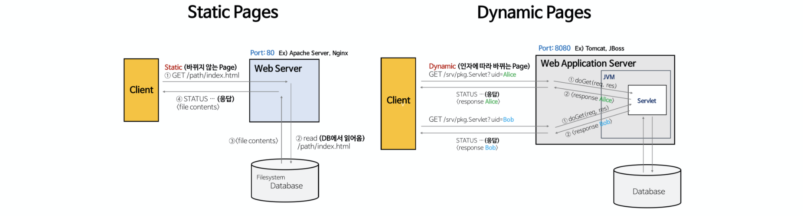
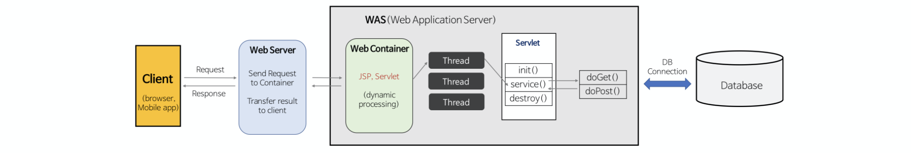
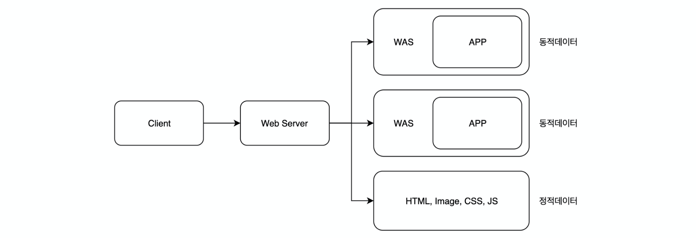
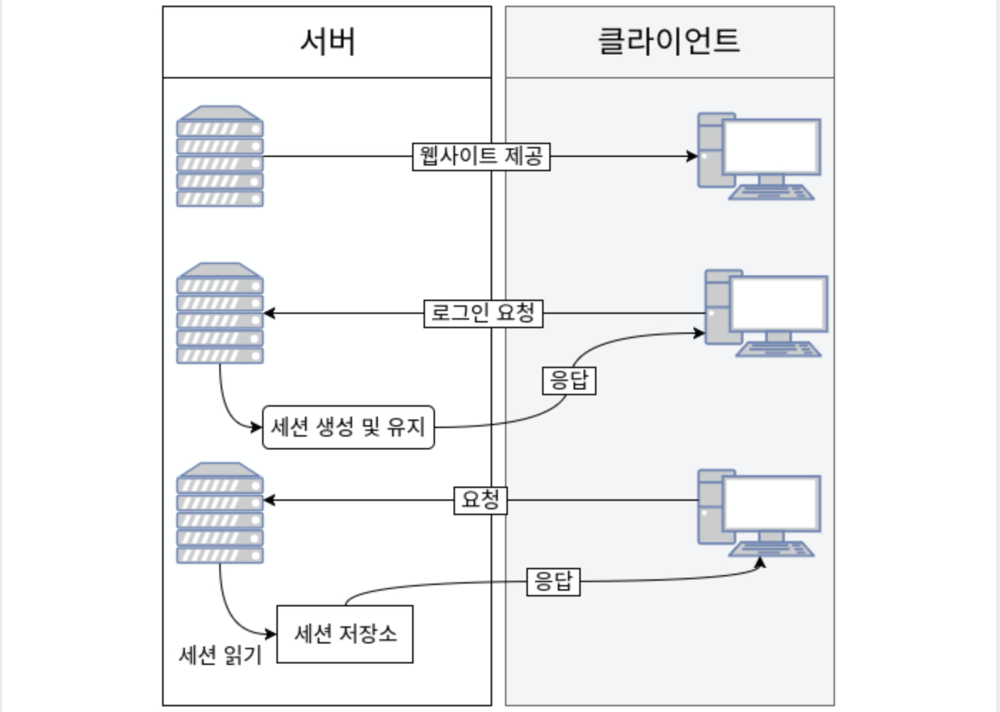
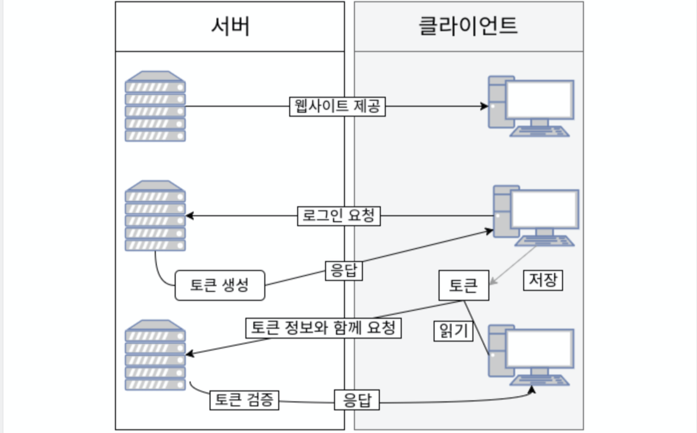

# WEB에 관한 질문

## 목차
- [Q. Web Server](#q-web-server)
- [Q. HTTP](#q-http)
- [Q. REST API(Restful API)](#q-rest-apirestful-api)
- [Q. 쿠키와 세션](#q-쿠키와-세션)
- [Q. 인증 방식](#q-인증-방식)
- [Q. 브라우저의 동작 과정](#q-브라우저의-동작-과정)

## Q. Web Server
웹 서버는 HTTP를 기반으로 클라이언트의 요청을 처리하는 서비스를 말합니다. 웹 브라우저와 같은 클라이언트의 요청에 따라 정적 페이지와 동적 페이지를 통해 응답을 하게 되는데, 정적 페이지를 처리하는 것이 **Web Server**이고 동적 페이지를 처리하는 것이 **Web Application Server**(**WAS**)입니다.

### 정적 페이지(Static Page) VS 동적 페이지(Dynamic Page)


출처: <https://gmlwjd9405.github.io/2018/10/27/webserver-vs-was.html>

정적 페이지는 서버에 **미리 저장된 파일**(**HTML, javascript, 이미지 파일 등**)을 말합니다. 클라이언트 요청에 따라 미리 저장된 파일을 전달하며, 페이지의 내용은 변하지 않습니다.

동적 페이지는 클라이언트의 요청에 따라 **데이터를 처리한 후** 만든 페이지입니다. 따라서 클라이언트의 요청에 따라 데이터가 변경되므로 같은 요청이라도 서로 다른 페이지가 될 수 있습니다. (위 그림의 Servlet은 자바에서 동적 페이지를 처리하는 인터페이스를 말합니다.)

### Web Server VS WAS(Web Application Server)
Web Server와 WAS 둘 다 HTTP를 기반으로 클라이언트의 요청을 처리하여 응답하는 서비스라는 점은 같습니다.

#### Web Server
Web Server는 클라이언트의 요청 중 정적인 처리를 담당합니다. 따라서 요청에 맞는 정적 페이지를 응답으로 보내는 역할을 합니다. Web Server는 대표적으로 Apache Server, Nginx, Microsoft IIS 등이 있습니다.

#### WAS(Web Application Server)
WAS는 클라이언트의 요청 중 동적인 처리를 담당합니다. 따라서 요청에 따라 DB 접속이나 비지니스 로직과 같은 동적인 처리 후 페이지를 만들어 응답으로 보내는 역할을 합니다. 

WAS는 웹 컨테이너(Web Container) 또는 서블릿 컨테이너(Servlet Container)라고도 불리며, Web Server 기능을 구조적으로 분산하여 서버의 부하를 줄이는 역할도 합니다. 따라서 WAS에서 정적 페이지와 동적 페이지 요청을 모두 처리할 수 있지만 부하를 줄이기 위해 분리하여 처리합니다.

WAS는 대표적으로 Tomcat, JBoss, Jeus, Web Sphere 등이 있습니다.

#### Web Service Architecture
웹 서버 구조는 일반적으로 Web Server와 WAS를 둘 다 사용합니다.


출처: <https://gmlwjd9405.github.io/2018/10/27/webserver-vs-was.html>

Java의 서블릿을 사용하는 웹 서버 구조는 일반적으로 위와 같습니다. Web Server를 앞단에 두고 정적 요청이면 이를 처리하여 바로 응답하고, 동적 요청이면 WAS로 전달합니다. 그리고 WAS 내부에서 서블릿과 같은 앱이 해당 요청을 처리하고 응답하는 구조입니다.


출처: <https://medium.com/@chrisjune_13837/web-%EC%9B%B9%EC%84%9C%EB%B2%84-%EC%95%B1%EC%84%9C%EB%B2%84-was-app%EC%9D%B4%EB%9E%80-692909a0d363>

Web Server는 여러 대의 WAS 서버를 가지고 로드 밸런싱 역할도 할 수 있습니다. 대표적으로 Nginx가 이러한 역할로 많이 사용하고 있습니다.

#### Web Server를 사용하는 이유
WAS에서 Web Server 역할을 모두 수행할 수 있는데, 정적 페이지를 처리하기 위한 기능 분리를 통해 서버 부하를 줄이기 위해 사용한다고 했습니다. 하지만 이는 여러 생각해 볼 점이 많다고 합니다. 실제로 Web Server를 앞단에 두는 것이 메모리적으로 더 비효율적일 수 있다는 이야기도 있습니다.

그래서 Web Server가 필요한 실제 사례로는 다음과 같다고 합니다.
- **보안**: Web Server가 해킹을 당해도 WAS에는 영향을 주지 않음
- **로드 밸런싱**: 위에서 본 것처럼 여러 WAS의 부하를 관리해줄 수 있음
- 하나의 Web Server에서 여러 개의 언어를 사용한 WAS가 있을 때

출처: <https://sieunlim.tistory.com/17> 

#### 대표적인 Web Server, WAS 예와 그 특징
- Web Server
    - Apache(아파치)
        - 세계에서 가장 많이 쓰는 무료 오픈소스 웹 서버
        - 다양한 기능과 구축이 쉬워 많이 사용
        - MPM(Multi Processing Module: 다중 처리 모듈) 방식
        - 느리고 여러 취약점이 있어 대형 서비스는 Nginx나 IIS를 사용
        - 기본적으로 80 포트 사용
    - Nginx
        - 아파치의 단점을 보완하고자 나왔으며, 동시접속 처리에 특화된 웹 서버
        - High Performance & High Concurrency & Low Resource Usage 지향
        - Event Driven 방식(비동기 처리)
        - Reverse Proxy 서버 역할 가능
- WAS
    - Tomcat
        - 아파치 재단에서 만든 WAS
        - 요청이 들어오면 자바 서블릿을 실행시키고 결과로 JSP가 포함된 웹 페이지를 만듦
        - 자체적으로 웹 서버가 있지만, 다른 웹 서버와 연동하여 사용 가능
        - 기본적으로 8080 포트 사용

## Q. HTTP
HTTP는 웹에서 서버와 클라이언트 사이 HTML을 주고받기 위한 약속입니다. 현재는 HTML뿐아니라 JSON, 멀티미디어 등 다양한 데이터를 주고받을 수 있습니다.

HTTP의 특징은 비연결적이고 무상태입니다. 이는 한번 요청과 응답이 끝나면 연결을 끊고 상태 정보를 유지하지 않는다는 것입니다. 이러한 특징으로 많은 수의 요청 처리를 처리할 수 있게 되었습니다. 하지만 상태가 필요한 경우가 있기 때문에 이 때는 별도의 쿠키와 세션과 같은 방법을 활용해야 합니다.

HTTP는 기본적으로 TCP/IP 통신 위에서 동작하며 80번 포트를 사용합니다.


## Q. REST API(Restful API)
REST API는 REST 제약조건을 준수하는 API를 말합니다. REST 제약조건은 서버-클라이언트 구조, 캐시 처리 가능, 무상태, 계층화, code-on-demand, 인터페이스 일관성이 있습니다. 이러한 규칙을 지킨다면(특히 인터페이스 일관성) 하위 호환성을 높일 수 있고, 독립적인 진화가 가능합니다. 따라서 REST 제약조건을 준수한 API는 API가 변경된다고 해도 클라이언트에 영향을 미치지 않습니다.

REST API를 설계하는 대표적인 방법은 URI로 자원을 표시하고, HTTP Method로 행위를 표현하는 것입니다. 이는 REST 제약조건 중 인터페이스 일관성의 메시지는 스스로를 설명해야한다는 조건을 지키기 위함입니다.

```
게시글 생성
http.../articles => POST 요청
```

REST를 가장 잘 준수한 애플리케이션은 웹 브라우저, HTTP, HTML입니다. 이들은 버전이 바뀐다고 해도 사용자가 업데이트할 필요가 없습니다. 이는 하위호환성을 지켰기 때문입니다. 반면에 REST가 잘 지켜지지 않은 것은 모바일 앱입니다. 모바일 앱은 빈번히 강제로 업데이트를 해야 합니다.


## Q. 쿠키와 세션
쿠키와 세션은 무상태인 HTTP를 보완하기 위해 서버에서 클라이언트의 상태를 유지하기 위한 방법입니다. 쿠키는 클라이언트에 저장되는 데이터이고, 세션은 서버에 저장되는 데이터입니다.

쿠키와 세션의 동작과정(로그인)
1. 클라이언트는 로그인 요청을 한다.
2. 서버는 요청받은 데이터를 확인 후 유저 정보를 세션에 저장한다.
3. 세션을 저장한 서버는 응답으로 set-cookie 헤더에 세션 id를 추가한다.
    - 보안상 유저 정보를 클라이언트에 저장할 수 없으므로, 세션 id를 쿠키에게 주고, 실제 유저 정보는 서버에 저장해둔다.
4. set-cookie 헤더를 받은 클라이언트는 쿠키를 저장한다.
5. 클라이언트는 저장된 쿠키가 있다면 이를 헤더에 담아서 서버에 요청한다.
    - 서버에서 설정한 만료기간이 끝날 때까지 이를 수행한다.

### 쿠키 정보를 모두 세션에 저장한다면?


## Q. 인증 방식
로그인 인증 방식은 세션/쿠키 방식과 토큰 방식이 있습니다.

세션/쿠키 방식은 로그인 정보를 서버에 저장합니다. 클라이언트는 세션 정보(id)를 쿠키에 담아 서버에 전송하고, 요청받은 서버는 쿠키에 저장되어 있는 세션 정보를 가지고 유저 정보를 찾아 확인합니다.



토큰 방식은 로그인 정보를 클라이언트에 저장합니다. 클라이언트가 로그인 요청을 하면 서버는 토큰을 발행하여 응답합니다. 클라이언트는 이 토큰을 저장합니다. 토큰 방식의 이점은 어떤 서버든지 토큰 검증 로직만 있다면 로그인 인증이 가능하므로 서버의 확장성을 높일 수 있습니다. 또한 서버마다 토큰 정보를 제한할 수 있고 CORS 문제도 간단히 해결할 수 있습니다. 토큰 방식의 대표적인 예는 JWT가 있습니다.




## Q. 브라우저의 동작 과정

